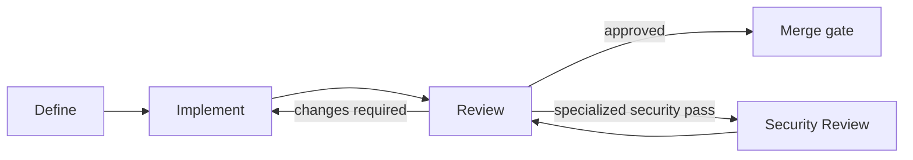

# Agent Workflow

This is the workflow agents follow across the MSX ecosystem. Each page describes one stage: its entry condition, boundary, procedure, and handoff. The stages apply the [Ways of Working](../Ways-of-Working/index.md) without restating the standards they consume.

These stage descriptions are the **single source for agent workflow behavior**. A repository does not carry its own copy; its `AGENTS.md` and `CLAUDE.md` are thin pointers to these pages ([Agentic Development](../Ways-of-Working/Agentic-Development.md)). Humans can follow the same workflow.

## The workflow

- **Define** captures, routes, refines, and plans work until it meets the readiness gate for its issue altitude.
- **Implement** takes one ready Task or Bug through delivery and hands off a review-ready pull request.
- **Review** supplies the independent perspective and either returns actionable feedback or approves the change.
- **Security Review** is a specialized review path entered when the requested scope requires a defensive security assessment.

[Maintain Agent Workflow](agent-author.md) is not a delivery stage. It updates these stage descriptions and the thin repository pointers when the workflow itself changes.

## Stages and maintenance

<!-- INDEX:START -->

| Page | Description |
| --- | --- |
| [Define Stage](define.md) | The workflow stage that captures, routes, refines, and plans work at the correct issue altitude. |
| [Implement Stage](implement.md) | The workflow stage that delivers one ready Task or Bug as a review-ready pull request. |
| [Review Stage](reviewer.md) | The workflow stage that independently reviews a pull request for delivery, taste, security, and decisions. |
| [Security Review Stage](security-reviewer.md) | A specialized workflow stage for defensive security review and responsible disclosure. |
| [Maintain Agent Workflow](agent-author.md) | Maintain the shared workflow stages and the thin repository pointers that reference them. |

<!-- INDEX:END -->
