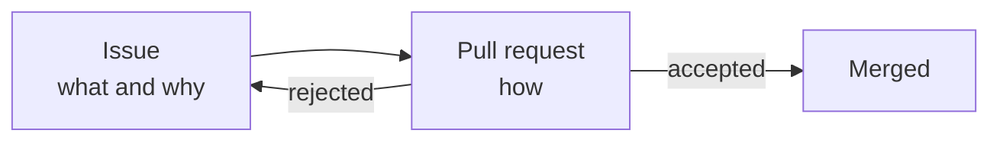

# Agent Interaction

Once more than one participant works a repository — several people, several agents, or a mix
— they need somewhere to coordinate. The tempting answer is a conversation: a chat, a thread,
a prompt history. The problem with a conversation is that it is not part of the repository.
It cannot be reviewed, it cannot be queried, and it disappears when the session does.

The platform already provides durable coordination artifacts. This page states how the
framework uses them.

## Coordination happens on artifacts

All coordination between humans and agents MUST happen through platform artifacts — issues,
labels, and pull requests — rather than through any channel that leaves no trace in the
repository.

The rule follows from
[everything as code](../../Ways-of-Working/Principles/Engineering-Practices.md#everything-as-code):
if the decision is not in the repository, the repository does not record why it looks the way
it does. It also follows from practical asymmetry — an agent's session ends and takes its
context with it, while an issue persists and can be picked up by a different agent, a
different runtime, or a person, weeks later.

| Artifact | What it carries | Why it, specifically |
| --- | --- | --- |
| **Issue** | The intent: what is wanted, why, and what "done" means | Durable, addressable, and independent of who acts on it |
| **Label** | A discrete decision or state transition | Machine-readable, so automation can react without parsing prose |
| **Pull request** | The proposed implementation, and the negotiation over it | Reviewable line by line, and revertible as one unit |
| **Comment** | Reasoning, questions, and advice attached to its subject | Stays with the artifact it concerns rather than in a separate stream |

## Two artifacts, two questions

Intent MUST be recorded separately from implementation. The issue states *what* is wanted and
*why*; the pull request proposes *how*.

The separation earns its keep at rejection. When a single artifact holds both, discarding a
bad implementation discards the reasoning that motivated it, and the next attempt starts from
nothing. When they are separate, the pull request closes and the issue stands — still stating
what is needed, now with a documented approach that did not work.

It also puts each question in front of the right reviewer. Whether something *should* be done
is a question about priorities and fit; whether an implementation is *correct* is a question
about the code. These are different judgements, often made by different people, and merging
them into one thread means the cheaper question crowds out the harder one.

The consequence is a rule about creation order: an issue exists before the work that resolves
it. Where a change is genuinely trivial, the pull request MAY stand alone, but it then carries
its own statement of intent, because something has to.

## Labels are the control channel

Where automation must be told something, it MUST be told with a label rather than with prose.

Prose is where humans express nuance, which is exactly what makes it a poor instruction to a
machine: parsing it means guessing, and a guess about whether a maintainer approved something
is a guess with consequences. A label is unambiguous, appears in the artifact's timeline with
who applied it and when, and can be required or forbidden by a rule.

Labels used for coordination MUST follow the organization's
[label vocabulary](../../Ways-of-Working/Automation-Labels.md), so that a label's owner and
meaning are knowable without reading the workflow that consumes it. Automation MUST ignore
labels it does not own.

## An agent is a participant, not an authority

An agent operating on these artifacts MUST do so under the same rules as any other
participant.

That means it opens issues and pull requests rather than pushing to protected branches, its
changes are reviewed, and its conclusions are advice until someone acts on them. The
[four-eyes principle](../../Ways-of-Working/Principles/AI-First-Development.md#4-eyes-or-n-eyes-principle)
does not weaken because one pair of eyes is automated; an agent reviewing an agent is
[advisory](advisory-agents.md), and human authority over the merge remains.

The symmetry is deliberate. A process that gave agents a privileged path would have two sets
of rules, and the agent path would be the one nobody audits.

## Handover is a state, not a message

Work passed from one participant to another MUST be handed over through the artifact's own
state — its labels, its assignment, its review status — and MUST NOT depend on a message
having been delivered.

An agent that finishes its part and describes the next step in a comment has produced
something a human must read and act on. An agent that finishes its part and moves the
artifact into the state the next stage reacts to has produced something the process picks up.
The first is a notification; the second is a handover.

This is what allows a chain of work to survive interruption. Any participant can determine
what happens next by looking at the artifact, without reconstructing a conversation.

## Where this connects

- [Spec](spec.md#requirements) — the requirement that coordination happens on durable artifacts and that intent is separable from implementation.
- [Advisory Agents](advisory-agents.md) — how an agent publishes judgement onto these artifacts without taking authority.
- [Automation Labels](../../Ways-of-Working/Automation-Labels.md) — the label vocabulary and ownership rules.
- [Workflow](../../Ways-of-Working/Workflow.md) — the stages these artifacts move through.
- [Issue Format](../../Ways-of-Working/Issues/index.md) — what an issue states.
- [PR Format](../../Ways-of-Working/PR-Format.md) — what a pull request states.
