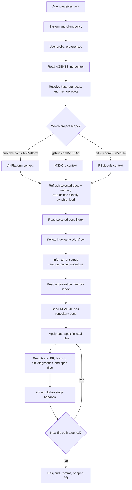

# Agentic Development — Design

The behavior in the [spec](spec.md) is delivered by an organization-level documentation and memory pair, adopted by each product repository through thin pointer files. The design keeps project knowledge in one reviewed place, keeps working memory in one durable place, and lets each agent runtime adapt without copying process knowledge.

## Organization anatomy

The GitHub organization is the project boundary. The host distinguishes work from personal projects; the organization selects the project context.

```text
<host>/<org>/
  docs/      # canonical knowledge base; changes through pull requests
  memory/    # durable agent and team memory; versioned working knowledge
  <repo-a>/  # product or component repository
  <repo-b>/
```

Current project scopes follow the same shape:

| Host | Organization | Docs | Memory |
| --- | --- | --- | --- |
| `dnb.ghe.com` | `AI-Platform` | `AI-Platform/docs` | `AI-Platform/memory` |
| `github.com` | `MSXOrg` | `MSXOrg/docs` | `MSXOrg/memory` |
| `github.com` | `PSModule` | `PSModule/docs` | `PSModule/memory` |

## Repository roles

### `docs`

The `docs` repository is the canonical knowledge base. It owns:

- vision, principles, and ways of working;
- coding standards and documentation standards;
- framework and capability specs and designs;
- project glossary and onboarding;
- the canonical Workflow and its linked stage procedures.

Changes to `docs` happen through pull requests because this repository defines durable project intent.

### `memory`

The `memory` repository is the durable working-memory store. It owns:

- recurring gotchas and lessons learned;
- active project context that should survive a single chat session;
- workflow-stage working knowledge;
- issue, PR, and incident notes worth reusing;
- project-specific preferences that are factual rather than private user preference.

Memory pages stay short and factual. They are safe to read before work begins and safe to improve when a lesson is learned.

### Product repositories

Product repositories carry local context and thin pointers:

```text
<repo>/
  AGENTS.md                        # required: the agent entry point
  CLAUDE.md                        # adapter: a one-line import of AGENTS.md
  .github/
    copilot-instructions.md        # optional: only for Copilot surfaces that do not read AGENTS.md
    instructions/
      <scope>.instructions.md      # optional: path-scoped local rules
  README.md
  docs/
```

`AGENTS.md` is the file every repository carries; the adapters are added only where a runtime needs one. The repository owns only repository-specific nuance: bootstrap entry points, build commands, contribution mechanics, architecture notes, local exceptions, and path-scoped rules. Cross-cutting standards remain in `docs`; reusable lessons remain in `memory`. Thin means "no duplicated reusable process," not "discard the local operating contract."

## OKF page model

Both `docs` and `memory` use the [Open Knowledge Format](../../Dictionary/index.md#open-knowledge-format) style: Markdown with YAML frontmatter, one concept per page, paths as stable identity, and indexes as navigation maps.

Minimum page frontmatter:

```yaml
---
title: Agentic Development
description: One-line description of the page.
---
```

Memory pages MAY add scope-oriented metadata when it helps agents filter context:

```yaml
---
title: GitHub Actions cache gotchas
description: Reusable notes for cache failures and permissions.
scope: project
tags:
  - github-actions
  - cache
  - gotcha
---
```

The body stays concise. If a page grows into multiple concepts, split it and link through the nearest `index.md`.

## Indexes as the mindmap

Indexes are the navigation layer. An agent starts at the root index, reads descriptions, then drills inward until it reaches the relevant page.

```text
docs/
  index.md
  Ways-of-Working/index.md
  Ways-of-Working/Workflow.md
  Ways-of-Working/Workflow-Stages/index.md
  Coding-Standards/index.md
  Capabilities/index.md
  Capabilities/agentic-development/index.md

memory/
  index.md
  agents/index.md
  knowledge/index.md
  gotchas/index.md
```

Every index describes what sits below it. Generated indexes are preferred where tooling exists; manually maintained indexes are acceptable when the memory repository is intentionally lightweight.

## Context resolution flow



Resolution is deterministic. If the active repository remote is `github.com/PSModule/Json`, the selected project context is `PSModule`; if it is `github.com/MSXOrg/docs`, the selected project context is `MSXOrg`. Multi-root workspaces use the active file, explicit user prompt, current terminal directory, or branch repository to select the project. Ambiguity is resolved by asking the user before acting.

## Pointer files

`AGENTS.md` is the cross-runtime pointer file. It identifies the project, names the canonical docs and memory root indexes, and lists local nuance. It points to the discovery trail, not to a stage-specific tool file.

```markdown
# Agent Instructions

This repository belongs to `github.com/MSXOrg`.

Canonical project context:

- `github.com/MSXOrg/docs`
- `github.com/MSXOrg/memory`

Before changing files:

1. Segment the work by host, organization, repository, path, and task.
2. Refresh every canonical context repository and stop unless each exactly matches its remote default branch.
3. Start at the resolved project `docs/index.md`.
4. Follow the Ways of Working index to Workflow, infer the current stage, and read that stage procedure.
5. Read the relevant project standards, repository README and local docs, and organization memory.
6. Apply path-specific local rules for the files being changed.

This file points; it does not define process knowledge.
```

The index trail is the default. A clear prompt can shortcut stage discovery: `Review this PR <link>` enters Review, `Make this issue <description>` enters Define, and `Implement <issue>` enters Implement. These phrases are routing hints interpreted by [Workflow](../../Ways-of-Working/Workflow.md#find-the-current-stage), not commands with independent procedures.

> **Discovery order vs. conflict precedence** — the pointer resolves organization context first, then the agent uses the stage procedure to select relevant organization and repository pages. Local pointer files and repository docs add nuance and narrow exceptions; they never silently override an organization standard unless the standard explicitly permits a local exception.

`CLAUDE.md` stays a thin import:

```markdown
@AGENTS.md
```

`.github/copilot-instructions.md` is optional. Add it only when the repository relies on a Copilot surface that does not read `AGENTS.md`; GitHub's [custom instructions support matrix](https://docs.github.com/en/copilot/reference/custom-instructions-support) records which surfaces do. When it is present, it points Copilot to the same root and adds only Copilot-specific loading guidance:

```markdown
Follow `AGENTS.md`.

Segment the work by host, organization, repository, path, and task. Refresh the resolved canonical context repositories and stop on any synchronization failure. Only then start at the organization docs root index and follow its Workflow. Use path-specific instruction files only for local path rules when their `applyTo` pattern matches a file being read, generated, reviewed, or edited.
```

Path-specific instruction files are reserved for local rules that cannot live centrally because they apply only to a repository path. They never define workflow stages.

## Local workspace

A local bootstrap makes central context predictable:

```text
~/.msx/
  docs.git/                    # MSXOrg/docs bare backing repository
  docs/                        # clean MSXOrg/docs main worktree
  memory/                      # simple MSXOrg/memory checkout
  projects/
    PSModule/
      docs.git/                # optional project docs backing repository
      docs/                    # optional project docs main worktree
      memory/                  # optional project memory checkout
```

The bootstrap clones missing repositories and fetches every existing context repository before use. Each clone must be clean, checked out on the remote default branch, and exactly equal to the fetched remote head. A dirty, locally ahead, diverged, wrong-branch, or unreachable clone stops context resolution; the agent does not use a possibly stale local copy. Bootstrap writes repository-local git configuration only.

MSXOrg is the default project. Additional projects plug in a name, relative workspace path, docs URL, and memory URL. For example, PSModule can use `projects/PSModule/{docs,memory}` beneath the same workspace while reusing the identical synchronization and validation path. Repository agent files retain this small coordinate block because it is required before project documentation can be reached; the reusable bootstrap behavior remains central.

## Memory writing rules

Agents write memory only when a lesson is likely to matter again. Good memory is:

- short and factual;
- scoped to the organization;
- linked to the issue, PR, repository, or document that proves it;
- free of secrets, credentials, and private personal notes;
- updated or removed when it becomes wrong.

Session-specific notes stay out of durable memory unless they become reusable project knowledge.

## Client behavior

Different clients load different files, but the framework keeps the same dependency direction. A client that reads `AGENTS.md` needs no additional pointer file; an adapter exists for the clients that do not.

| Client | Adapter | Behavior |
| --- | --- | --- |
| Cross-client agents | `AGENTS.md` | Resolve and synchronize the shared docs and memory roots, then traverse indexes to Workflow and the current stage. |
| Claude Code | `CLAUDE.md` | Import `AGENTS.md`; add no duplicated process knowledge. |
| Copilot in VS Code, and the Copilot cloud agent | `AGENTS.md` | Read `AGENTS.md` natively, including its freshness gate. Path-scoped `.github/instructions/*.instructions.md` files still apply when their `applyTo` pattern matches a file being read, generated, reviewed, or edited. |
| Copilot surfaces without `AGENTS.md` support | `.github/copilot-instructions.md`, optional | Copilot Chat on GitHub.com, Visual Studio, JetBrains, and Eclipse read repository-wide instructions only. A repository that relies on one of them adds the adapter, which follows `AGENTS.md` and adds nothing else. |
| Copilot code review | Base-branch instructions | Review using trusted base-branch instructions rather than instructions changed by the PR under review. |

## Failure modes

| Failure | Design response |
| --- | --- |
| Repository does not identify its organization context | Infer from remote URL; ask when ambiguous. |
| A docs or memory clone is missing or cannot synchronize | Bootstrap or repair it, then retry. Stop context resolution until every canonical context repository passes the freshness gate. |
| Pointer file duplicates central standards | Replace duplicated content with links during review. |
| A skill, command, named agent, or instruction file defines a workflow stage | Delete the duplicate procedure and link to Workflow or its stage page. |
| Memory conflicts with docs | Docs win; memory is corrected or removed. |
| Two organizations are open in one workspace | Select by active repository; ask before cross-project changes. |
| A client ignores one pointer format | Add a thin adapter for that client that points to the same canonical roots. |

## Adoption path

1. Create or identify the organization `docs` repository.
2. Create or identify the organization `memory` repository, using the [Memory Repository Template](memory-template.md) as the starting scaffold.
3. Add `docs/index.md` and `memory/index.md` as the two root maps.
4. Add the canonical Workflow and linked stage procedures to `docs`.
5. Add starter memory sections to `memory`.
6. Add the `AGENTS.md` pointer to each product repository, plus only the adapters its runtimes require.
7. Add a bootstrap that keeps local docs and memory clones present and exactly synchronized before use.
8. Review new work for pointer discipline: facts live once, links point to them.

## Where this connects

- [Spec](spec.md) — the requirements this design delivers.
- [Memory Repository Template](memory-template.md) — the concrete scaffold every organization's canonical `memory` repository instantiates.
- [Agentic Development](../../Ways-of-Working/Agentic-Development.md) — the way-of-working standard this framework implements.
- [Documentation Model](../../Ways-of-Working/Documentation-Model.md) — why spec and design are split.
- [README-Driven Context](../../Ways-of-Working/Readme-Driven-Context.md) — why local repository context remains the front door.
