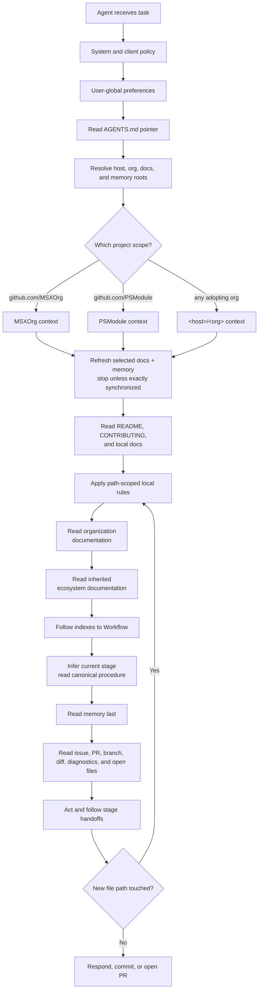

# Agentic Development — Design

The behavior in the [spec](spec.md) is delivered by an organization-level documentation and memory pair, adopted by each product repository through thin pointer files. The design keeps project knowledge in one reviewed place, keeps working memory in one durable place, and lets each agent runtime adapt without copying process knowledge.

## Organization anatomy

The GitHub organization is the project boundary. The host distinguishes work from personal projects; the organization selects the project context.

```text
<host>/<org>/
  docs/      # canonical knowledge base; changes through pull requests
  memory/    # durable agent and team memory; versioned working knowledge
  <repo-a>/  # product or component repository
  <repo-b>/
```

Current project scopes follow the same shape:

| Host | Organization | Docs | Memory |
| --- | --- | --- | --- |
| `github.com` | `MSXOrg` | `MSXOrg/docs` | `MSXOrg/memory` |
| `github.com` | `PSModule` | `PSModule/docs` | `PSModule/memory` |
| `<host>` | `<org>` | `<org>/docs` | `<org>/memory` |

The last row is the general case: any adopting organization on any GitHub host — public or an enterprise instance — plugs into the same shape without changing the framework.

## Repository roles

### `docs`

The `docs` repository is the canonical knowledge base. It owns:

- vision, principles, and ways of working;
- coding standards and documentation standards;
- framework and capability specs and designs;
- project glossary and onboarding;
- the canonical Workflow and its linked stage procedures.

Changes to `docs` happen through pull requests because this repository defines durable project intent.

### `memory`

The `memory` repository is the durable working-memory store. It owns:

- recurring gotchas and lessons learned;
- active project context that should survive a single chat session;
- workflow-stage working knowledge;
- issue, PR, and incident notes worth reusing;
- project-specific preferences that are factual rather than private user preference.

Memory pages stay short and factual. They are safe to read before work begins and safe to improve when a lesson is learned.

### Product repositories

Product repositories carry local context and thin pointers:

```text
<repo>/
  AGENTS.md                        # required: the router — a list of destinations
  .claude/
    CLAUDE.md                      # required: routes Claude Code — @../AGENTS.md
  .github/
    CONTRIBUTING.md                # how a change is made here
    copilot-instructions.md        # required: routes the Copilot surfaces that need it
    instructions/
      <scope>.instructions.md      # exceptional: a path-scoped local caveat
  README.md                        # what it is, how it builds
  docs/                            # architecture and domain context
```

The repository owns only repository-specific nuance, and each kind has a file that owns it: `README.md` for what the repository is and how it builds, `.github/CONTRIBUTING.md` for contribution mechanics, `docs/` for architecture and domain context, and path-scoped rule files for local caveats. `AGENTS.md` points at them and holds none of it. Cross-cutting standards remain in `docs`; reusable lessons remain in `memory`. Thin means "no duplicated reusable process," not "discard the local operating contract" — the contract lives, it just lives in the file a human would read.

## OKF page model

Both `docs` and `memory` use the [Open Knowledge Format](../../Dictionary/index.md#open-knowledge-format) style: Markdown with YAML frontmatter, one concept per page, paths as stable identity, and indexes as navigation maps.

Minimum page frontmatter:

```yaml
---
title: Agentic Development
description: One-line description of the page.
---
```

Memory pages MAY add scope-oriented metadata when it helps agents filter context:

```yaml
---
title: GitHub Actions cache gotchas
description: Reusable notes for cache failures and permissions.
scope: project
tags:
  - github-actions
  - cache
  - gotcha
---
```

The body stays concise. If a page grows into multiple concepts, split it and link through the nearest `index.md`.

## Indexes as the mindmap

Indexes are the navigation layer. An agent starts at the root index, reads descriptions, then drills inward until it reaches the relevant page.

```text
docs/
  index.md
  Ways-of-Working/index.md
  Ways-of-Working/Workflow.md
  Ways-of-Working/Workflow-Stages/index.md
  Coding-Standards/index.md
  Capabilities/index.md
  Capabilities/agentic-development/index.md

memory/
  index.md
  agents/index.md
  knowledge/index.md
  gotchas/index.md
```

Every index describes what sits below it. Generated indexes are preferred where tooling exists; manually maintained indexes are acceptable when the memory repository is intentionally lightweight.

## Context resolution flow



Resolution is deterministic. If the active repository remote is `github.com/PSModule/Json`, the selected project context is `PSModule`; if it is `github.com/MSXOrg/docs`, the selected project context is `MSXOrg`. Multi-root workspaces use the active file, explicit user prompt, current terminal directory, or branch repository to select the project. Ambiguity is resolved by asking the user before acting.

## Pointer files

`AGENTS.md` is the cross-runtime router. It names the project and lists where to read, in order. It holds nothing else — no bootstrap, no build commands, no contribution mechanics, no standards.

```markdown
# Agent Instructions

This repository is `github.com/MSXOrg/<repo>`. Read in this order:

1. `README.md` — what this repository is and how it builds.
2. `.github/CONTRIBUTING.md` — how a change is made and reviewed here.
3. `docs/index.md` — this repository's own documentation.
4. `~/.msx/docs/src/docs/index.md` — the organization standards.
5. `~/.msx/memory/index.md` — durable lessons, read last.

Read nearest first. A local file never overrides a standard, and memory never
overrides documentation.
```

A router lists the destinations that exist in that repository, written as the paths that repository actually uses — the ones above are an example, not a required layout. A repository with no documentation of its own drops that line; one that publishes the standards resolves steps 3 and 4 to the same tree and drops the duplicate. Writing a real path matters more than matching the example, because the router is read literally.

The index trail is the default. A clear prompt can shortcut stage discovery: `Review this PR <link>` enters Review, `Make this issue <description>` enters Define, and `Implement <issue>` enters Implement. These phrases are routing hints interpreted by [Workflow](../../Ways-of-Working/Workflow.md#find-the-current-stage), not commands with independent procedures.

> **Reading order vs. conflict precedence** — the router reads the repository's own files first and widens outward, because nearest context is cheapest and most specific. Precedence runs the other way: repository files add nuance and narrow exceptions and never silently override an organization standard unless that standard permits a local exception, and memory never overrides documentation.

`.claude/CLAUDE.md` is a single import:

```markdown
@../AGENTS.md
```

Claude Code accepts either `./CLAUDE.md` or `./.claude/CLAUDE.md` as the project file, and resolves a relative import against the file that contains it — so from `.claude/`, the router is `../AGENTS.md`. Writing `@AGENTS.md` there would resolve to `.claude/AGENTS.md` and silently load nothing.

`.github/copilot-instructions.md` has the same shape, for the Copilot surfaces that do not read `AGENTS.md`:

```markdown
Follow the instructions in [AGENTS.md](../AGENTS.md).
```

That is the entire file. It holds no reading order, no workflow, and no standard, so there is nothing in it that can fall out of step with the router. Any future runtime is handled the same way: give it a route under whatever filename it reads, and leave the content in `AGENTS.md`.

Path-scoped instruction files are reserved for local rules that cannot live centrally because they apply only to a repository path, and only when the rule does not belong in `README.md` or `.github/CONTRIBUTING.md` instead. They never define workflow stages.

## Local workspace

A local bootstrap makes central context predictable:

```text
~/.msx/
  docs.git/                    # MSXOrg/docs bare backing repository
  docs/                        # clean MSXOrg/docs main worktree
  memory/                      # simple MSXOrg/memory checkout
  projects/
    PSModule/
      docs.git/                # optional project docs backing repository
      docs/                    # optional project docs main worktree
      memory/                  # optional project memory checkout
```

The bootstrap clones missing repositories and fetches every existing context repository before use. Each clone must be clean, checked out on the remote default branch, and exactly equal to the fetched remote head. A dirty, locally ahead, diverged, wrong-branch, or unreachable clone stops context resolution; the agent does not use a possibly stale local copy. Bootstrap writes repository-local git configuration only.

MSXOrg is the default project. Additional projects plug in a name, relative workspace path, docs URL, and memory URL. For example, PSModule can use `projects/PSModule/{docs,memory}` beneath the same workspace while reusing the identical synchronization and validation path. Repository agent files retain this small coordinate block because it is required before project documentation can be reached; the reusable bootstrap behavior remains central.

## Refresh hooks

The freshness gate is only worth as much as the last time it ran. A workspace bootstrapped
once is current at that moment and progressively less so afterwards, and an agent reading a
week-old clone reads a standard that has since changed while believing it is canonical.

So the refresh runs at the **start of every session**, not once per machine. What differs
between runtimes is where the trigger hangs, never what it does:

| Runtime shape | Lifecycle point | How the refresh attaches |
| --- | --- | --- |
| Local interactive agent | Session start | A session-start hook in the runtime's own configuration invokes the bootstrap before the first turn. |
| Hosted or remote agent | Environment setup | The environment's setup steps run the bootstrap while the workspace is being prepared, so the agent starts against fresh context. |
| Review-time agent | Pull request event | Instructions are read from the pull request's head branch, so freshness follows the branch under review rather than a local clone. |
| Batch or scheduled agent | Job start | The job's first step is the bootstrap; a scheduled run has no earlier lifecycle point to rely on. |

Each of these is one **declaration** of the same behaviour. The bootstrap is a single
idempotent operation — clone what is missing, fetch what exists, verify each clone is clean,
on the remote default branch, and exactly equal to the fetched head — and a hook does
nothing but call it at the right moment. That is what makes a new runtime cheap to support:
the work is finding its lifecycle point, not writing another refresh.

The refresh MUST be idempotent, because it runs far more often than it changes anything. A
hook that is expensive or noisy when everything is already current gets disabled, and a
disabled hook is worse than no hook, because the workspace still looks bootstrapped.

Where a runtime offers no lifecycle point at all, the refresh MUST be invoked explicitly
before context is read. It MUST NOT be skipped on the grounds that the workspace was
bootstrapped recently; "recently" is not a state the agent can observe, and the gate exists
precisely to replace that judgement with a check.

Each shape's obligations beyond the refresh — its entry file, tool declaration, and identity —
are set out in [Runtime Integration](runtime-integration.md).

## Memory writing rules

Agents write memory only when a lesson is likely to matter again. Good memory is:

- short and factual;
- scoped to the organization;
- linked to the issue, PR, repository, or document that proves it;
- free of secrets, credentials, and private personal notes;
- updated or removed when it becomes wrong.

Memory is written by **horizon**: organization-wide lessons and per-repository facts are
durable and shared, while notes about the task in hand are session-scoped and never pushed
([memory repository template](memory-template.md#memory-has-three-horizons)). A session note
becomes durable only by being deliberately promoted and rewritten as a statement of fact.

Durable memory is committed and pushed as it is written, one commit per discrete lesson, so
that nothing depends on a session ending cleanly.

## Client behavior

Different clients load different files, but the framework keeps the same dependency direction. A client that reads `AGENTS.md` needs no file of its own; a client that does not gets a route to it.

| Client | Reads | Behavior |
| --- | --- | --- |
| Cross-client agents | `AGENTS.md` | Read the router, then follow its order outward from the repository to the organization documentation and memory. |
| Claude Code | `.claude/CLAUDE.md` | Imports the router with `@../AGENTS.md` and adds nothing else. |
| Copilot Chat in VS Code, and the Copilot cloud agent | `AGENTS.md` | Read `AGENTS.md` natively and follow its route list. Path-scoped `.github/instructions/*.instructions.md` files still apply when their `applyTo` pattern matches a file being read, generated, reviewed, or edited. |
| Copilot surfaces without `AGENTS.md` support | `.github/copilot-instructions.md` | Copilot Chat on GitHub.com, Visual Studio, JetBrains, Eclipse, and Copilot code review outside GitHub.com read this file. It routes them to the router and adds nothing else. |
| Copilot code review | Head-branch instructions | Reads repository instructions, agent instructions, and skills from the pull request's **head** branch, not the base branch. |

Because Copilot code review reads the head branch, a pull request that changes `AGENTS.md`, a client route, or a path-scoped instruction file also changes the instructions used to review that pull request. Those files are therefore reviewed by a human on their own merits, and an automated approval is never treated as independent of them. What this means for repositories that accept outside contributions is still open — see [MSXOrg/docs#123](https://github.com/MSXOrg/docs/issues/123).

## Failure modes

| Failure | Design response |
| --- | --- |
| Repository does not identify its organization context | Infer from remote URL; ask when ambiguous. |
| A docs or memory clone is missing or cannot synchronize | Bootstrap or repair it, then retry. Stop context resolution until every canonical context repository passes the freshness gate. |
| Pointer file duplicates central standards | Replace duplicated content with a route during review. A client file holds a pointer, not a copy. |
| A skill, command, named agent, or instruction file defines a workflow stage | Delete the duplicate procedure and link to Workflow or its stage page. |
| Memory conflicts with docs | Docs win; memory is corrected or removed. |
| Two organizations are open in one workspace | Select by active repository; ask before cross-project changes. |
| A client ignores one pointer format | Add a route file under the filename that client reads, containing only a pointer to `AGENTS.md`. |
| A repository file contradicts an organization standard | The standard governs. Narrow the local file to the exception the standard permits, or change the standard. |

## Adoption path

1. Create or identify the organization `docs` repository.
2. Create or identify the organization `memory` repository, using the [Memory Repository Template](memory-template.md) as the starting scaffold.
3. Add `docs/index.md` and `memory/index.md` as the two root maps.
4. Add the canonical Workflow and linked stage procedures to `docs`.
5. Add starter memory sections to `memory`.
6. Add the `AGENTS.md` router to each product repository, plus a route for every client that cannot read it.
7. Add a bootstrap that keeps local docs and memory clones present and exactly synchronized before use.
8. Review new work for pointer discipline: facts live once, links point to them.

## Where this connects

- [Spec](spec.md) — the requirements this design delivers.
- [Memory Repository Template](memory-template.md) — the concrete scaffold every organization's canonical `memory` repository instantiates.
- [MCP Servers](mcp-servers.md) — the shared tool layer every runtime declares in its own format.
- [Plugin Distribution](plugin-distribution.md) — how named intents are packaged and kept pointer-based.
- [Runtime Integration](runtime-integration.md) — what each runtime shape supplies, and why it never supplies process.
- [Agent Interaction](agent-interaction.md) — how agents and humans coordinate through platform artifacts.
- [Advisory Agents](advisory-agents.md) — agents that produce advice rather than commits.
- [Conformance](conformance.md) — the checklist a repository is measured against.
- [Agentic Development framework](index.md) — the framework this design delivers.
- [Documentation Model](../../Ways-of-Working/Documentation-Model.md) — why spec and design are split.
- [README-Driven Context](../../Ways-of-Working/Readme-Driven-Context.md) — why local repository context remains the front door.
