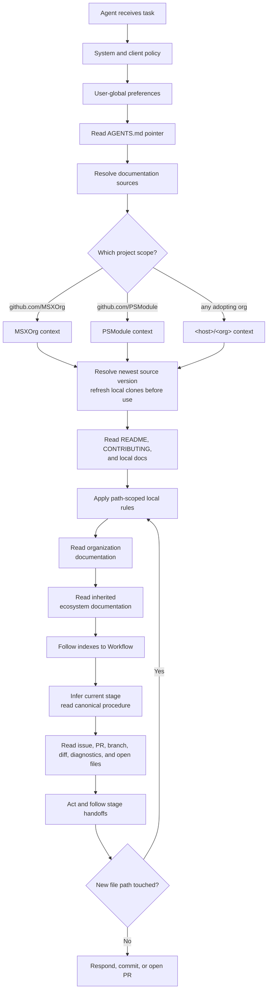

# Agentic Development — Design

The behavior in the [spec](spec.md) is delivered by repository-addressable documentation sources, adopted by each product repository through thin pointer files. The design keeps project knowledge in one reviewed place and lets each agent runtime adapt without copying process knowledge.

## Organization anatomy

The GitHub organization is the project boundary. The host distinguishes work from personal projects; the organization selects the project context.

```text
<host>/<org>/
  <documentation-source>/  # canonical knowledge base; changes through pull requests
  <repo-a>/                 # product or component repository
  <repo-b>/
```

Current project scopes identify these sources:

| Host | Organization | Documentation source | Entry file | Published documentation | Preferred clone |
| --- | --- | --- | --- | --- | --- |
| `github.com` | `MSXOrg` | `MSXOrg/docs` | `src/docs/index.md` | <https://msxorg.github.io/docs/> | `~/.msxorg/docs` |
| `github.com` | `PSModule` | `PSModule/Process-PSModule` | `docs/index.md` | <https://psmodule.io/docs/Modules/Process-PSModule/> | `~/.psmodule/process-psmodule` |
| `<host>` | `<org>` | Designated `<org>/<repository>` | Declared by the router | Declared by the router | Declared by the router |

The last row is the general case. Repository identity remains stable whether an agent uses a CLI, the web, published documentation, or a refreshed local clone.

## Repository roles

### Documentation source

The designated documentation source is the canonical knowledge base. It owns:

- vision, principles, and ways of working;
- coding standards and documentation standards;
- framework and capability specs and designs;
- project glossary and onboarding;
- the canonical Workflow and its linked stage procedures.

Changes happen through pull requests because the source defines durable project intent. `MSXOrg/docs` owns cross-organization guidance. `PSModule/Process-PSModule` owns PSModule process and standards and inherits from `MSXOrg/docs`.

### Product repositories

Product repositories carry local context and thin pointers:

```text
<repo>/
  AGENTS.md                        # required: the router — a list of destinations
  .claude/
    CLAUDE.md                      # required: routes Claude Code — @../AGENTS.md
  .github/
    CONTRIBUTING.md                # how a change is made here
    copilot-instructions.md        # required: routes the Copilot surfaces that need it
    instructions/
      <scope>.instructions.md      # exceptional: a path-scoped local caveat
  README.md                        # what it is, how it builds
  docs/                            # architecture and domain context
```

The repository owns only repository-specific nuance, and each kind has a file that owns it: `README.md` for what the repository is and how it builds, `.github/CONTRIBUTING.md` for contribution mechanics, `docs/` for architecture and domain context, and path-scoped rule files for local caveats. `AGENTS.md` points at them and holds none of it. Cross-cutting standards remain in `docs`. Thin means "no duplicated reusable process," not "discard the local operating contract" — the contract lives, it just lives in the file a human would read.

## OKF page model

Documentation sources use the [Open Knowledge Format](../../Dictionary/index.md#open-knowledge-format) style: Markdown with YAML frontmatter, one concept per page, paths as stable identity, and indexes as navigation maps.

Minimum page frontmatter:

```yaml
---
title: Agentic Development
description: One-line description of the page.
---
```

The body stays concise. If a page grows into multiple concepts, split it and link through the nearest `index.md`.

## Indexes as the mindmap

Indexes are the navigation layer. An agent starts at the root index, reads descriptions, then drills inward until it reaches the relevant page.

```text
docs/
  index.md
  Ways-of-Working/index.md
  Ways-of-Working/Workflow.md
  Ways-of-Working/Workflow-Stages/index.md
  Coding-Standards/index.md
  Capabilities/index.md
  Capabilities/agentic-development/index.md

```

Every index describes what sits below it. Generated indexes are preferred where tooling exists.

## Context resolution flow



Resolution is deterministic. If the active repository remote is `github.com/PSModule/Json`, the selected project context is `PSModule`; if it is `github.com/MSXOrg/docs`, the selected project context is `MSXOrg`. Multi-root workspaces use the active file, explicit user prompt, current terminal directory, or branch repository to select the project. Ambiguity is resolved by asking the user before acting.

## Pointer files

`AGENTS.md` is the cross-runtime router. It lists where to read, identifies each
source, and requires the newest accessible version without selecting an access
tool. It holds no detailed synchronization mechanics, build commands,
contribution mechanics, or standards.

```markdown
# AGENTS

Read nearest first and always use the newest version.

Read in this order:

1. `README.md` — what this repository is and how it builds.
2. `.github/CONTRIBUTING.md` — how a change is made and reviewed here.
3. `docs/index.md` — this repository's own documentation.
4. [MSXOrg/docs](https://github.com/MSXOrg/docs/) — organization standards;
   entry file `src/docs/index.md`; published at <https://msxorg.github.io/docs/>;
   preferred clone `~/.msxorg/docs`.

Use a CLI, the web, published documentation, or a refreshed local clone,
whichever provides the newest accessible source.

Repository-local guidance may add nuance but does not override organization or
inherited standards.
```

A PSModule repository inserts its initiative source before `MSXOrg/docs`:

```markdown
4. [PSModule/Process-PSModule](https://github.com/PSModule/Process-PSModule/) —
   PSModule process and standards; entry file `docs/index.md`; published at
   <https://psmodule.io/docs/Modules/Process-PSModule/>; preferred clone
   `~/.psmodule/process-psmodule`.
```

A router lists only destinations that apply to its repository. A repository with no documentation of its own drops that line; one that publishes the standards resolves local and organization documentation to the same source and drops the duplicate. The route does not require a particular client or access method. A local clone is usable only after its freshness gate succeeds.

The index trail is the default. A clear prompt can shortcut stage discovery: `Review this PR <link>` enters Review, `Make this issue <description>` enters Define, and `Implement <issue>` enters Implement. These phrases are routing hints interpreted by [Workflow](../../Ways-of-Working/Workflow.md#find-the-current-stage), not commands with independent procedures.

> **Reading order vs. conflict precedence** — the router reads the repository's own files first and widens outward, because nearest context is cheapest and most specific. Precedence runs the other way: repository files add nuance and narrow exceptions and never silently override an organization standard unless that standard permits a local exception.

`.claude/CLAUDE.md` is a single import:

```markdown
@../AGENTS.md
```

Claude Code accepts either `./CLAUDE.md` or `./.claude/CLAUDE.md` as the project file, and resolves a relative import against the file that contains it — so from `.claude/`, the router is `../AGENTS.md`. Writing `@AGENTS.md` there would resolve to `.claude/AGENTS.md` and silently load nothing.

`.github/copilot-instructions.md` has the same shape, for the Copilot surfaces that do not read `AGENTS.md`:

```markdown
Follow the instructions in [AGENTS.md](../AGENTS.md).
```

That is the entire file. It holds no reading order, no workflow, and no standard, so there is nothing in it that can fall out of step with the router. Any future runtime is handled the same way: give it a route under whatever filename it reads, and leave the content in `AGENTS.md`.

Path-scoped instruction files are reserved for local rules that cannot live centrally because they apply only to a repository path, and only when the rule does not belong in `README.md` or `.github/CONTRIBUTING.md` instead. They never define workflow stages.

## Local workspace

A preferred local clone makes documentation context predictable:

```text
~/.msxorg/
  docs/                        # clean MSXOrg/docs clone
~/.psmodule/
  process-psmodule/            # clean PSModule/Process-PSModule clone
```

When an agent uses a local clone, it ensures the clone exists, fetches its
remote, and fast-forwards its default branch before reading. Each clone must be
clean, checked out on the remote default branch, and exactly equal to the
fetched remote head. A dirty, locally ahead, diverged, wrong-branch, or
unreachable clone stops local resolution; the agent does not use a stale copy.
Remote CLI, web, and published documentation remain valid current sources.

Each GitHub organization has its own organization-named workspace root, such as
`~/.msxorg` for MSXOrg or `~/.psmodule` for PSModule. Repository agent files
retain public organization documentation destinations; runtime and development
guidance defines how a context checkout is prepared and verified.

## Context freshness

The local freshness gate is only worth as much as the last time it ran. A clone
synchronized once is current at that moment and progressively less so
afterwards, and an agent reading a week-old clone reads a standard that has
since changed while believing it is canonical.

When a runtime uses local clones, Git synchronization runs at the **start of
every session**, not once per machine. What differs between runtimes is where
the trigger hangs, never what it does:

| Runtime shape | Lifecycle point | How context freshness is established |
| --- | --- | --- |
| Local interactive agent | Session start | The agent resolves a current remote source or fetches and fast-forwards a preferred clone before the first turn. |
| Hosted or remote agent | Environment setup | Setup provides current documentation through a remote route or a freshly prepared clone. |
| Review-time agent | Pull request event | Instructions are read from the pull request's head branch, so freshness follows the branch under review rather than a local clone. |
| Batch or scheduled agent | Job start | The job resolves current documentation before acting; a scheduled run has no earlier lifecycle point to rely on. |

Each of these is one **declaration** of the same behavior: use the newest
accessible source. When that source is a local clone, the runtime ensures it is
clean, on the remote default branch, and exactly equal to the fetched head
before context is read.

The synchronization MUST be idempotent, because it runs far more often than it
changes anything. A process that is expensive or noisy when everything is
already current gets disabled, and a disabled process is worse than no process,
because the workspace still appears synchronized.

Where a runtime uses local clones but offers no lifecycle point, Git
synchronization MUST be invoked explicitly before context is read. It MUST NOT
be skipped on the grounds that the workspace was synchronized recently;
"recently" is not a state the agent can observe, and the gate exists precisely
to replace that judgment with a check.

Each shape's obligations beyond context freshness — its entry file, tool declaration, and identity —
are set out in [Runtime Integration](runtime-integration.md).

## Client behavior

Different clients load different files, but the framework keeps the same dependency direction. A client that reads `AGENTS.md` needs no file of its own; a client that does not gets a route to it.

| Client | Reads | Behavior |
| --- | --- | --- |
| Cross-client agents | `AGENTS.md` | Read the router, then follow its order outward from the repository to the organization documentation. |
| Claude Code | `.claude/CLAUDE.md` | Imports the router with `@../AGENTS.md` and adds nothing else. |
| Copilot Chat in VS Code, and the Copilot cloud agent | `AGENTS.md` | Read `AGENTS.md` natively and follow its route list. Path-scoped `.github/instructions/*.instructions.md` files still apply when their `applyTo` pattern matches a file being read, generated, reviewed, or edited. |
| Copilot surfaces without `AGENTS.md` support | `.github/copilot-instructions.md` | Copilot Chat on GitHub.com, Visual Studio, JetBrains, Eclipse, and Copilot code review outside GitHub.com read this file. It routes them to the router and adds nothing else. |
| Copilot code review | Head-branch instructions | Reads repository instructions, agent instructions, and skills from the pull request's **head** branch, not the base branch. |

Because Copilot code review reads the head branch, a pull request that changes `AGENTS.md`, a client route, or a path-scoped instruction file also changes the instructions used to review that pull request. Those files are therefore reviewed by a human on their own merits, and an automated approval is never treated as independent of them. What this means for repositories that accept outside contributions is still open — see [MSXOrg/docs#123](https://github.com/MSXOrg/docs/issues/123).

## Failure modes

| Failure | Design response |
| --- | --- |
| Repository does not identify its organization context | Infer from remote URL; ask when ambiguous. |
| A preferred clone is missing or cannot synchronize | Use a current remote route, or clone or repair it before reading locally. Never use the stale clone as fallback. |
| Pointer file duplicates central standards | Replace duplicated content with a route during review. A client file holds a pointer, not a copy. |
| A skill, command, named agent, or instruction file defines a workflow stage | Delete the duplicate procedure and link to Workflow or its stage page. |
| Two organizations are open in one workspace | Select by active repository; ask before cross-project changes. |
| A client ignores one pointer format | Add a route file under the filename that client reads, containing only a pointer to `AGENTS.md`. |
| A repository file contradicts an organization standard | The standard governs. Narrow the local file to the exception the standard permits, or change the standard. |

## Adoption path

1. Create or identify the organization's canonical documentation source.
2. Add the canonical Workflow and linked stage procedures to that source.
3. Add the `AGENTS.md` router to each product repository, plus a route for every client that cannot read it.
4. Document source entry files, published documentation, and preferred clones; require Git synchronization only when a clone is used.
5. Review new work for pointer discipline: facts live once, links point to them.

## Where this connects

- [Spec](spec.md) — the requirements this design delivers.
- [MCP Servers](mcp-servers.md) — the shared tool layer every runtime declares in its own format.
- [Plugin Distribution](plugin-distribution.md) — how named intents are packaged and kept pointer-based.
- [Runtime Integration](runtime-integration.md) — what each runtime shape supplies, and why it never supplies process.
- [Agent Interaction](agent-interaction.md) — how agents and humans coordinate through platform artifacts.
- [Advisory Agents](advisory-agents.md) — agents that produce advice rather than commits.
- [Conformance](conformance.md) — the checklist a repository is measured against.
- [Agentic Development framework](index.md) — the framework this design delivers.
- [Documentation Model](../../Ways-of-Working/Documentation-Model.md) — why spec and design are split.
- [README-Driven Context](../../Ways-of-Working/Readme-Driven-Context.md) — why local repository context remains the front door.
