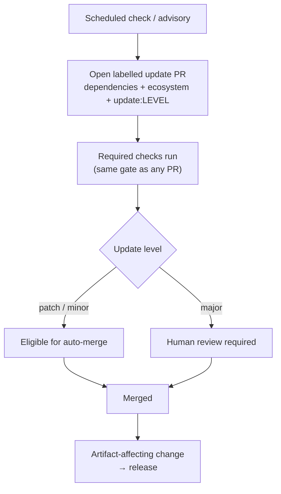

# Dependency Updates — Design

The behaviour in the [spec](spec.md) is delivered by the platform-native updater
([Dependabot](https://docs.github.com/code-security/dependabot)) configured in
`.github/dependabot.yml`, plus a small labelling and auto-merge layer.

## What gets checked

| Kind | Trigger | Cadence |
| --- | --- | --- |
| **Version update** | A newer version of a pin exists | Scheduled (e.g. weekly), with a cooldown before a freshly published version is proposed |
| **Security update** | A published advisory affects a pin | On disclosure, out of band from the schedule |

## The updater

Dependabot opens **one PR per outdated or vulnerable dependency** — or one per
configured **group** of related dependencies — carrying the bump and the
upstream release notes. SHA-pinned dependencies get the new commit SHA with the
version as a trailing comment. Ecosystems, directories, schedule, cooldown,
grouping, and the static labels all live in `.github/dependabot.yml`.

## Labels

Every update PR carries **two independent dimensions**:

| Label | Dimension | Meaning |
| --- | --- | --- |
| `dependencies` | category | Applied to **every** automated update PR. |
| `github-actions` · `docker` · `terraform` · `npm` · `python` · `powershell` | ecosystem | Which ecosystem the update targets. One per PR. |
| `update:major` | update level | The dependency crossed a **major** version — potentially breaking. |
| `update:minor` | update level | The dependency gained a **minor** version — additive. |
| `update:patch` | update level | The dependency took a **patch** — fix-level. |

`dependencies` and the ecosystem label are applied statically by the updater
config. The `update:*` label is derived from the update metadata
(`version-update:semver-{major,minor,patch}`), so it is always accurate to the
actual bump.

### Separation from release versioning

The `update:*` labels **must not** reuse the release-bump labels
(`Major` / `Minor` / `Patch` / `NoRelease`). The two are different dimensions on
the same pull request:

| Dimension | Question | Label set | Owned by |
| --- | --- | --- | --- |
| **Release bump** | How much does *this repository's* version change? | `Major` · `Minor` · `Patch` · `NoRelease` | [Release Management](../release-management/spec.md) |
| **Dependency update level** | How much did the *upstream dependency* change? | `update:major` · `update:minor` · `update:patch` | This capability |

A dependency update is an **artifact-affecting change**, so merging it produces a
release. If the PR carried a `Major` label to describe the *dependency's* jump,
the release workflow would read it as a **major release of this repository** — a
major upstream bump is very often only a patch, or no user-visible change, to the
consuming artifact. So the two coexist: the **release bump** label (default
`Patch`) governs this repository's version and is the label the release workflow
reads; the **`update:*`** label is advisory metadata that drives review routing,
never the bump.

## Update-level policy

| Update level | Handling |
| --- | --- |
| `update:patch`, `update:minor` | Eligible for **auto-merge** once all required checks pass. |
| `update:major` | **Human review required**; never auto-merged. |

Auto-merge is gated on green CI, never a bypass — every update passes the full
check suite before it can merge. A repository may tighten this (require review
for `update:minor` too) but never loosen it to auto-merge `update:major`.

## Security updates

Raised on advisory disclosure, independently of the schedule, and
**prioritised**. They otherwise follow the same labels, the same review policy,
and the same release path as any other update.

## Configuration surface

| Surface | Where |
| --- | --- |
| Ecosystems, directories, schedule, cooldown, grouping | `.github/dependabot.yml` |
| Static labels (`dependencies` + ecosystem) | `.github/dependabot.yml` |
| `update:*` labels | update metadata → labelling step |
| Auto-merge policy | branch protection / auto-merge automation |
| Security updates | repository security settings (on by default) |

## Where this connects

- [Spec](spec.md) — the requirements this design delivers.
- [Release Management](../release-management/design.md) — the release an update PR cuts.
- [Downstream Release Propagation](../downstream-release-propagation/design.md) — the internal counterpart; propagation PRs are dependency updates too.
- [GitHub Actions](../../Coding-Standards/GitHub-Actions.md#keep-pinned-actions-current) — the Action-pin specifics this builds on.
