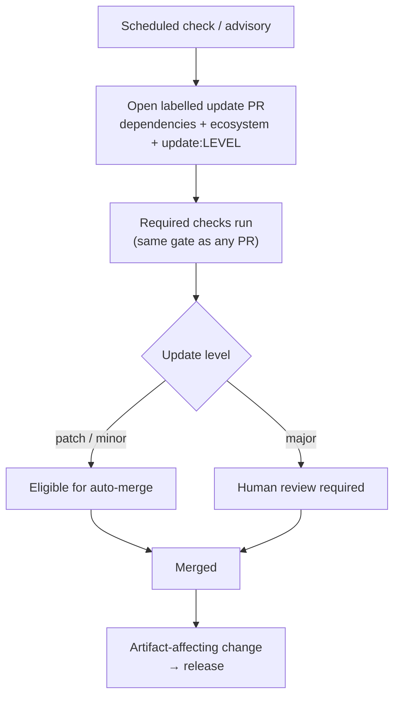
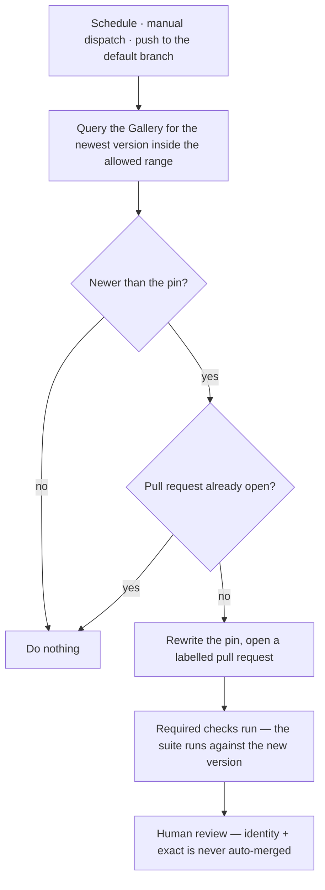

# Dependency Updates — Design

The behaviour in the [spec](spec.md) is delivered by the platform-native updater
([Dependabot](https://docs.github.com/code-security/dependabot)) configured in
`.github/dependabot.yml`, plus a small labelling and auto-merge layer.

## What gets checked

| Kind | Trigger | Cadence |
| --- | --- | --- |
| **Version update** | A newer version of a pin exists | Scheduled (e.g. weekly), with a cooldown before a freshly published version is proposed |
| **Security update** | A published advisory affects a pin | On disclosure, out of band from the schedule |

## The updater

Dependabot opens **one PR per outdated or vulnerable dependency** — or one per
configured **group** of related dependencies — carrying the bump and the
upstream release notes. SHA-pinned dependencies get the new commit SHA with the
version as a trailing comment. Ecosystems, directories, schedule, cooldown,
grouping, and the static labels all live in `.github/dependabot.yml`.

```mermaid
flowchart TD
  check["Scheduled check / advisory"] --> pr["Open labelled update PR<br/>dependencies + ecosystem + update:LEVEL"]
  pr --> ci["Required checks run<br/>(same gate as any PR)"]
  ci --> route{"Update level"}
  route -->|"patch / minor"| auto["Eligible for auto-merge"]
  route -->|"major"| review["Human review required"]
  auto --> merged["Merged"]
  review --> merged
  merged --> release["Artifact-affecting change<br/>→ release"]
```

## Labels

Every update PR carries **two independent dimensions**:

| Label | Dimension | Meaning |
| --- | --- | --- |
| `dependencies` | category | Applied to **every** automated update PR. |
| `github-actions` · `docker` · `terraform` · `npm` · `python` · `powershell` | ecosystem | Which ecosystem the update targets. One per PR. |
| `update:major` | update level | The dependency crossed a **major** version — potentially breaking. |
| `update:minor` | update level | The dependency gained a **minor** version — additive. |
| `update:patch` | update level | The dependency took a **patch** — fix-level. |

`dependencies` and the ecosystem label are applied statically by the updater
config. The `update:*` label is derived from the update metadata
(`version-update:semver-{major,minor,patch}`), so it is always accurate to the
actual bump.

### Separation from release versioning

The `update:*` labels **must not** reuse the release-bump labels
(`Major` / `Minor` / `Patch` / `NoRelease`). The two are different dimensions on
the same pull request:

| Dimension | Question | Label set | Owned by |
| --- | --- | --- | --- |
| **Release bump** | How much does *this repository's* version change? | `Major` · `Minor` · `Patch` · `NoRelease` | [Release Management](../release-management/spec.md) |
| **Dependency update level** | How much did the *upstream dependency* change? | `update:major` · `update:minor` · `update:patch` | This capability |

A dependency update is an **artifact-affecting change**, so merging it produces a
release. If the PR carried a `Major` label to describe the *dependency's* jump,
the release workflow would read it as a **major release of this repository** — a
major upstream bump is very often only a patch, or no user-visible change, to the
consuming artifact. So the two coexist: the **release bump** label (default
`Patch`) governs this repository's version and is the label the release workflow
reads; the **`update:*`** label is advisory metadata that drives review routing,
never the bump.

## Update-level policy

| Update level | Handling |
| --- | --- |
| `update:patch`, `update:minor` | Eligible for **auto-merge** once all required checks pass. |
| `update:major` | **Human review required**; never auto-merged. |

Auto-merge is gated on green CI, never a bypass — every update passes the full
check suite before it can merge. A repository may tighten this (require review
for `update:minor` too) but never loosen it to auto-merge `update:major`.

## Security updates

Raised on advisory disclosure, independently of the schedule, and
**prioritised**. They otherwise follow the same labels, the same review policy,
and the same release path as any other update.

## Configuration surface

| Surface | Where |
| --- | --- |
| Ecosystems, directories, schedule, cooldown, grouping | `.github/dependabot.yml` |
| Static labels (`dependencies` + ecosystem) | `.github/dependabot.yml` |
| `update:*` labels | update metadata → labelling step |
| Auto-merge policy | branch protection / auto-merge automation |
| Security updates | repository security settings (on by default) |

## Ecosystems the platform updater does not cover

Dependabot supports a fixed list of package ecosystems, and the **PowerShell
Gallery is not on it** — there is no `package-ecosystem` value for it, and
Renovate has no Gallery datasource either. This is a gap in the platform, not a
choice this organization made. A repository that pins a Gallery module in CI
therefore gets no update pull request from the updater above, however correctly
it is configured.

That matters because of what [Dependencies](../../Coding-Standards/Dependencies.md#the-balance)
requires: a CI pipeline pins identity plus exact, and *"tight pinning is safe
**because** the updates are automated."* Without automation the same pin becomes
the "too tight" failure — the module keeps shipping fixes the repository never
takes, and the pin that made the build reproducible is what stops it being
patched.

**If Dependabot ever ships a PowerShell Gallery ecosystem, delete this and add a
`package-ecosystem` entry.** The pattern below exists only because the platform
has no answer, and it should not outlive that.

### The pattern

A scheduled workflow that queries the Gallery, rewrites the pin, and opens the
same kind of labelled pull request the updater would:

```mermaid
flowchart TD
  trigger["Schedule · manual dispatch · push to the default branch"] --> query["Query the Gallery for the newest version inside the allowed range"]
  query --> compare{"Newer than the pin?"}
  compare -->|"no"| quiet["Do nothing"]
  compare -->|"yes"| existing{"Pull request already open?"}
  existing -->|"yes"| quiet
  existing -->|"no"| pr["Rewrite the pin, open a labelled pull request"]
  pr --> ci["Required checks run — the suite runs against the new version"]
  ci --> review["Human review — identity + exact is never auto-merged"]
```

Two properties make it trustworthy rather than merely present:

- **It cannot pass without performing the check.** An unreachable Gallery, a pin
  pattern that matches nothing, and a pattern that matches several places are all
  hard failures. Reporting "already up to date" because the lookup broke is the
  exact failure this capability exists to remove.
- **It rewrites only the version.** The identity half of the pin — the module
  `GUID` — is never touched, because identity does not change between versions of
  the same module. The consuming script still verifies it at run time, so an
  identity mismatch fails the test check.

### The schedule can lapse, silently

GitHub disables scheduled workflows automatically: *"In a public repository,
scheduled workflows are automatically disabled when no repository activity has
occurred in 60 days"*
([GitHub docs](https://docs.github.com/en/actions/how-tos/manage-workflow-runs/disable-and-enable-workflows)).
Nothing announces it. **A scheduled workflow that has stopped running looks
exactly like one that ran and found nothing to do** — both are silent.

This is named rather than solved, because a watchdog's own liveness would then
need watching:

- **The evidence is the workflow's run history.** A live updater shows recent
  runs that found nothing; a lapsed one shows no runs since a date. That is the
  one place the two states are distinguishable. Re-enabling is a single action on
  the workflow's page.
- **Recovery is automatic, detection is not.** Adding the default branch's `push`
  event as a second trigger does *not* cover the quiet window — during inactivity
  there are no pushes either. What it guarantees is that the **first push after a
  quiet period re-checks the pin**, which is when a stale pin starts to matter
  again, without anyone remembering that the schedule died.

### Adopting it in another repository

1. Copy the updater script and its workflow.
2. Point the script at the pin: the module name, the file holding it, and a
   pattern with a `version` capture group. The pattern is why the pin can stay
   wherever it already lives — a script parameter default, a data file, a
   workflow input — instead of being moved into a manifest to suit the tooling.
3. Set the allowed range to whatever the consuming code already declares, so the
   updater can never propose a version that code refuses to run under.
4. Ensure the `dependencies`, ecosystem, and `update:*` labels exist in the
   repository; the workflow applies them and label creation is not automatic.
5. Decide the token. The default workflow token is enough, but a pull request it
   opens has its checks held in an approval-required state until someone with
   write access starts them. That is acceptable for an identity-plus-exact pin,
   which is never auto-merged anyway; a GitHub App installation token removes the
   step where it matters.

## Where this connects

- [Spec](spec.md) — the requirements this design delivers.
- [Release Management](../release-management/design.md) — the release an update PR cuts.
- [Downstream Release Propagation](../downstream-release-propagation/design.md) — the internal counterpart; propagation PRs are dependency updates too.
- [GitHub Actions](../../Coding-Standards/GitHub-Actions.md#keep-pinned-actions-current) — the Action-pin specifics this builds on.
