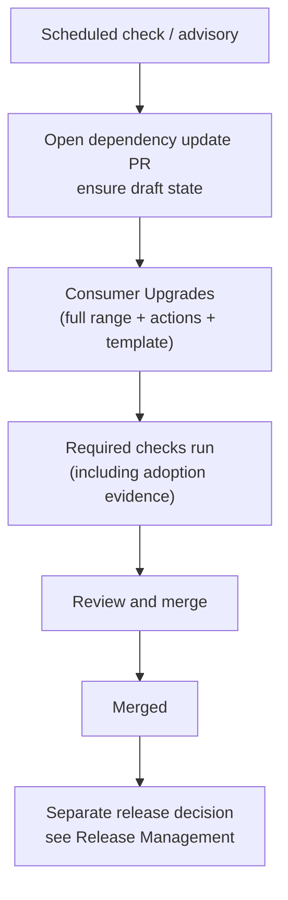

# Dependency Updates — Design

The behaviour in the [spec](spec.md) is delivered by an automated updater
configured in `.github/dependabot.yml`, plus the review and merge controls that
handle its pull requests.

## What gets checked

| Kind | Trigger | Cadence |
| --- | --- | --- |
| **Version update** | A newer version of a pin exists | Scheduled, with a cooldown before a freshly published version is proposed |
| **Security update** | A published advisory affects a pin | On disclosure, out of band from the schedule |

## Coverage from manifests

Which ecosystems are covered is not a judgement call — it is a function of the
files the repository contains. Each ecosystem announces itself with a manifest:

| Ecosystem | Announced by | Coverage path |
| --- | --- | --- |
| GitHub Actions | Workflow and composite-action definitions under `.github/` | Native updater |
| Containers | A container definition or a base-image reference | Native updater |
| Language packages | The ecosystem's manifest and lockfile at the directory root it governs | Native updater when supported |
| Infrastructure definitions | The module or provider constraint file for the tool in use | Native updater when supported |

The organization owns a **native-support catalogue** and an **exception register**.
The catalogue names the ecosystems the platform-native updater supports; generation
emits one updater entry per supported ecosystem and directory. An unsupported
manifest is not forced into an invalid native entry. Instead, it must have an
exception-register entry naming the manifest and directory, why native support is
absent, the responsible owner, and the shared centrally managed mechanism that
checks and proposes updates.

Reconciliation compares every manifest with the generated native configuration and
the exception register. Adding an ecosystem is therefore either the manifest plus
regenerated native configuration, or the manifest plus a central exception request.
A repository never introduces a bespoke updater: the exception consumes a mechanism
operated once for the organization, and remains visible until native support exists.

## Cadence and cooldown

Frequency and the timezone the schedule is expressed in are **organization
configuration**, not constants. A schedule expressed in a timezone nobody works in
lands pull requests outside the hours anyone triages them.

```yaml
schedule:
  interval: cron
  cronjob: "0 9 * * 1,3,5"
  timezone: <the organization's working timezone>
```

The **cooldown** is a deliberate delay between a version's publication and its
proposal. It costs a few days of currency and buys the chance for an upstream project
to withdraw or supersede a bad release before every consumer has a pull request open
against it. Currency is the goal; being first is not.

The organization standard is an implicit **three-day** cooldown for version updates. Repositories omit `cooldown` when they use that standard; an explicit mapping records a deliberate non-default duration.

Security updates ignore both settings. An advisory means the pinned version is known
bad now, and waiting for a schedule window or a cooldown would be waiting on purpose.

## The updater

The updater opens **one PR per outdated or vulnerable dependency**, carrying the
proposed reference change and upstream release context. SHA-pinned dependencies get the new
commit SHA with the version as a trailing comment. Ecosystems, directories, and
schedule live in `.github/dependabot.yml`; a non-default
cooldown belongs there too, while the standard three-day cooldown remains
implicit.


```mermaid
flowchart TD
  check["Scheduled check / advisory"] --> pr["Open dependency update PR<br/>ensure draft state"]
  pr --> adoption["Consumer Upgrades<br/>(full range + actions + template)"]
  adoption --> ci["Required checks run<br/>(including adoption evidence)"]
  ci --> review["Review and merge"]
  review --> merged["Merged"]
  merged --> release["Separate release decision<br/>see Release Management"]
```

### Complete the adoption

The updater's proposal is an input, not proof that the consumer is upgraded.
The author or delegated agent completes
[Consumer Upgrades](../../Ways-of-Working/Consumer-Upgrades.md) in that same
delivery: establish the actual consumed source, fix the proposed target, and
inspect the entire applicable range with full pagination and semantic/lineage
ordering. An embedded newest note does not replace earlier crossed releases.

The procedure owns action composition, target-era template comparison,
preservation of consumer intent, and existing validation, including no-action
ranges. Its reconciled evidence belongs in the update PR. If the updater
omits required context, retrieve equivalent authoritative producer evidence;
otherwise register the gap and keep affected work blocked. This adds an
adoption obligation to the existing review path, not another updater.

### Release decision

Dependency changes are collected before the repository release decision is
made. The repository-wide effect follows [Release
Management](../release-management/design.md).

## Review and merge

Every automated update passes the repository's normal review and required-check
gates, including [complete consumer evidence](../../Ways-of-Working/Definition-of-Ready-and-Done.md#definition-of-ready-for-review).
Required migration work cannot be deferred while merging an incompatible
reference bump. Automatic merge, where configured, never bypasses those gates.

Bind adoption verification to the
[required-check signal](../merge-automation/design.md#the-gate-a-ruleset-requires-the-checks)
before enabling automatic readiness, approval, or merge for update PRs.
An existing required PR validation check can carry this condition; a separate
check is needed only when no existing check owns it. Missing or stale
range/ledger/template evidence keeps the result pending or failed, even when
build and test checks are green. Re-evaluate the result when the candidate or
its required evidence changes.

Create update PRs as drafts. If the native updater cannot do that, the receiving
workflow immediately converts each opened proposal to draft, before requesting
human review. Keep it draft until the normal review-readiness gate, including
adoption verification, holds. The draft flag is the review-handoff signal; it
does not replace the binding required check or protect the creation-to-conversion
window by itself.

Until evidence verification is enforced through the required check, update PRs
remain outside automated readiness, approval, and merge. The platform updater
supplies a proposal; it does not assert that the gate has passed.

## Security updates

Raised on advisory disclosure, independently of the schedule, and
**prioritised**. They otherwise follow the same review policy and release path as
any other update.

## Configuration surface

| Surface | Where | Set by |
| --- | --- | --- |
| Native ecosystems and directories | `.github/dependabot.yml` | Generated from supported manifests |
| Unsupported ecosystems | Central exception register | Centrally managed shared mechanism |
| Schedule (`interval`, `day` and `time`, or `cronjob`) and `timezone` | `.github/dependabot.yml` | Organization configuration |
| Cooldown | Updater default (three days); explicit mapping only for a deliberate non-default duration | Organization configuration |
| Release decision | Release Management | Decided for the collected repository change |
| Merge policy | Branch protection and merge automation | Organization configuration |
| Security updates | Repository security settings | On by default |

Everything marked *generated* is reproducible from the repository, so a difference
between the committed file and a fresh generation is drift. Everything marked
*organization configuration* is a deliberate choice that generation MUST preserve
rather than overwrite.

## Where this connects

- [Spec](spec.md) — the requirements this design delivers.
- [Consumer Upgrades](../../Ways-of-Working/Consumer-Upgrades.md) — the procedure that turns an update proposal into verified adoption.
- [Repository Governance](../repository-governance/design.md#drift-detection-and-reconciliation) — the reconciliation that compares generated configuration against what is committed.
- [Release Management](../release-management/design.md) — the release an update PR cuts.
- [Downstream Release Propagation](../downstream-release-propagation/design.md) — the internal counterpart; propagation PRs are dependency updates too.
- [GitHub Actions](../../Coding-Standards/GitHub-Actions.md#keep-pinned-actions-current) — the Action-pin specifics this builds on.
