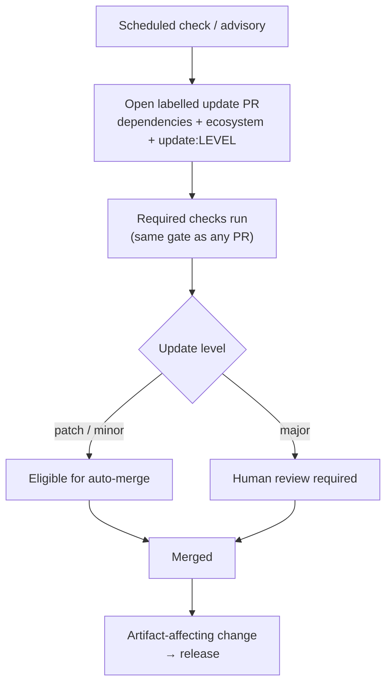

# Dependency Updates — Design

The behaviour in the [spec](spec.md) is delivered by the platform-native updater
([Dependabot](https://docs.github.com/code-security/dependabot)) configured in
`.github/dependabot.yml`, plus a small labelling and auto-merge layer.

## What gets checked

| Kind | Trigger | Cadence |
| --- | --- | --- |
| **Version update** | A newer version of a pin exists | Scheduled, with a cooldown before a freshly published version is proposed |
| **Security update** | A published advisory affects a pin | On disclosure, out of band from the schedule |

## Coverage from manifests

Which ecosystems are covered is not a judgement call — it is a function of the
files the repository contains. Each ecosystem announces itself with a manifest:

| Ecosystem | Announced by | Coverage path |
| --- | --- | --- |
| GitHub Actions | Workflow and composite-action definitions under `.github/` | Native updater |
| Containers | A container definition or a base-image reference | Native updater |
| Language packages | The ecosystem's manifest and lockfile at the directory root it governs | Native updater when supported |
| Infrastructure definitions | The module or provider constraint file for the tool in use | Native updater when supported |

The organization owns a **native-support catalogue** and an **exception register**.
The catalogue names the ecosystems the platform-native updater supports; generation
emits one updater entry per supported ecosystem and directory. An unsupported
manifest is not forced into an invalid native entry. Instead, it must have an
exception-register entry naming the manifest and directory, why native support is
absent, the responsible owner, and the shared centrally managed mechanism that
checks and proposes updates.

Reconciliation compares every manifest with the generated native configuration and
the exception register. Adding an ecosystem is therefore either the manifest plus
regenerated native configuration, or the manifest plus a central exception request.
A repository never introduces a bespoke updater: the exception consumes a mechanism
operated once for the organization, and remains visible until native support exists.

## Cadence and cooldown

Frequency and the timezone the schedule is expressed in are **organization
configuration**, not constants. A schedule expressed in a timezone nobody works in
lands pull requests outside the hours anyone triages them.

```yaml
schedule:
  interval: weekly
  day: monday
  time: "09:00"
  timezone: <the organization's working timezone>
```

The **cooldown** is a deliberate delay between a version's publication and its
proposal. It costs a few days of currency and buys the chance for an upstream project
to withdraw or supersede a bad release before every consumer has a pull request open
against it. Currency is the goal; being first is not.

Security updates ignore both settings. An advisory means the pinned version is known
bad now, and waiting for a schedule window or a cooldown would be waiting on purpose.

## The updater

Dependabot opens **one PR per outdated or vulnerable dependency** — or one per
configured **group** of related dependencies — carrying the bump and the
upstream release notes. SHA-pinned dependencies get the new commit SHA with the
version as a trailing comment. Ecosystems, directories, schedule, cooldown,
grouping, and the static labels all live in `.github/dependabot.yml`.


```mermaid
flowchart TD
  check["Scheduled check / advisory"] --> pr["Open labelled update PR<br/>dependencies + ecosystem + update:LEVEL"]
  pr --> ci["Required checks run<br/>(same gate as any PR)"]
  ci --> route{"Update level"}
  route -->|"patch / minor"| auto["Eligible for auto-merge"]
  route -->|"major"| review["Human review required"]
  auto --> merged["Merged"]
  review --> merged
  merged --> release["Artifact-affecting change<br/>→ release"]
```

## Labels

Every update PR carries **two independent dimensions**:

| Label | Dimension | Meaning |
| --- | --- | --- |
| `dependencies` | category | Applied to **every** automated update PR. |
| `github-actions` · `docker` · `terraform` · `npm` · `python` · `powershell` | ecosystem | Which ecosystem the update targets. One per PR. |
| `update:major` | update level | The dependency crossed a **major** version — potentially breaking. |
| `update:minor` | update level | The dependency gained a **minor** version — additive. |
| `update:patch` | update level | The dependency took a **patch** — fix-level. |

`dependencies` and the ecosystem label are applied statically by the updater
config. The `update:*` label is derived from the update metadata
(`version-update:semver-{major,minor,patch}`), so it is always accurate to the
actual bump.

### Separation from release versioning

Both label sets are namespaced, and they name two different dimensions of the same pull
request. The `update:*` set MUST NOT reuse the `release:*` set, and neither set may use
bare words:

| Dimension | Question | Label set | Owned by |
| --- | --- | --- | --- |
| **Release bump** | How much does *this repository's* version change? | `release:major` · `release:minor` · `release:patch` · `release:none` | [Release Management](../release-management/spec.md) |
| **Dependency update level** | How much did the *upstream dependency* change? | `update:major` · `update:minor` · `update:patch` | This capability |

A dependency update is an **artifact-affecting change**, so merging it produces a
release. If one pull request carried a single `major` label meaning *the dependency's*
jump, the release workflow would read it as a **major release of this repository** — and a
major upstream bump is very often only a patch, or no user-visible change at all, to the
consuming artifact. So the two coexist: the **`release:*`** label governs this
repository's version and is the label the release workflow reads; the **`update:*`** label
is advisory metadata that drives review routing, never the bump.

Namespacing both sides is what makes this hold in practice rather than by convention.
Hosted Dependabot applies a SemVer label to its own pull requests **when a repository has
labels named `major`, `minor`, or `patch`** — it matches on those bare words. Had the
release set kept the bare vocabulary, every Dependabot pull request would arrive with the
repository's own version decision pre-set by a bot, describing the upstream bump. Because
no bare label exists, Dependabot finds nothing to apply, and a dependency pull request is
release-safe by default: it carries an accurate `update:*` level and no release decision
until a maintainer makes one.

The `skip-release` workaround sometimes suggested for this is a **no-op on hosted
Dependabot**; the labelling behavior cannot be configured from the repository. Which label
names exist is the only control, which is why both dimensions are namespaced.

## Grouping

Grouping trades review granularity for review cost, and the trade is only worth
making where the granularity carries no information:

| Group | Contents | Rationale |
| --- | --- | --- |
| Per-ecosystem minor and patch | Every minor and patch update within one ecosystem, in one pull request | Twelve patch bumps reviewed separately cost twelve reviews and reveal no more than one |
| Isolated major | One pull request per major update | This is the diff a reviewer has to read; batching it hides it |

A group MUST NOT span ecosystems. Reviewing an ecosystem's updates requires knowing
that ecosystem's conventions, and a pull request mixing several leaves no reviewer
qualified for the whole diff.

Grouping also bounds the blast radius of a failure. When a grouped pull request goes
red, the failure is attributable to one ecosystem; when a cross-ecosystem batch goes
red, isolating the cause means splitting the pull request by hand.

## Review posture

| Update level | Handling |
| --- | --- |
| `update:patch`, `update:minor` | Eligible for **automatic merge** once every required check passes. |
| `update:major` | **Human review required**; never merged automatically. |

The asymmetry follows [SemVer](https://semver.org/): a minor or patch release
promises compatibility, so passing checks is evidence enough, and a human reading the
diff adds ceremony rather than information. A major release promises nothing, so the
checks cannot substitute for reading it.

Automatic merge is gated on green checks, never a bypass — every update passes the
full suite before it can merge. A repository MAY tighten this (requiring review for
`update:minor` too) and MUST NOT loosen it to merge `update:major` automatically.

## Security updates

Raised on advisory disclosure, independently of the schedule, and
**prioritised**. They otherwise follow the same labels, the same review policy,
and the same release path as any other update.

## Configuration surface

| Surface | Where | Set by |
| --- | --- | --- |
| Native ecosystems and directories | `.github/dependabot.yml` | Generated from supported manifests |
| Unsupported ecosystems | Central exception register | Centrally managed shared mechanism |
| Schedule interval, day, time, timezone | `.github/dependabot.yml` | Organization configuration |
| Cooldown | `.github/dependabot.yml` | Organization configuration |
| Grouping | `.github/dependabot.yml` | Generated: per-ecosystem minor/patch groups, majors isolated |
| Static labels (`dependencies` + ecosystem) | `.github/dependabot.yml` | Generated |
| `update:*` labels | Update metadata → labelling step | Derived per pull request |
| Automatic-merge policy | Branch protection and merge automation | Organization configuration |
| Security updates | Repository security settings | On by default |

Everything marked *generated* is reproducible from the repository, so a difference
between the committed file and a fresh generation is drift. Everything marked
*organization configuration* is a deliberate choice that generation MUST preserve
rather than overwrite.

## Where this connects

- [Spec](spec.md) — the requirements this design delivers.
- [Automation Labels](../../Ways-of-Working/Automation-Labels.md) — the ownership and namespacing rules the label scheme follows.
- [Repository Governance](../repository-governance/design.md#drift-detection-and-reconciliation) — the reconciliation that compares generated configuration against what is committed.
- [Release Management](../release-management/design.md) — the release an update PR cuts.
- [Downstream Release Propagation](../downstream-release-propagation/design.md) — the internal counterpart; propagation PRs are dependency updates too.
- [GitHub Actions](../../Coding-Standards/GitHub-Actions.md#keep-pinned-actions-current) — the Action-pin specifics this builds on.
