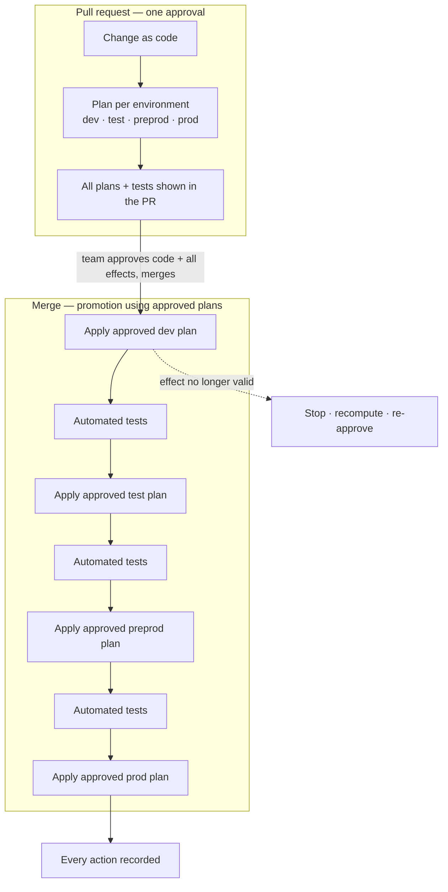

# Deploying Azure from GitHub

This design delivers the [Deployment spec](../spec.md) for one combination:
**Azure** (including Microsoft Entra ID) as the service provider and **GitHub**
as the CI/CD platform, with **Terraform (open source)** as the change
engine. The computed effect the spec speaks of is a **saved Terraform plan**;
the record of state is a remote Terraform state per environment.

Another design covers another combination — deploying Azure from Azure DevOps,
deploying AWS from GitHub, deploying GitHub from GitHub — without changing the
spec.

## Approach

A change is proposed as a pull request. On the pull request the process computes
the effect for **every environment in the promotion path** and shows them all;
approving and merging the pull request is the single approval of the code change
together with all of those effects ([FR2](../spec.md#fr2), [FR3](../spec.md#fr3)).
The merge then runs the promotion, deploying to each environment in order using
the **exact plans that were approved** ([FR4](../spec.md#fr4)), running tests
between environments ([FR7](../spec.md#fr7)) and recording every action
([FR9](../spec.md#fr9)).



### Why this shape

- **One approval for the whole path.** Because the reviewer sees the effect on
  every environment, a single approval is sufficient; the design adds no
  per-environment reviewer gate, matching the spec's non-goal.
- **Approved plans, not re-derived ones.** The saved plans reviewed on the pull
  request are the artifacts the promotion applies. This trades the convenience of
  re-planning at deploy time for the guarantee the spec requires — the deployed
  effect equals the approved effect.

### Alternatives considered

- **Re-plan at deploy.** Rejected: the deploy would compute its own effect, which
  can differ from the approved one — it fails [FR4](../spec.md#fr4).
- **Approve only the source diff, plan at deploy.** Rejected: the reviewer never
  sees the effect, failing [FR2](../spec.md#fr2)–[FR3](../spec.md#fr3).
- **A required-reviewer gate on each environment.** Rejected as redundant: the
  effects for all environments are already approved together; extra gates add
  friction without adding a decision.

## Components

| Component | Role |
| --- | --- |
| **Reusable workflow** (`.github/workflows/terraform.yml`, `workflow_call`) | The provider-agnostic core: init, format, validate, plan, render, policy scan, test, apply. |
| **Plan (pull-request) workflow** | For every environment in the path, computes `plan -out`, renders it into the pull request, scans it, and uploads it as the approved artifact. |
| **Promotion (merge) workflow** | Walks the environments in order, applying each approved plan and running tests between them. |
| **Azure identity step** | `azure/login` federated sign-in; sets `ARM_USE_OIDC=true` so the `azurerm` and `azuread` providers use the same token. |
| **State backend** | Azure Storage per environment, with blob-lease locking and encryption at rest — the record of state. |
| **Environments** | GitHub Environments per environment name — the per-environment **identity boundary** and deployment branch policy (not an approval gate). |
| **Break-glass workflow** (`workflow_dispatch`) | The emergency path. |
| **Drift job** (`schedule`) | Periodic `plan -detailed-exitcode` that opens an issue on drift. |

## The effect is a saved plan

Terraform's saved plan is what makes "approve the effect, then apply exactly it"
concrete:

1. `terraform plan -out=tfplan.<env>` computes the effect against that
   environment's state and writes it to a file that pins provider versions and
   the state's **serial** and **lineage**.
2. `terraform show` renders it for humans (pull-request comment) and as JSON for
   policy scanning; `sha256(tfplan.<env>)` is recorded.
3. `terraform apply tfplan.<env>` carries out **exactly** that effect, and
   refuses with `Saved plan is stale` if the state advanced — the native backstop
   for [FR5](../spec.md#fr5).

## Review and approval

The pull-request workflow computes a plan for **each** environment in the
promotion path and makes all of them visible in the pull request, alongside
format, validation, policy, and test results. These are **required checks**, so a
change cannot merge unless every environment's effect computed successfully. A
branch ruleset on `main` requires review (CODEOWNERS for `**/*.tf`), dismisses
stale approvals on new commits, and requires branches to be up to date — so the
shown effects reflect current `main`. Approving and merging is the single
approval the spec requires ([FR3](../spec.md#fr3)); the approved plan artifacts
are retained for the promotion.

## Promotion using the approved plans

On merge, the promotion workflow retrieves the plan artifacts approved on the
pull request (keyed to the merge commit) and, for each environment in order:

1. **Verifies** `sha256(tfplan.<env>)` against the value recorded at plan time,
   defeating artifact swap.
2. **Applies** `terraform apply tfplan.<env>` — exactly the approved effect
   ([FR4](../spec.md#fr4)). If the plan is stale, the apply fails closed and the
   promotion stops; a fresh plan is produced and re-approved
   ([FR5](../spec.md#fr5)).
3. **Tests** — runs the environment's automated tests; a failing required test
   stops the promotion before the next environment ([FR7](../spec.md#fr7)).

Deployments against the same state are **serialised** by a concurrency group
keyed per state with `cancel-in-progress: false`, backed by the state lock, and
an in-flight apply is never cancelled ([FR6](../spec.md#fr6)).

## Identity and access (OIDC)

- The workflow requests the GitHub OIDC token with `permissions: id-token: write`;
  `azure/login` federates on it using the non-secret `client-id`, `tenant-id`,
  and `subscription-id` — no client secret exists ([NFR1](../spec.md#nfr1)).
- Azure federated credentials pin the subject claim
  `repo:MSXOrg/Platform:environment:<env>`, binding identity to the environment
  ([NFR3](../spec.md#nfr3)).
- Two identities per environment: **read-only** for computing the effect and
  **write** for applying it, the write identity reachable only from that
  environment ([NFR2](../spec.md#nfr2)).
- Entra ID resources use the `azuread` provider on the same federated token —
  Entra rides the Azure identity context, no separate secret. Managing GitHub
  itself uses the `github` provider with a GitHub App installation token, never a
  personal access token.

## Break-glass path

The emergency path ([FR8](../spec.md#fr8)) is a `workflow_dispatch` "emergency
deploy" with required inputs `reason`, `incident_id`, target environment, and a
typed confirmation, restricted to authorised operators. It still runs
`plan -out` then `apply tfplan`, so the effect is shown before it deploys; it
records the inputs and logs as an immutable run record, and opens a follow-up
issue to bring the change back through the standard pull-request path. There is
no flag on the standard workflow that skips review.

## Records and drift

Every run's rendered plans, apply logs, and test results are retained as run
artifacts and logs, and each apply is recorded in the environment's deployment
history — the audit trail for [FR9](../spec.md#fr9)/[NFR4](../spec.md#nfr4). A
scheduled `plan -detailed-exitcode` job detects drift and opens an issue
([FR10](../spec.md#fr10)).

## Interface

```yaml
# .github/workflows/terraform.yml (reusable — workflow_call)
on:
  workflow_call:
    inputs:
      environment:        { type: string, required: true }   # dev | test | preprod | prod
      working-directory:  { type: string, required: true }
      action:             { type: string, default: plan }    # plan | apply
      terraform-version:  { type: string, default: "1.9.x" }
```

The core is provider-agnostic; the Azure sign-in is the single service-provider
step. A different service provider (AWS) or CI/CD platform (Azure DevOps)
reuses this design's shape with its own identity step and is documented as its
own design under [Deployment](../index.md).

## Security boundaries and threats

- **Credential exposure** — OIDC only; no static cloud secret exists, and the
  default token is read-only.
- **Plan artifact confidentiality** — a saved plan can contain sensitive values
  in plaintext. Retention is short, artifacts are restricted, sensitive variables
  and outputs are marked, and pull-request comments carry scrubbed renders; on a
  public repository plan artifacts are never exposed unscrubbed.
- **Artifact swap** — each apply verifies `sha256(tfplan.<env>)` before applying.
- **Cross-environment escalation** — federated subjects are pinned per
  environment; the write identity is reachable only from its environment.
- **Stale apply** — Terraform's serial/lineage guard, plus serialisation and
  branch-freshness rules.

## Testing and operability

- **Dry run** the full path on `dev`: pull-request plans for every environment,
  review, merge, promotion with tests.
- **Exercise the stale path** by mutating state between approval and deploy and
  confirming the apply fails closed.
- **Exercise break-glass** end-to-end and confirm the reconciliation follow-up is
  opened and attribution is recorded.

## Repository hardening

Third-party actions are pinned to commit SHAs; allowed actions are restricted;
secret scanning with push protection is enabled as defence in depth even under an
OIDC model.

## Decisions

One-way-door decisions are recorded here beside the spec, per
[Decision before change](../../../Ways-of-Working/Principles/AI-First-Development.md#decision-before-change).

- **Approve every environment's effect on the pull request; apply those exact
  saved plans on merge.** Chosen over re-plan-at-deploy (does not apply the
  approved effect) and per-environment gates (redundant given the effects are
  already approved together). Revisit only if a saved plan can no longer be the
  review-to-deploy contract.

## References

- GitHub — security hardening with OpenID Connect: <https://docs.github.com/en/actions/security-for-github-actions/security-hardening-your-deployments/about-security-hardening-with-openid-connect>
- GitHub — configuring OIDC in Azure: <https://docs.github.com/en/actions/security-for-github-actions/security-hardening-your-deployments/configuring-openid-connect-in-azure>
- GitHub — managing environments: <https://docs.github.com/en/actions/how-tos/deploy/configure-and-manage-deployments/manage-environments>
- GitHub — reusing workflows: <https://docs.github.com/en/actions/using-workflows/reusing-workflows>
- GitHub — control concurrency: <https://docs.github.com/en/actions/using-jobs/using-concurrency>
- HashiCorp — automate Terraform with GitHub Actions: <https://developer.hashicorp.com/terraform/tutorials/automation/github-actions>
- HashiCorp — `terraform plan` / `terraform apply` (saved plan): <https://developer.hashicorp.com/terraform/cli/commands/plan> · <https://developer.hashicorp.com/terraform/cli/commands/apply>
- Terraform AzureRM provider — OIDC: <https://registry.terraform.io/providers/hashicorp/azurerm/latest/docs/guides/service_principal_oidc>
- Azure — `azure/login`: <https://github.com/Azure/login>
- Microsoft — GitHub Actions + Terraform OIDC on Azure sample: <https://learn.microsoft.com/en-us/samples/azure-samples/github-terraform-oidc-ci-cd/github-terraform-oidc-ci-cd/>
