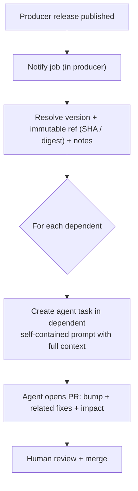

# Downstream Release Propagation — Design

The notification runs in the **producer** when a release is cut. It resolves the
release coordinates, builds a self-contained prompt per dependent, and delegates
the change to a cloud agent **in the dependent** via the
[Agent Tasks API](https://docs.github.com/rest/agent-tasks/agent-tasks). The
brief travels entirely in the prompt; the agent opens the pull request directly.

## Trigger model

**The `GITHUB_TOKEN` constraint.** GitHub does not start new workflow runs from
events raised by the default `GITHUB_TOKEN` (an anti-recursion safeguard). So if
the producer publishes its release with `GITHUB_TOKEN` — the default — the
`release: published` event never fires, and a separate `on: release` workflow
never runs.

| Release created by | `release: published` fires? | Trigger model |
| --- | --- | --- |
| `GITHUB_TOKEN` (default) | No | **Inline** — run notification in the same release run (`needs: <release-job>`) or via `workflow_call`. |
| A PAT | Yes | Either — a separate `on: release` workflow, or inline. |

**Default to the inline model:** it works regardless of release identity and
keeps the release and its propagation in one observable run. Verify the identity
by which token the release step passes; if it is `GITHUB_TOKEN`, inline is
mandatory. Provide two entry points: the **release** stage (gated to stable
releases), and a **`workflow_dispatch`** taking the release tag, for backfill.

## Release coordinate resolution

| Coordinate | Meaning |
| --- | --- |
| `version` | Human-readable version — travels only as a tag / trailing comment |
| immutable ref | The commit SHA (pinned-reference) or image digest (published-artifact) that dependents pin to |
| `release_notes` | The producer's release body, embedded verbatim in the prompt |

## Agent prompt context

The prompt is the context handoff. Each embeds: an **action-oriented summary**;
the **exact target reference** the PR must produce
(`uses: org/<producer>@<sha> # <version>`, or the image tag/digest); the
**release notes** verbatim; and
**related-change context** — new or renamed config keys, new environment
variables or secrets, required infrastructure changes, migrations, changed
defaults, or breaking changes. It is assembled in code and is the single source
of truth for the change.

## Delegation

The delegation step creates an agent task in the dependent carrying the prompt
and the instruction to open the PR, then polls until the task reaches `queued`,
`in_progress`, or `completed` (a fast task may go straight to `completed`). It
**fails** only if the task cannot be created or lands in `failed`, `timed_out`,
or `cancelled`. Fan-out is a **matrix** of dependents (pinned-reference shape) or
a single configured `notify_repo` (published-artifact shape), with
`fail-fast: false` so one dependent's failure does not stop the rest.

## Agent instructions

The agent is told to: **apply the bump** (every matching reference, bringing any
mutable-tag pins into SHA-pinned compliance); **apply the related changes it can
make safely**; **call out** larger or riskier work under a follow-up section
rather than forcing it into the bump; **summarise impact** in the PR body; and
**open the pull request**.

## Permissions and credentials

`GITHUB_TOKEN` is unsuitable for three independent reasons: it cannot act across
repositories, it is not the user-to-server token the Agent Tasks API requires,
and a release it publishes cannot trigger a `release:` workflow. So the job:

- Declares **least-privilege** `permissions:` (`contents: read` suffices).
- Uses `PROPAGATION_TOKEN` — a user PAT carrying the **Agent tasks** permission,
  an org secret scoped to only the dependents that need it. Because the agent
  commits and opens the PR within its task session, the token does not itself
  push or open PRs.
- Passes the secret **explicitly by name** when the notification is a reusable
  workflow — never `secrets: inherit`, per the
  [GitHub Actions coding standard](../../Coding-Standards/GitHub-Actions.md).

## Failure behaviour

| Condition | Behaviour |
| --- | --- |
| Task not created (missing permission / capability off) | Step **fails** with the error; re-run via `workflow_dispatch`. |
| Task lands in a failed / timed-out / cancelled state | Step **fails** with the reported state. |
| One dependent's leg fails | Fails independently (`fail-fast: false`); others proceed. |
| Prerelease published | Propagation is skipped. |

## Where this connects

- [Spec](spec.md) — the requirements this design delivers.
- [Release Management](../release-management/design.md) — produces the release and note this consumes.
- [GitHub Actions](../../Coding-Standards/GitHub-Actions.md) — SHA pinning, least-privilege permissions, explicit secret passing.
- [Security](../../Coding-Standards/Security.md#supply-chain) — the supply-chain rationale for immutable references.
