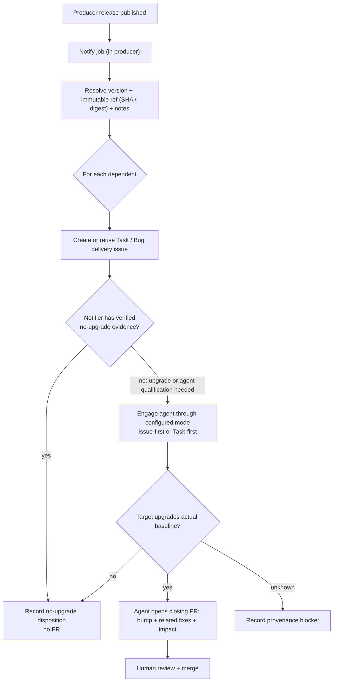

# Downstream Release Propagation — Design

The notification runs in the **producer** when a release is cut. The notifier
resolves the release coordinates, creates or reuses the dependent's Task or Bug,
and builds its self-contained brief. If authoritative consumer evidence already
establishes a no-upgrade outcome, it records that outcome without engaging an
agent. Otherwise, the configured [delegation mode](#delegation) engages a cloud
agent **in the dependent**, where qualification precedes Build. A needed
upgrade produces a PR closing that one delivery leaf; no-upgrade outcomes
create no PR.

```mermaid
flowchart TD
  rel["Producer release published"] --> notify["Notify job (in producer)"]
  notify --> resolve["Resolve version + immutable ref (SHA / digest) + notes"]
  resolve --> fan{"For each dependent"}
  fan --> issue["Create or reuse Task / Bug delivery issue"]
  issue --> known{"Notifier has verified<br/>no-upgrade evidence?"}
  known -->|"yes"| nochange["Record no-upgrade disposition<br/>no PR"]
  known -->|"no: upgrade or agent qualification needed"| delegate["Engage agent through configured mode<br/>Issue-first or Task-first"]
  delegate --> qualify{"Target upgrades actual baseline?"}
  qualify -->|"yes"| pr["Agent opens closing PR: bump + related fixes + impact"]
  qualify -->|"no"| nochange
  qualify -->|"unknown"| blocked["Record provenance blocker"]
  pr --> review["Human review + merge"]
```

## Trigger model

**The `GITHUB_TOKEN` constraint.** GitHub does not start new workflow runs from
events raised by the default `GITHUB_TOKEN` (an anti-recursion safeguard). So if
the producer publishes its release with `GITHUB_TOKEN` — the default — the
`release: published` event never fires, and a separate `on: release` workflow
never runs.

| Release created by | `release: published` fires? | Trigger model |
| --- | --- | --- |
| `GITHUB_TOKEN` (default) | No | **Inline** — run notification in the same release run (`needs: <release-job>`) or via `workflow_call`. |
| A PAT | Yes | Either — a separate `on: release` workflow, or inline. |

**Default to the inline model:** it works regardless of release identity and
keeps the release and its propagation in one observable run. Verify the identity
by which token the release step passes; if it is `GITHUB_TOKEN`, inline is
mandatory. Provide two entry points: the **release** stage (gated to stable
releases), and a **`workflow_dispatch`** taking the release tag, for backfill.

## Release coordinate resolution

| Coordinate | Meaning |
| --- | --- |
| `version` | The fixed propagated upstream target, distinct from the dependent's own package version |
| immutable ref | The commit SHA (pinned-reference) or image digest (published-artifact) that dependents pin to |
| `release_notes` | The complete source-bound release body and publication envelope, embedded verbatim in the prompt |
| Evidence sources | Authoritative producer sources for version/source mapping, fully paginated release history, target-era documentation, and the recorded immutable compatible template where applicable |

The stable event or explicit backfill fixes the target once. A later release
does not change it. The dependent still establishes whether that target is an
upgrade from its actual baseline; an old notification never authorizes a
downgrade. Automatic propagation remains stable-only even though the common
consumer procedure also supports explicitly requested prerelease upgrades.

## Agent prompt context

The prompt is the context handoff. Each embeds: an **action-oriented summary**;
the **exact target reference** the PR must produce
(`uses: org/<producer>@<sha> # <version>`, or the image tag/digest); the
**release notes** verbatim; and
**related-change context** — new or renamed config keys, new environment
variables or secrets, required infrastructure changes, migrations, changed
defaults, or breaking changes. It also links the producer-owned evidence sources
and [Consumer Upgrades](../../Ways-of-Working/Consumer-Upgrades.md).

The prompt transports context; it does not replace the authoritative release
records or the dependent's baseline investigation. Its summary cannot truncate
the complete received note, and receiving that note does not prove that the
dependent inspected its full crossed range. Historical and prerelease evidence
stays bound to the corresponding immutable source, not today's final PR body,
docs, or template.

## Adoption qualification

Qualify the target through [Consumer Upgrades](../../Ways-of-Working/Consumer-Upgrades.md)
before entering Build or opening a PR. When the notifier already has
authoritative consumer provenance, it can qualify before delegation. Otherwise
the delegated agent begins with read-only qualification in the delivery issue;
it does not infer the baseline from a floating alias's current destination.
Unknown provenance blocks qualification rather than producing a no-upgrade
result.

An identical baseline/target version and immutable identity records
**already current**; a lower target records **superseded, no downgrade**.
Apply the common procedure's
[no-upgrade issue disposition](../../Ways-of-Working/Consumer-Upgrades.md#stage-2-fix-the-target-and-release-path):
retain comparison evidence, create no empty PR, and close only an unneeded open
leaf as not planned. Existing PR work or unmet local criteria are reconciled
with the owner, not silently canceled.

## Delegation

Two delegation modes can carry the request into the dependent. Both consume
the Task or Bug created or reused by the notifier before qualification. A
needed repository change enters Build only after that leaf satisfies the
[Definition of Ready](../../Ways-of-Working/Definition-of-Ready-and-Done.md#delivery-leaf-readiness).

| | **Task-first** | **Issue-first** |
| --- | --- | --- |
| The request is | an agent task created after its delivery leaf exists | an issue in the dependent, which the agent picks up |
| The agent produces | an upgrade PR closing the leaf, or the qualified no-upgrade outcome | an upgrade PR closing the issue, or the qualified no-upgrade outcome |
| Idempotency key | the delivery issue — one per producer version per dependent | the issue itself — one issue per producer version per dependent |
| Visible before the agent starts | the delivery issue and task state | the issue |
| Suits | immediate execution after the delivery leaf is ready | propagation that needs triage, discussion, or scheduling before work starts |

**Issue-first is the default:** the delivery issue itself is the request, with
the target and required evidence recorded by the notifier. The configured
issue pickup mechanism engages the agent; no direct Agent Task creation is
required. Qualification establishes whether delivery is needed and refines independently
verifiable acceptance criteria and an executable local plan before Build.
For a needed upgrade, the agent opens a pull request closing exactly that issue.
Idempotency is by **existence**: the issue is the durable record that this version
was propagated, so a repeat run finds and reuses it.

**Task-first** creates a task through the
[Agent Tasks API](https://docs.github.com/rest/agent-tasks/agent-tasks), only after
the same Task or Bug delivery issue exists. The task carries the issue number
and instruction to qualify the upgrade before creating a closing PR, then is
polled until it reaches `queued`, `in_progress`, or
`completed` (a fast task may go straight to `completed`). It fails only if the
task cannot be created or lands in `failed`, `timed_out`, or `cancelled`. An agent
task is execution state, not a delivery record; it never authorizes a standalone
delivery pull request.

Either way the model is chosen per producer, not per release, so a dependent
receives propagation in one consistent shape.

Fan-out is a **matrix** of dependents (pinned-reference shape) or a single
configured `notify_repo` (published-artifact shape), with `fail-fast: false` so
one dependent's failure does not stop the rest.

## Agent instructions

The agent is given the same instructions under either delegation model:

- **Qualify first.** Follow [Adoption qualification](#adoption-qualification);
  a proven no-upgrade outcome ends without a PR, and an unknown baseline blocks.
- **Follow [Consumer Upgrades](../../Ways-of-Working/Consumer-Upgrades.md).**
  Establish each actual consumed baseline, inspect the complete applicable
  range to the provided target, and reconcile the action ledger and immutable
  target-template comparison. The received newest note is not the range.
- **Apply the verified adoption.** Update matching in-scope references under the
  applicable pinning policy, preserve consumer-owned content and configuration
  intent, and run existing relevant validation against the exact target source.
- **Block required gaps.** Register missing evidence or larger required work
  with its owner and keep affected adoption blocked. Only genuinely independent
  work can move to a follow-up without blocking this upgrade.
- **Retain the procedure's evidence** in the PR body: exact range and refs,
  release records, reconciled completed/not-applicable actions, template
  differences, outcomes, and blockers, including explicit no-action results.
- **For a needed upgrade, open the pull request** — closing exactly the Task or Bug delivery leaf
  created or reused for this producer version, and staying draft until the
  [review-readiness gate](../../Ways-of-Working/Definition-of-Ready-and-Done.md#definition-of-ready-for-review)
  holds.

## Permissions and credentials

`GITHUB_TOKEN` cannot act across repositories, and a release it publishes cannot
trigger a separate `release:` workflow. Task-first additionally needs the
user-to-server credential accepted by the Agent Tasks API. So the job:

- Declares **least-privilege** `permissions:` (`contents: read` suffices).
- Uses `PROPAGATION_TOKEN`, scoped only to the dependents that need it, with
  **Issues: write** for creating and maintaining delivery issues and the
  permissions required by the configured delegation mode. Task-first uses a
  user PAT with the **Agent tasks** permission; Issue-first uses the issue
  pickup mechanism rather than unconditionally creating an Agent Task. The
  agent commits and opens the PR in its own session, so the notification
  credential does not itself push or open PRs.
- Passes the secret **explicitly by name** when the notification is a reusable
  workflow — never `secrets: inherit`, per the
  [GitHub Actions coding standard](../../Coding-Standards/GitHub-Actions.md).

## Failure behaviour

| Condition | Behaviour |
| --- | --- |
| Delegation not created (missing permission / capability off) | Step **fails** with the error; re-run via `workflow_dispatch`. |
| This version already propagated to this dependent | Step **succeeds**, reporting the existing delivery issue and pull request if one exists; no duplicate is created. |
| Task lands in a failed / timed-out / cancelled state | Step **fails** with the reported state. |
| One dependent's leg fails | Fails independently (`fail-fast: false`); others proceed. |
| Prerelease published | Propagation is skipped. |
| Required consumer provenance, release/action evidence, or applicable template compatibility is missing | Affected consumer work is blocked with a linked owning gap; other dependents can proceed. |
| Target matches the proven baseline or is below it | Record the no-upgrade outcome and apply the [delivery-issue disposition](#adoption-qualification); no empty PR or downgrade. |

Notification success and consumer completion are separate outcomes. Reusing an
issue or successfully delegating work does not mean the consumer has passed
review, merged, or met its applicable
[publication and template completion obligations](../../Ways-of-Working/Definition-of-Ready-and-Done.md#repository-delivery-leaf).

## Where this connects

- [Spec](spec.md) — the requirements this design delivers.
- [Consumer Upgrades](../../Ways-of-Working/Consumer-Upgrades.md) — the complete-range adoption procedure used by each dependent.
- [Release Management](../release-management/design.md) — produces the release and note this consumes.
- [GitHub Actions](../../Coding-Standards/GitHub-Actions.md) — SHA pinning, least-privilege permissions, explicit secret passing.
- [Security](../../Coding-Standards/Security.md#supply-chain) — the supply-chain rationale for immutable references.
- [PR Format](../../Ways-of-Working/PR-Format.md) — the delivery-leaf closure contract used by the agent.
