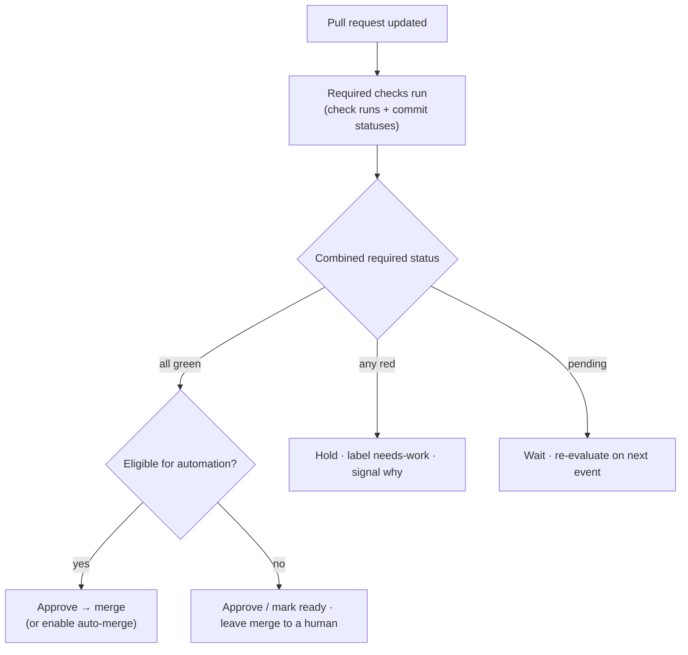

# Merge Automation — Design

The behaviour in the [spec](spec.md) is delivered by three parts that already
exist on the GitHub platform: the **named checks** a workflow publishes, a
repository **ruleset** that requires them, and a **GitHub App** that reads the
combined result and acts. No part judges the diff — the checks are the decision.

## How a check reaches the pull request

Two mechanisms put a named check on a pull request, and a ruleset can require
either by its name or context:

| Mechanism | How it appears | Permission | Use it for |
| --- | --- | --- | --- |
| **Check run** | The job name, emitted automatically by Actions for every job | None beyond running the workflow | A signal that is one of the workflow's own jobs |
| **Commit status** | A context posted to the head commit via the [Status API](https://docs.github.com/rest/commits/statuses) | `statuses: write` | A signal that is not a whole job, or comes from outside Actions — an external CI system, or a tool that reports its own status |

The default is a check run: name the job and the check exists for free. Reach for
a commit status only when the signal is not a whole job — a per-linter status, an
external system's result. Authoring both is covered in
[Gate merges with a named status check](../../Coding-Standards/GitHub-Actions.md#gate-merges-with-a-named-status-check).

## The gate: a ruleset requires the checks

A repository **ruleset** (or branch protection) names the required checks. This
is what makes the signal binding: an unlisted check is advisory, a listed one
holds the pull request until it is green. The required-check name and the
job or status context that produces it are one contract — change one, change the
other in the same change.

## The automation

A **GitHub App** (or equivalent automation) is the actor. It subscribes to the
`check_suite`, `check_run`, and `status` webhook events — or reads the combined
status for the head commit — and evaluates whether every required context is
successful. It then acts on the signal alone:

| Combined required status | Action |
| --- | --- |
| **All green** | Eligible pull request → approve and merge (or enable native auto-merge). Ineligible → approve or mark ready, and leave the merge to a human. |
| **Any red** | Hold. Surface why on the pull request (a label such as `needs-work`, or a comment). Never merge. |
| **Any pending** | Wait. Re-evaluate on the next check event. |

## Eligibility

Which pull requests may merge without a human mirrors the
[dependency-update policy](../dependency-updates/design.md#update-level-policy):
low-risk, well-labelled changes are eligible; anything that can break consumers,
or that policy marks for review, needs a human approval even on green. The
eligible set is configuration, and it only ever **tightens** the gate —
automation never merges something a human review would have held.

## Prefer native auto-merge

Where possible the app **enables GitHub's own auto-merge** rather than calling the
merge API itself. GitHub then merges the moment the required checks pass, and
holds if any fails — the same gate, enforced by the platform. The app needs only
`pull-requests: write` to enable auto-merge and to approve; it never needs
`contents: write` to push a merge, which keeps its blast radius small.

## Least-privilege permissions

The automation carries only what it uses:

| Scope | Why |
| --- | --- |
| `checks: read`, `statuses: read` | Read the required-check results. |
| `pull-requests: write` | Submit the approving review, enable auto-merge, apply labels. |
| `contents: write` | **Only** if the app performs the merge itself instead of native auto-merge — avoid when native auto-merge suffices. |

A GitHub App's approving review counts toward required approvals the same as a
person's. If the ruleset requires a review from a code owner, the app must be
listed as a code owner for its approval to satisfy that rule — scope the app's
approval to the eligible set the ruleset actually lets it satisfy.

## Configuration surface

| Surface | Where |
| --- | --- |
| Which checks gate merge | Repository ruleset — required status checks |
| The check names / contexts | The workflows that publish them (job names / status contexts) |
| The eligible set (what may auto-merge) | The automation's configuration (labels / rules) |
| The actor's permissions | The GitHub App installation scopes |

## Where this connects

- [Spec](spec.md) — the requirements this design delivers.
- [GitHub Actions](../../Coding-Standards/GitHub-Actions.md#gate-merges-with-a-named-status-check) — authoring the named checks this consumes.
- [Dependency Updates](../dependency-updates/design.md) — the auto-merge policy this generalises; dependency update PRs are the canonical eligible set.
- [Release Management](../release-management/design.md) — the release a merge triggers.
- [Branching and Merging](../../Ways-of-Working/Branching-and-Merging.md) — pull-request-only integration and readable history.
