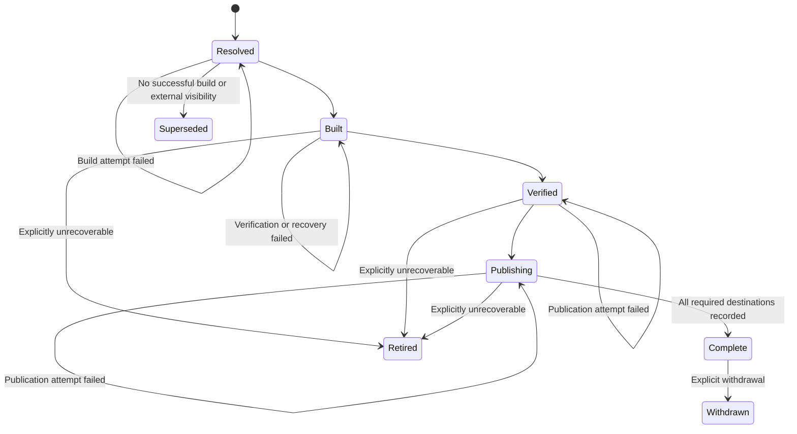

# Release Management — Design

This page realizes the [release-management specification](spec.md) while keeping
repositories on one shared, GitHub-native release path. It describes the
**intended lifecycle** first, then identifies which parts the current shared
automation baseline implements. The specification remains normative even where
the implementation crosswalk records a gap.

## Design principles

1. **The release intent is authoritative.** Tags, releases, workflow runs, and
   destination listings are observations that must agree with durable state.
2. **Resolve once, then resume.** A retry continues frozen work; it never turns
   current repository metadata into a different release under the same identity.
3. **Build once.** Verification and every destination receive the same retained
   bytes.
4. **Complete everywhere before advertising anywhere.** Current discovery,
   stable aliases, and completion announcements follow durable completion.
5. **Roll forward.** Failure, retirement, and withdrawal preserve history and
   reservations. Corrections use a new approved version.
6. **Consumers choose policy within a trust boundary.** Producers expose only
   the controlled references required to implement that policy.

## Release authority and interfaces {#branching-model}

Exactly one configured stable line owns stable publication. A repository can
develop on several branches, but only a merge or approved manual request whose
fixed source is on that line can create a stable release.

| Interface | Purpose | Release authority |
| --- | --- | --- |
| Pull-request decision check | Validates the owned release decision before merge. | None; it validates intent. |
| Merge to the stable line | Normal request for a release of the accumulated range. | Reviewed pull request and branch policy. |
| Direct push | Validates source and leaves the change pending. | None; it never inherits `DefaultBump`. |
| Manual release request | Releases an explicit stable-line source and accumulated range. | Explicit bump, complete notes, and approval for that range. |
| Retry request | Resumes one durable release intent. | The original frozen approval and intent. |
| Retirement request | Ends recovery of one incomplete intent. | Explicit maintainer authorization. |
| Withdrawal request | Makes one completed release ineligible. | Explicit maintainer authorization. |
| Announcement retry | Redelivers an unacknowledged completion message. | The completed release record. |

The merge path remains the default because it keeps the compatibility decision,
consumer evidence, source review, and release-note source together. Manual
release exists for approved accumulated change, not as a way around review.

The [Branching and Merging](../../Ways-of-Working/Branching-and-Merging.md)
standard owns standing development-to-stable promotion. Release management
starts when reviewed source reaches the configured stable line; it does not
duplicate the promotion process.

## Durable release intent

Resolve creates or loads one durable release intent before Build. Its stable
identity makes duplicate delivery and retries idempotent.

| Field | Frozen or progressive | Purpose |
| --- | --- | --- |
| Intent identity and idempotency key | Frozen | Identifies one logical release independently of a workflow run. |
| Trigger and approval evidence | Frozen | Shows who or what authorized the release and included range. |
| Stable line, fixed source, and range baseline | Frozen | Defines the exact source history being released. |
| Aggregate decision and its source | Frozen | Records major, minor, patch, or skip and whether the fallback was used. |
| Canonical version and reservation state | Frozen after Resolve | Prevents later work from taking the same coordinate. |
| Release-note snapshot and provenance | Frozen | Preserves the reviewed contributor-authored account. |
| Required destinations and announcement routes | Frozen | Prevents configuration drift during recovery. |
| Lifecycle stage and failure detail | Progressive | Records the last successful boundary and actionable failure. |
| Artifact location and cryptographic fingerprint | Frozen after Build | Binds verification and publication to identical bytes. |
| Verification evidence | Progressive, append-only | Proves which retained artifact passed which checks. |
| Publication progress by destination | Progressive, append-only | Supports idempotent multi-target resume. |
| Alias reconciliation progress | Progressive, append-only | Records advertising after completion or withdrawal. |
| Announcement progress by destination | Progressive, append-only | Supports at-least-once delivery without republishing. |
| Retirement or withdrawal evidence | Append-only | Preserves a terminal operator decision without rewriting history. |

The durable store can be implemented with any shared platform that provides
atomic writes, immutable history, and lookup by repository and intent. A
workflow run summary is useful evidence but is not sufficient storage: runs can
expire, retries use new run identifiers, and one run cannot safely coordinate
all later lifecycle operations.

### Lifecycle states



A failed attempt does not create a second logical state machine. It records the
failure against the last successful lifecycle boundary. `Superseded` applies
only to work that never produced a successful build and never exposed a release
coordinate. `Retired` preserves a permanently reserved coordinate for an
incomplete release. `Withdrawn` preserves completion while changing eligibility.

## Resolve

Resolve is the only stage that selects source, scope, decision, version, note
snapshot, destinations, and announcement routes. Every later stage consumes
those fields.

### Identify the accumulated range

For a new stable request:

1. Find the source revision of the greatest completed stable release that is an
   ancestor of the fixed source. If no completed stable release exists, use the
   beginning of repository history.
2. Enumerate every source change after that baseline through the fixed source.
3. Associate reviewed pull requests and their owned release decisions where
   possible. Keep skipped changes in the range.
4. Calculate the highest known increment in the range: major, then minor, then
   patch.
5. Require one reviewed aggregate decision that is no lower than that minimum
   and explicitly covers any skipped or direct change whose compatibility impact
   is otherwise unknown.
6. Freeze the full range and account for every source revision in this or an
   earlier durable release intent.

The current merged pull request normally supplies the aggregate approval. If
unreviewed direct changes make that approval incomplete, Resolve stops and
requires a manual release request covering the range. `DefaultBump` applies only
when the current associated pull request has no explicit decision and the range
otherwise has complete reviewed evidence.

An unbuilt, unexposed pending request can be coalesced into a later approved
range and marked `Superseded`. A built or externally visible request cannot be
coalesced; it must complete or be retired before later work advances.

### Resolve the owned instruction set

Owned labels are the contributor-facing vocabulary. Their exact definitions and
conflicts live in [Automation Labels](../../Ways-of-Working/Automation-Labels.md).

| Marker | Resolve effect |
| --- | --- |
| `release:major` | Selects a major aggregate increment. |
| `release:minor` | Selects a minor aggregate increment. |
| `release:patch` | Selects a patch aggregate increment. |
| `release:skip` | Validates and accumulates the change without immediate publication. |
| `release:pre-release` | Publishes an ordinary prerelease series for the next stable candidate. |
| `release:rc` | Publishes the next constant-identifier release candidate for the next stable candidate. |
| `release:announce` | Enables configured completion announcements for the frozen request. |

Exactly one of major, minor, patch, or skip can own the decision. An ordinary
prerelease or RC is a modifier on a major, minor, or patch request; neither can
modify skip, and the two prerelease modes conflict with one another.
`release:announce` does not select a version or authorize publication.

The required pull-request check recomputes when source, owned markers, or
`.github/release.config.yml` changes. It publishes one named required result and
fails closed for missing, conflicting, invalid, stale, or unsupported input.

### Required pre-merge decision check {#required-pre-merge-decision-check}

The decision check is the release resolver in validation mode. It validates the
current pull-request decision, configured fallback, modifier conflicts, source
scope, and whether the known accumulated range can be approved by this request.
It never publishes or reserves a version. Branch policy requires its exact
check name, so absent and stale results block merge as well as explicit failure.

### Resolve the stable version {#version-computation}

Version resolution starts from `0.0.0` when there is no stable history. Otherwise
it finds the greatest SemVer among:

- completed stable releases; and
- permanently reserved stable versions from built, visible, retired, or
  withdrawn intents.

Resolve applies the aggregate increment to that baseline. For example, a first
patch release is `0.0.1`, a first minor release is `0.1.0`, and a deliberate
first stable major release is `1.0.0`.

The resolved version is persisted as a provisional reservation before Build.
The reservation becomes permanent after the first successful build or any
external visibility. This separates safe coalescing of untouched work from the
non-negotiable rule that one visible or built coordinate always means one source
and one artifact.

### Resolve prereleases and release candidates

A prerelease applies its aggregate increment to the stable baseline and permanent
stable reservations, then appends a native identifier that sorts before the
normal version:

```text
<next-stable-core>-<series>.<counter>
```

An ordinary prerelease uses the shared workflow's validated series identifier.
A dedicated release candidate always uses `rc`:

```text
2.5.0-rc.1
2.5.0-rc.2
2.5.0-rc.3
```

The counter is the next unreserved numeric value for that core and series. It is
stored unpadded so SemVer numeric ordering remains correct. The normal core
`2.5.0` is not consumed by any prerelease, but every published prerelease
identifier remains bound to its original content even after cleanup.

Each publishing target validates its native prerelease flag against the
canonical version. A stable canonical version cannot be sent through a native
prerelease channel, and a canonical prerelease cannot be represented as stable.

## Build, Verify, and Publish

The lifecycle retains the familiar four-stage pipeline:

```text
Resolve -> Build -> Verify -> Publish
```

`Verify` is the specification's target-neutral name for the existing Test stage.
Workflow job names can continue to use `Test` while the stage verifies the
frozen artifact.

### Build

Build receives the fixed source and resolved version. It produces one artifact,
stores it in retained release storage, calculates a cryptographic fingerprint,
and records both before any verification or publication.

Build does not discover a newer branch tip, query labels again, edit the note
snapshot, or publish. If Build fails before a complete artifact is recorded, it
can retry with the frozen inputs. Once Build succeeds, no later phase can rebuild
or mutate the artifact under that version.

### Verify

Verify downloads the retained artifact by intent and confirms its fingerprint
before testing it. Source-level checks can run earlier, but release evidence must
show that the artifact intended for publication passed the required target,
integration, signing, and policy checks.

Successful verification records the fingerprint, check identity, result, and
evidence location. A retry can reuse valid frozen evidence or repeat a
non-mutating check against the same bytes.

### Publish

Publish creates the destination-native artifact and release record from the
retained bytes and frozen note envelope. Every destination follows
[Publishing Targets](design-publishing-targets.md).

For each required destination, Publish:

1. Looks for a durable successful publication record.
2. If one exists, verifies that the destination coordinate still identifies the
   recorded fingerprint and reuses it.
3. If none exists, verifies that the coordinate is free or already identifies
   the same artifact.
4. Publishes the retained bytes and canonical metadata.
5. Reads the destination back where supported.
6. Records the coordinate, fingerprint, release-record location, and evidence.

The release becomes `Complete` only when every frozen required destination has a
successful durable record. Native Latest state, moving aliases, and
announcements run after that transition. A partial release remains
`Publishing`, even if one destination makes its coordinate externally visible.

## Phase-aware recovery

A retry names the release-intent identity. The system loads durable state and
chooses the first unfinished boundary:

| Recorded boundary | Retry action |
| --- | --- |
| `Resolved` with no successful artifact | Run Build again from frozen inputs. |
| `Built` | Restore the retained artifact, verify its fingerprint, and run Verify. |
| `Verified` | Restore the retained artifact and begin Publish. |
| `Publishing` | Verify recorded destinations and publish only unfinished ones. |
| `Complete` | Return the completed outcome; reconcile only independently retryable advertising work. |
| `Retired` | Return the retirement outcome without rebuilding or publishing. |
| `Withdrawn` | Return the withdrawal outcome without recreating or announcing the release. |

Recovery never asks current labels, configuration, branch head, tag order, or
edited pull-request text to redefine frozen intent. Configuration can gain a new
destination only for a new release. It cannot silently broaden an in-flight
release.

If retained storage is missing, the operator can restore a copy only when its
cryptographic fingerprint matches the recorded successful build. Otherwise the
intent must remain failed or be explicitly retired. Rebuilding similar source is
not proof of identical bytes and is forbidden under the reserved version.

## Retirement and withdrawal

Retirement and withdrawal solve different problems:

| Operation | Applies to | Effect |
| --- | --- | --- |
| Supersede | Resolved, unbuilt, unexposed intent | Coalesces untouched work into a later reviewed range. |
| Retire | Built or externally visible incomplete intent | Stops recovery, preserves failure and reservation, and leaves the release incomplete. |
| Withdraw | Completed release | Makes the release ineligible while preserving completion history and reservation. |

An authorized withdrawal writes an append-only withdrawal event, requests the
strongest target-native hide, unlist, yank, or delete operation, and then
reconciles discovery and aliases. Target limitations are recorded rather than
represented as stronger guarantees. For example, a target may permit unlisting
but not deletion of already downloaded content.

Withdrawal does not delete the release intent, free the version, alter the
artifact, rewrite notes, or imply that consumers already holding the artifact no
longer have it. A fixed release uses a new reviewed version.

## Current-version discovery and aliases

Durable completed state is the authority for current-version discovery. The
algorithm:

1. Select stable intents whose required destinations completed.
2. Exclude retired or withdrawn releases and any release that policy marks
   ineligible.
3. Order canonical versions by SemVer precedence.
4. Return the greatest match or an explicit no-current-version result.

An API, tag, or release lookup failure is an error. It is never converted into a
successful empty result.

Aliases are optional advertising references layered on top of discovery. The
closed families are:

- `latest`, one alias for the greatest eligible completed stable version;
- major, one alias such as `v3` for the greatest eligible `3.x.y`; and
- minor, one alias such as `v3.4` for the greatest eligible `3.4.x`.

Each family defaults off and is enabled independently. Completion and withdrawal
run the same reconciliation algorithm. A normal completion never moves an alias
backward. Withdrawal can move one backward to the greatest remaining eligible
match, and removes it when no match remains. Prereleases never update stable
aliases.

Moving Git tags require explicit consumer-side fetch behavior. Operators who
consume an owned alias follow [Accept moved release tags](accept-moved-release-tags.md).

## Completion announcements

Announcements are a post-completion delivery channel, not part of artifact
publication. Resolve freezes whether announcements are enabled and which
configured destinations apply. Complete freezes the canonical message context:
version, immutable release link, summary, and release-intent identity.

Each announcement destination has its own delivery record and idempotency key.
The sender records attempts and acknowledgements. If acknowledgement is missing,
it may resend the same logical message; receivers therefore observe
at-least-once delivery and should deduplicate by release identity.

Announcement failure does not roll back a complete release and does not permit a
new version, build, or publication. It remains an independently retryable
post-completion task.

## Release notes and evidence {#release-notes}

Release notes preserve contributor-authored pull-request content rather than
reducing it to a generated commit list. The frozen note snapshot follows
[PR Format](../../Ways-of-Working/PR-Format.md) and covers every reviewed pull
request in the accumulated range, including skipped changes.

Manual requests supply equivalent reviewed context for direct or otherwise
unaccounted changes. Resolve fails if a source revision in the range has neither
reviewed note context nor an explicit evidence-gap record approved with the
manual request.

The publication envelope augments, but does not rewrite, the authored note:

- canonical and destination-native versions;
- previous completed stable baseline;
- fixed source and included range;
- aggregate decision, decision source, and fallback use;
- artifact fingerprint and verification evidence;
- destination coordinates and release-record links;
- note snapshot provenance; and
- completion, retirement, withdrawal, alias, and announcement events.

A later explanatory correction is another append-only metadata event containing
before and after text, reason, actor, time, and source evidence. It cannot change
the version, source, artifact, decision, or behavior attributed to the release.

## Release scope

`Paths` is evaluated over the complete accumulated range. With no explicit
configuration, every path is release-affecting. A repository can narrow scope
only after accounting for direct and transitive artifact inputs.

```yaml
Paths:
  - src/**
  - module/**
  - build/**
```

Validation still runs when no path is eligible, when the decision is skip, or
when a direct push cannot publish. No universal exclusion exists for docs,
tests, or workflows: a documentation site ships docs, test fixtures can be
packaged, and workflow files can define release behavior.

## Consumer update policies

The consumer resolves one of five policies:

| Policy | Producer mechanism | Durable consumer reference |
| --- | --- | --- |
| `latest` | Discover the greatest eligible completed stable release. | The discovered immutable version or fingerprint required by trust policy. |
| `lock-major-boundary` | Producer major alias, such as `v3`. | Moving alias only inside the allowed trust boundary. |
| `lock-minor-boundary` | Producer minor alias, such as `v3.4`. | Moving alias only inside the allowed trust boundary. |
| `lock-specific-version` | Exact immutable version. | Exact version. |
| `lock-immutable-fingerprint` | Content digest, commit SHA, or equivalent. | Immutable fingerprint. |

A requested boundary is unsupported when the producer does not publish the
matching alias; it is never widened silently. When a consumer field accepts only
one opaque reference, a text such as `>=3,<4` is not a range expression. The
producer carries the bound through its controlled alias.

Moving references are allowed only for producers inside the consumer's declared
trust boundary. Another team is external even when it belongs to the same
company. External dependencies use the strongest immutable reference available.
The [Dependencies standard](../../Coding-Standards/Dependencies.md) owns the
broader pinning and update trade-off.

Before `1.0.0`, SemVer permits a breaking change in each minor version. A major
alias such as `v0` therefore crosses potentially breaking `0.y.z` releases. A
consumer that wants patch-only movement before `1.0.0` uses a minor alias such
as `v0.4`, not `v0`.

## Ordering, idempotency, and reconciliation

Workflow concurrency groups queue same-line work and never cancel an in-flight
publication. Durable reconciliation provides the stronger guarantee that source
order survives missed events, worker replacement, manual retries, and finite
execution queues.

For each stable line, the reconciler finds source revisions not yet accounted
for by a complete, retired, or superseding intent. It processes the oldest
unsettled range first. Duplicate triggers use an idempotency key derived from the
repository, stable line, fixed source, and request kind, and return the existing
intent rather than creating another.

This ordering prevents a later fast run from taking a version or release range
that belongs to earlier unresolved work.

## Configuration

Repositories keep the existing MSX configuration file:

```text
.github/release.config.yml
```

The current baseline surface remains:

```yaml
ReleaseBranches:
  - main
DefaultBump: patch
Paths:
  - src/**
  - module/**
```

- `ReleaseBranches` identifies branches evaluated by the existing schema. The
  intended lifecycle permits exactly one value to authorize stable publication;
  any additional branch can validate or publish prereleases only.
- `DefaultBump` accepts only `major`, `minor`, or `patch` and applies only to an
  associated reviewed pull request.
- `Paths` declares artifact-affecting scope. Omission means every path.

The intended configuration surface additionally needs independently disabled
`latest`, major, and minor aliases; publishing destinations; announcement
destinations; retained-artifact policy; and destination-specific native mapping.
Those fields are not documented as YAML keys until the shared implementation
defines and validates them. Unknown fields and values fail closed; repositories
must not invent local release schema.

Repositories choose policy. Shared automation owns resolution, durable state,
SemVer calculation, artifact handoff, retry rules, target adapters, discovery,
alias reconciliation, and evidence format.

## Intended and implemented behavior

The lifecycle above is the target design. The implementation lives in shared
release automation rather than this documentation repository, and each
repository remains governed by the workflow revision it invokes. The table
records the audited shared baseline that this capability documentation
synchronizes against; an **intended** row MUST NOT be treated as available until
the invoked workflow documents and exposes it.

| Surface | Baseline coverage | Intended behavior still required |
| --- | --- | --- |
| Pull-request release decision | Implemented for explicit major, minor, patch, skip, ordinary prerelease, and `DefaultBump`. | Aggregate the full unreleased range and preserve the frozen decision source. |
| Direct pushes | Validation and push-triggered processing exist. | Prevent fallback-based publication and require an approved manual aggregate request. |
| Manual stable releases | Not implemented as a release-creation path. | Fixed stable-line source, explicit aggregate increment, complete notes, and range approval. |
| Dedicated RC mode | Not implemented. | `release:rc`, constant `rc` identifier, monotonic counters, and conflict with `release:pre-release`. |
| Durable release intent | Workflow-run evidence exists; resolution is based on current pull-request metadata and tags. | Durable frozen inputs, lifecycle state, idempotency, and permanent version reservations. |
| Build-once recovery | A run can hand one build artifact to later jobs. | Retain successful bytes across runs, verify the fingerprint, and resume by recorded phase without rebuilding. |
| Multi-target completion | Publication can target configured destinations. | Durable per-destination progress and completion only after every required target succeeds. |
| Current-version discovery | Version calculation is tag-oriented. | Select the greatest eligible completed stable intent and exclude incomplete or withdrawn releases. |
| Moving aliases | Existing shared flows can update configured aliases. | Closed opt-in families, monotonic completion updates, and withdrawal-aware reselection or removal. |
| Announcements | Durable announcement delivery is not implemented. | Frozen message context, per-destination journal, idempotency, and at-least-once retry after completion. |
| Retirement and withdrawal | End-to-end lifecycle operations are not implemented. | Preserve failure or completion history, permanent reservations, target-native withdrawal evidence, and replay-safe terminal outcomes. |
| Immutable GitHub Releases | Exact version tags are treated as immutable by policy. | Reconcile and verify the repository's immutable-release setting where GitHub supports it. |
| Published-note correction | Release notes and evidence are published. | Append-only correction records with source evidence and unchanged release identity. |

Until the durable lifecycle is implemented, an operator MUST NOT work around a
partial release by rerunning against changed metadata or rebuilding under the
same exposed version. Stop, preserve evidence, and roll forward with a newly
approved version when byte identity cannot be proven.

## Design decisions

### The durable intent, not a tag, is the release authority

Tags can be missing, moved when explicitly used as aliases, or present before all
destinations complete. A durable intent can state which artifact, source,
approval, and destinations the tag is expected to represent and can distinguish
partial publication from completion.

### Manual release uses the same pipeline

A separate manual pipeline would create a second version algorithm and weaker
evidence path. Manual requests therefore change only the trigger and approval
source; they still Resolve, Build, Verify, and Publish one retained artifact.

### Announcements follow completion

Treating a chat or webhook message as a publishing destination would either
announce partial releases or make a transient message failure roll back a valid
artifact. Separating delivery retains truthful completion and retryable
communication.

### Withdrawal changes eligibility, not history

Deleting history would make audit, replay, and version reservation ambiguous.
An append-only withdrawal preserves what happened while letting discovery and
aliases stop recommending the release.

## Where this connects

- [Spec](spec.md) — the normative release contract.
- [Publishing Targets](design-publishing-targets.md) — destination-native
  mappings and guarantees.
- [Accept moved release tags](accept-moved-release-tags.md) — consumer recovery
  for controlled aliases implemented as Git tags.
- [Automation Labels](../../Ways-of-Working/Automation-Labels.md) — exact marker
  meanings and conflicts.
- [GitHub Actions](../../Coding-Standards/GitHub-Actions.md) — immutable external
  action pins and controlled owned aliases.
- [PR Format](../../Ways-of-Working/PR-Format.md) — release-note and consumer
  evidence source.
