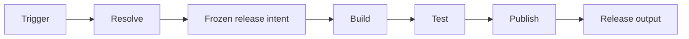

# Release Management — Logical Core Design

This design realizes the specification through one reusable pipeline and a
target adapter boundary. It defines logical responsibilities, not a specific
automation product or hosting service.

## Release pipeline

| Stage | Responsibility | Output |
| --- | --- | --- |
| Trigger | Admit an approved change, direct source update, or authorized manual request. | Candidate source and context |
| Resolve | Determine eligibility, decision, version line, version, notes, and targets. | Frozen release intent |
| Build | Produce the version-marked artifact once. | Immutable artifact identity |
| Test | Verify the built artifact and its version marker. | Verification evidence |
| Publish | Transfer the verified artifact and record to every required target. | Target confirmations |
| Record | Assemble durable release evidence and eligible aliases. | Completed release output |

## Trigger and branch mapping

The framework accepts three trigger classes:

- **Reviewed change:** an approved change on a release line creates the normal
  release candidate.
- **Direct source update:** an approved direct update is resolved with the same
  policy and evidence requirements as a reviewed change.
- **Manual request:** an authorized request supplies an explicit source identity,
  decision, and reviewed note context; it never bypasses resolution or testing.

Release-line mapping declares one stable line and zero or more prerelease lines.
The stable line is the sole authority for stable versions. A prerelease line
maps to a stable version base plus a unique prerelease identifier and counter.
Promotion from an integration line to the stable line is a new stable intent:
it resolves from the latest stable version, carries the approved aggregate
change scope, and never promotes a prerelease identity in place.

## Resolution and release intent

Resolve evaluates artifact-affecting paths, approved metadata, and configured
policy. It rejects multiple version decisions, a `skip` decision combined with a
version decision, and an invalid default. Its strict order is:

1. Validate the configured default, if present.
2. Reject conflicting decisions.
3. Honor an explicit `skip`.
4. Prefer one explicit `major`, `minor`, or `patch` decision.
5. Use the valid configured default.
6. Fail with a missing-decision error.

The result is written as an immutable, durable release intent before Build. It
contains source identity; resolved decision and its source; stable or
prerelease mode; calculated version and authoritative version base; declared
artifact scope; reviewed note snapshot; required targets; and a unique release
key. The release key makes retries idempotent.

## Version computation

Version computation reads only the frozen decision and the latest stable version
from the configured authority. It increments the major, minor, or patch
component according to the resolved decision. A prerelease derives its base from
that computed version and adds its configured identifier and monotonically
increasing counter. Prerelease versions never become the base for a stable
version calculation.

For the first stable release, the version authority declares an initial stable
baseline. The framework records that baseline in the release intent so the
calculation remains explainable and retry-safe.

## Required pre-merge decision check

Before an approved change enters a release line, a read-only decision check
evaluates the same eligibility and decision rules as Resolve. The check reports
the effective decision or an actionable error for missing, invalid, or
conflicting inputs. It runs again when the source, decision metadata, policy, or
artifact scope changes. A valid `skip` is a successful no-release result.

The branch's required-check policy makes this result a release gate. Release
execution repeats resolution against the actual source; the pre-merge check is
evidence, not a substitute for release-time validation.

## Build, test, and publish

Build receives only the frozen intent and emits one version-marked artifact plus
an immutable artifact identity. Test verifies that artifact without rebuilding
it. Publish accepts only a verified artifact identity and checks each target for
an existing matching version before writing.

Required targets are bundled as one logical release. The framework stages
target confirmations and marks the release complete only after all required
targets succeed. A failed target leaves the intent recoverable. Recovery
replays only incomplete operations using the same version and artifact. If
source or artifact inputs changed, Resolve creates a new intent and version.

## Scope, serialization, and aggregation

Path filtering is a declared mapping from delivered artifact inputs and
consumer-facing contracts to release eligibility. Exclusions cannot override a
declared artifact input. Resolution still runs for every candidate so that
`skip`, missing decisions, and conflicts are visible.

A serialization key combines the release line and artifact identity scope.
Later candidates queue behind an active release on that key. When intervening
changes arrive after a failure, an operator either resumes the original intent
or approves an aggregate intent that records every included change; the system
does not infer aggregation.

## Release notes

Resolve snapshots the title and complete reviewed change description with the
immutable source identity. Publication adds provenance separately: version,
decision source, version base, artifact identity, target outcomes, and time.
The complete output consists of the stable or prerelease version marker, the
verified artifact, and a durable release record.

## Release output

The completed record includes the version marker, immutable source and artifact
identities, verification evidence, complete reviewed note snapshot, decision
and version base, and confirmation from every required target. Alias updates
appear only after this record is complete.

## Logical configuration interface

| Concept | Required behavior |
| --- | --- |
| Release-line map | Defines one stable authority and optional prerelease lines. |
| Decision policy | Declares valid explicit decisions and an optional strict default. |
| Artifact scope | Lists artifact-affecting inputs and consumer contracts. |
| Version authority | Names the one stable-version source. |
| Target set | Lists required target adapters and their conventions. |
| Alias policy | Enables only the closed stable alias set and its eligibility rules. |
| Recovery policy | Defines retention and approval for retry or aggregation. |

## Related records

- [Specification](spec.md)
- [Publishing Target Design](design-publishing-targets.md)
