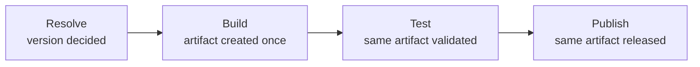

# Release Management — Design

The behaviour in the [spec](spec.md) is delivered by a **shared reusable release
workflow**. A repository opts in with a short caller workflow and a small
`.github/release.config.yml`; everything else has a sensible default, so a
minimal caller plus a one-line path filter is enough to adopt it.

## Branching model

A **release branch** is any branch configured as a release target, each with a
**release type** — `stable` or `prerelease`.

- **Single branch (zero-config).** One release branch (the default branch)
  produces stable releases. Prereleases are opt-in via a PR label.
- **Multi-branch.** `dev` (prerelease) collects PRs and publishes a prerelease
  on every merge; `main` (stable) receives `dev`. Merging `dev → main` computes
  the stable version from the **latest stable release** plus the merge PR's bump
  label — the prerelease counter does not carry over.
- **One production authority.** At most one branch is `release-type: stable`;
  every other release branch is `prerelease`. The single stable branch
  (typically `main`) owns the production version — a prerelease branch can never
  cut a stable release.
- **Bundled releases.** A **staging branch** collects feature PRs; merging it to
  a release branch produces **exactly one** release for all bundled changes.

```yaml
# .github/release.config.yml
release-branches:
  - branch: main
    release-type: stable
  - branch: dev
    release-type: prerelease
```

## The pipeline

Every release runs the same four stages in order. The stage boundaries exist to
make **build-once** enforceable — each stage may only consume what the previous
stage produced.



| Stage | Produces | Invariant |
| --- | --- | --- |
| **Resolve** | the version | the version is known before anything is built, so it can be baked in |
| **Build** | the artifact | the artifact is created exactly **once**, carrying its version |
| **Test** | a verdict | validation runs against the built artifact, not a rebuild of its source |
| **Publish** | released versions | the artifact is transferred unchanged to every target |

Two consequences follow, and they are the point of the model:

- **The version is identity, not metadata.** Because Resolve precedes Build, the
  version is embedded in the artifact rather than attached to it. A manifest
  version, an image label, and the tag agree because they came from one decision.
- **Recovery preserves artifact identity.** Retrying validation or publication of
  an unchanged, already-built artifact reuses that artifact and its resolved
  version. A correction that changes the output is a new release: it resolves a
  new version and builds new bytes. An artifact is never patched, re-tagged, or
  rebuilt under an existing version — that would publish something other than what
  was tested.

## Version computation

- The bump comes from the PR label (`release:major` / `release:minor` / `release:patch` / `release:none`).
  Exactly one is required; **no default** is applied. A missing label, multiple
  SemVer labels, or a SemVer label alongside `release:none` are all **rejected**, so
  the version is always a decision someone made. For `workflow_dispatch`, the
  bump is an input.
- **First release** starts from a baseline (`v0.1.0` or `v1.0.0`). Pre-`1.0.0`
  breaking changes are `release:minor` per [SemVer §4](https://semver.org/#spec-item-4);
  `release:major` is never auto-detected pre-`1.0.0`.
- The tag is created on the commit now at the head of the release branch —
  squash, merge-commit, and rebase strategies alike.

### Why the labels are namespaced

The bump vocabulary is namespaced under `release:` rather than using the bare words
`Major`, `Minor`, and `Patch`, and the reason is concrete rather than cosmetic.

Hosted Dependabot applies a SemVer label to its own pull requests **when a repository has
labels named `major`, `minor`, or `patch`**. It matches on those bare words. In a
repository where the release bump set is unprefixed, an upstream patch bump therefore
arrives already carrying a label that this workflow reads as the repository's own version
decision — set by a bot, describing something else entirely, with nobody having decided it.

Namespacing removes the collision at its source. There is no bare `major`, `minor`, or
`patch` label for Dependabot to find, so a dependency pull request arrives with **no**
release decision attached, fails closed like any other unlabelled pull request, and a
maintainer makes the call at the pull request gate.

Do not reach for a suppression workaround instead. The `skip-release` label and the
equivalent configuration flag are a **no-op on hosted Dependabot** — the labelling
behavior is not configurable from the repository. The only lever a repository actually has
is which label names exist, so that is the lever this design pulls.

See [Automation Labels](../../Ways-of-Working/Automation-Labels.md#every-set-is-namespaced)
for the general rule.

## Prereleases

- **Branch-level** — a prerelease-type branch publishes on every push, using the
  branch name as the identifier: `v1.3.0-dev.1`, `v1.3.0-dev.2`, …
- **PR-level** — a prerelease label on an open PR publishes
  `v<base>-<identifier>.<counter>`: `base` is the next version from the PR's bump
  label, `identifier` is the normalised branch name, and `counter`
  auto-increments per push.
- Artifact-specific conventions replace the SemVer suffix where they exist
  (`-alpha.N` for npm, `.devN` for Python). Release candidates use `-rc.N`,
  auto-incrementing.
- **Cleanup** deletes prerelease tags, releases, and artifacts after the PR
  closes (configurable); stable releases are never touched.

## Path filtering

`.github/release.config.yml` declares `release-paths` as ordered include/exclude
globs (excludes win). The workflow **always runs** so validation executes on
every merge; only the release step is skipped when no artifact-affecting path
changed.

```yaml
release-paths:
  - "src/**"
  - "Dockerfile"
  - "action.yml"
  - "!docs/**"       # documentation-only changes never release
  - "!.github/**"    # CI/CD changes never release
```

## Release notes

The GitHub Release **name** is the version; the **body** depends on the trigger:
`# <PR title>` + description (merged PR), `# <first commit line>` + remainder
(direct push), or `# <summary>` + collected history (dispatch). The same note is
handed to [Downstream Release Propagation](../downstream-release-propagation/design.md).

## Release output

1. A git tag `vX.Y.Z` on the release-branch commit — always.
2. The published artifact where one lives outside git — a container image
   (`<image>:<version>` and `@<digest>`), a package in its registry. For Action,
   workflow, and module artifacts the tag itself **is** the artifact.
3. A GitHub Release whose name is the version, carrying the note and the
   immutable reference (digest, package version, or the tag).

## Publishing targets

Publish is the only stage that knows where an artifact goes, and it reaches every
destination through one abstraction: a **publishing target**. A target is any
destination that accepts a versioned artifact and serves it to consumers — the
GitHub Release itself, a package registry, an extension marketplace, a container
registry.

The release process is written against the target *contract*, never against a
specific target. Each target documents how it answers six questions — version
scheme, prerelease representation and sort order, immutability, unpublish
behaviour, floating-tag support, and where its release record lives — in
[Publishing Targets](design-publishing-targets.md). Adding a destination means
writing that contract and a publish step; it does not change Resolve, Build,
Test, or the spec.

Where a repository has more than one target, publishing is **all-or-nothing** for
a version:

- Targets are attempted in a defined order, and each is idempotent — publishing
  an already-published version is a success only when it identifies the same
  immutable artifact. A version collision with different bytes is an error, so a
  re-run completes the set rather than accepting changed output.
- A target that rejects the version fails the release. The version is not
  advertised as available until every target holds it.
- A partial publication resumes Publish for the **same** artifact and the same
  version. It never resolves a new version to work around a single failed target,
  because the targets that already succeeded hold that immutable version.

## Floating tags

Floating tags are optional, mutable pointers published alongside the immutable
version tag, for consumers that want to track a line rather than a point:

| Tag | Points at | Moves when |
| --- | --- | --- |
| `latest` | the newest stable version | any stable release |
| `vMAJOR` | the newest stable version in that major | a stable release within that major |
| `vMAJOR.MINOR` | the newest stable patch in that minor | a stable patch within that minor |

Three rules keep them safe:

- **Prereleases never move a floating tag.** Only a stable release advances one,
  so a floating tag never points at something not promoted for adoption.
- **A floating tag never moves backwards.** It only advances, so a consumer
  following it never silently downgrades.
- **Only controlled release automation moves a floating tag.** Humans and ad hoc
  workflows do not create or repoint one. The automation publishes the immutable
  version first, then moves only the aliases that release is eligible to advance.
- **A major tag stays inside its compatibility line.** `vMAJOR` advances only
  for compatible stable patch and minor releases in that major. A breaking
  release creates the next major tag and leaves the previous one in place.
- **Floating tags are controlled references only for owned automation.** An
  organization- or initiative-owned Action or reusable workflow may be consumed
  through its controlled `vMAJOR` tag. External automation and anything requiring
  byte-for-byte reproducibility pins to the immutable version, digest, or SHA
  ([supply chain](../../Coding-Standards/Security.md#supply-chain)).

## Serialised releases

Release runs for the same ref are **serialised** and **queue rather than
cancel** — an in-flight release is never aborted mid-write, since it may be
part-way through creating a tag or pushing an artifact. The shared workflow
declares a concurrency group keyed by workflow and ref, with
`cancel-in-progress` disabled:

```yaml
concurrency:
  group: ${{ github.workflow }}-${{ github.ref }}
  cancel-in-progress: false
```

Serialisation is provided once by the reusable workflow so every repository
inherits it; the mechanism is the
[GitHub Actions standard](../../Coding-Standards/GitHub-Actions.md#concurrency).
The single-stable-branch rule above is what keeps the production version under
one authority — the stable branch is the only ref that ever cuts a production
release, and its runs are serialised like any other.

## Configuration surface

| Surface | Where |
| --- | --- |
| Release branches + type | `.github/release.config.yml` |
| Bump label / prerelease / RC | PR label, or `workflow_dispatch` input |
| Path filter | `.github/release.config.yml` |
| Prerelease cleanup toggle | release config / workflow input |
| Publishing targets | reusable-workflow input + GitHub environment; see [Publishing Targets](design-publishing-targets.md) |

## Where this connects

- [Spec](spec.md) — the requirements this design delivers.
- [Publishing Targets](design-publishing-targets.md) — the contract each destination documents.
- [Downstream Release Propagation](../downstream-release-propagation/design.md) — consumes the release note and immutable reference.
- [GitHub Actions](../../Coding-Standards/GitHub-Actions.md) — how the workflow itself is authored (SHA pins, least privilege, concurrency).
- [Security](../../Coding-Standards/Security.md#supply-chain) — why consumers pin to immutable references.
