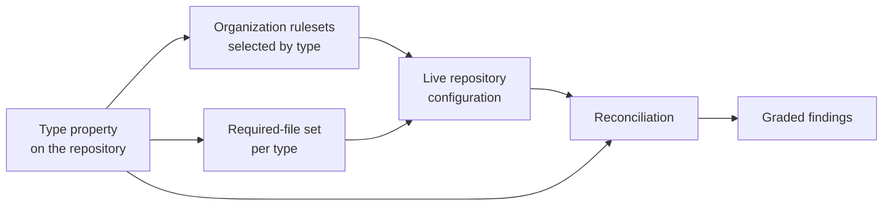

# Repository Governance — Design

Three moving parts deliver the [spec](spec.md): a **property** that carries the
declaration, **organization rulesets** whose conditions read it, and
**reconciliation** that compares the live world against what the declaration
implies.

The declaration is the only per-repository input. Everything downstream of it is
organization-level configuration, which is what makes the number of things that
can drift equal to the number of types rather than the number of repositories
([NFR1](spec.md#non-functional)).

## The declaration

The type is a **multi-select** organization custom property, required on every
repository, defaulting to the Standard value. Multi-select rather than
single-select because branch model and layering are separate concerns
([FR2](spec.md#classification), [repository types](design-types.md)).

The property mechanism — how conditions target it, why conditions are written as
exclusions, and how an existing condition is migrated onto it without dropping
coverage — is owned by [Repository Type
Property](../../Ways-of-Working/Repository-Type-Property.md). This design does not
restate it.

Moving an organization from a single-select property to a multi-select `Type`
property is a schema change the platform does not perform in place. The migration
uses a uniquely named temporary multi-select property to keep every control
covered while the canonical name is recreated; the precise sequence and API
semantics are owned by [Repository Type
Property](../../Ways-of-Working/Repository-Type-Property.md#migrating-from-a-single-select-property).
Coverage is verified by asking the platform which rules apply to each repository
rather than by reasoning about condition JSON.

## Rulesets by type

One ruleset per governed concern, each selecting repositories by type. Rulesets
are organization-level: a repository-level branch protection would be a second
definition of the same control, and two definitions are two truths
([NFR1](spec.md#non-functional)).

| Ruleset | Selects | Branches | Enforces |
| --- | --- | --- | --- |
| **Baseline protection** | Every type except Unmanaged | Protected branches | No deletion, no force-push, required checks |
| **Pull-request gate** | Every type except Unmanaged and Memory | Protected branches | Pull request required |
| **Artifact history** | Type includes Artifact | Default branch or Infrastructure integration branch | Squash-only merge, linear history required |
| **Promotion — integration** | Type includes Infrastructure | Integration branch | Squash-only merge |
| **Promotion — production** | Type includes Infrastructure | Production branch | Merge-commit only, promotion-source check required |
| **Documentation build** | Type includes Docs | Protected branches | Documentation-build check required |
| **Automated review** | Every type except Unmanaged | Default branch | A review is requested on every pull request; advisory, not a gate |

Two properties of this table matter more than its contents:

- **Conditions are exclusions, not allow-lists.** Each ruleset matches every repository and then subtracts the types that must be exempt. A type value invented later is covered by default; only a type an administrator has explicitly named ever loses coverage ([NFR5](spec.md#non-functional), [filter by exclusion](../../Ways-of-Working/Repository-Type-Property.md#filter-by-exclusion-not-by-inclusion)).
- **Rulesets layer rather than override.** A repository matching three rulesets is subject to the union of all three. Nothing needs to know what else applies, which is why a layering type can be added without touching a branch-model ruleset.

Automatic deletion of a merged pull request's head branch is not a ruleset rule.
Reconciliation verifies the repository-level `delete_branch_on_merge` setting for
every governed repository instead. Memory therefore retains the protection,
check, review, and branch-cleanup baseline while being exempt only from the
pull-request gate; Unmanaged is the sole type that removes the baseline.

Bypass is granted on each ruleset to a **named administrative group in
pull-request mode only** — never to individuals, and never as a blanket write
exception ([FR16](spec.md#bypass)).

## Organization defaults repository

Each organization carries one public repository named `.github`. It has three
distinct surfaces: community files that GitHub inherits into repositories,
content published on the organization's profile, and local context that governs
the defaults repository itself. Treating those surfaces as one distributable
file set would copy repository-specific configuration into places where it does
not belong.

The [MSXOrg defaults repository](https://github.com/MSXOrg/.github) and the
[PSModule defaults repository](https://github.com/PSModule/.github) implement
the same structure:

| Surface | Status | Behavior |
| --- | --- | --- |
| `.github/CODE_OF_CONDUCT.md` | Required | Inherited by a repository that has no local code of conduct. |
| `.github/SECURITY.md` | Required | Inherited by a repository that has no local security policy. |
| `.github/SUPPORT.md` | Required | Inherited by a repository that has no local support policy. |
| `.github/pull_request_template.md` | Required | Used when a repository has no local pull request template. |
| `.github/CONTRIBUTING.md` | Optional | Provides an organization-wide fallback where local contribution guidance is absent. |
| `.github/ISSUE_TEMPLATE/` | Optional | Provides the organization's issue forms and template configuration where a repository defines no local issue-template set. |
| `profile/README.md` | Optional | Publishes the public organization profile; it is not inherited by repositories. |
| `media/` | Optional | Holds assets used by the profile or community files; it is not inherited by repositories. |
| `README.md`, `AGENTS.md`, client routes, `.gitattributes`, and `.gitignore` | Required locally | Explain and govern the defaults repository; they are not organization defaults. |

All inherited community files live under `.github/` in the defaults repository
so their scope is visible from their path. A local file in a target repository
takes precedence and therefore records a deliberate repository exception. If a
target defines any local issue-template set, it owns that complete set rather
than combining local and central forms.

The defaults repository does not centralize repository ownership, dependency
updates, release configuration, license terms, or other repository-specific
configuration. Those files remain in each target repository because either
their values vary by repository or the platform does not inherit them.

Client routes are also repository-specific. In particular,
`.github/copilot-instructions.md` in the defaults repository routes Copilot for
that repository only; it is not an organization-wide file default.
Organization-wide Copilot instructions are configured through the organization
settings and point to the same canonical standards rather than copying them.

### The promotion-source check

Branch protection can require a check; it cannot express "only from this branch".
So the constraint is implemented as a check that reads its own pull request's head
branch and fails unless it is the integration branch. Being a required check, it
inherits everything the merge gate already provides: it blocks the merge, it is
visible on the pull request, and it is bypassable only by the group the ruleset
names.

## Required files by type

The [Repository Standard](../../Ways-of-Working/Repository-Standard.md#required-files)
owns the file list and which type adds to it. This design owns only the
enforcement: presence is checked by reconciliation on the default branch, at
**Block** severity for the files that make a repository contributable and
**Report** severity for the rest.

## Drift detection and reconciliation

Rulesets prevent unwanted changes to branches. They do not prevent a repository
from being *configured* into a state its declaration does not describe — a
required check renamed, a merge method re-enabled, a required file deleted, a type
value that no longer validates. Reconciliation is the loop that closes that gap:
**compare the declared intent against the live world, continuously, and grade
every difference.**

The loop is generic. It is a scheduled comparison plus a graded response, and it
is implementable as a workflow in an administrative repository, as an application
holding the organization's configuration, or as a policy engine. What matters is
the contract below, not the implementation that satisfies it.

### What is compared

| Comparison | Question |
| --- | --- |
| Type is set | Does the repository carry a type value at all? |
| Type is valid | Is every value in the organization's allowed list? |
| Type composes | Is the combination valid ([validation rules](design-types.md#validation-rules))? |
| Exemption is justified | Does an exempted repository carry a recorded reason? |
| Rulesets apply | Do the rulesets the type implies actually evaluate against this repository? |
| Branch shape matches | Do the protected branches, merge methods, and required checks match what the type declares? |
| Required files present | Does the default branch carry the governed baseline and the files its type adds, or the explicit Unmanaged discoverability minimum? |

### Severity decides the response

| Severity | Meaning | Response |
| --- | --- | --- |
| **Block** | The declaration is unusable or the repository is not contributable | A failing check on the change that introduces it |
| **Warn** | Live configuration diverges from the declaration but the repository still functions | A comment on the affected pull request |
| **Report** | A standing condition that needs review rather than an immediate fix | A tracking issue, opened once and updated thereafter |

Grading is what keeps the loop usable. A single severity forces a choice between
blocking on things that do not warrant it and merely reporting things that do; the
result of either is that findings stop being read.

### When it runs

On repository creation, on a change to the type property, on a push to a default
branch (for the file comparisons), and on a schedule that catches configuration
changed out of band. The schedule is the one that matters most, because
out-of-band configuration change is the drift the event triggers cannot see.

### Idempotence

Reconciliation reports the same finding at most once. A finding is identified by
the repository, the comparison, and the specific difference; a run that
re-discovers an existing finding **updates** it rather than creating a second one,
and a finding whose condition has been resolved is closed
([FR20](spec.md#reconciliation)). Without this, the loop's output degrades into a
stream nobody can distinguish new findings in.

### A finding names its remedy

Every finding states what is wrong, what the declared type requires instead, and
where the rule is written down. A finding that reports only a mismatch transfers
the work of interpretation to the reader; a finding that names the remedy is
actionable by whoever receives it, human or agent
([FR21](spec.md#reconciliation)).

Reconciliation **reports** by default. Whether it also *applies* a remedy is a
separate decision per comparison, and one that MUST be made deliberately: an
automated fix to a protection is itself a change to a control, and it belongs
under the same review as any other ([decision before
change](../../Ways-of-Working/Principles/AI-First-Development.md#decision-before-change)).

## Configuration surface

| Setting | Where |
| --- | --- |
| Allowed type values | Organization custom-property schema |
| Which controls a type implies | Organization rulesets |
| Required approvals per type | Organization rulesets |
| Bypass group | Organization rulesets |
| Organization community defaults | Public organization `.github` repository |
| Organization-wide Copilot instructions | Organization Copilot settings |
| Required-file set per type | [Repository Standard](../../Ways-of-Working/Repository-Standard.md#required-files) |
| Comparison severities | Reconciliation configuration |
| Reconciliation schedule | Reconciliation configuration |

## Where this connects

- [Spec](spec.md) — the requirements this design delivers.
- [Repository Types](design-types.md) — the catalogue the rulesets select on.
- [Repository Type Property](../../Ways-of-Working/Repository-Type-Property.md) — the property mechanism and condition migration.
- [Repository Standard](../../Ways-of-Working/Repository-Standard.md) — the required-file sets reconciliation checks.
- [Branching and Merging](../../Ways-of-Working/Branching-and-Merging.md) — the merge gate and who may approve.
- [Automation Labels](../../Ways-of-Working/Automation-Labels.md) — the namespaced labels reconciliation and the rulesets rely on.
