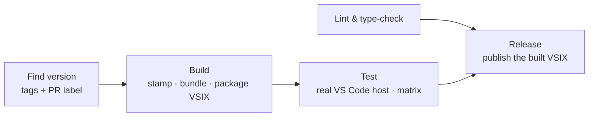

# VS Code Extension Framework — Design

The behaviour in the [spec](spec.md) is delivered by a **shared reusable
workflow** and a **template repository**, following the org's `Process-*` /
`Template-*` convention (as [Process-PSModule](https://github.com/PSModule/Process-PSModule)
does for PowerShell modules). A repository opts in with a short caller workflow
and a single `.github/vscode-extension.yml` settings file; everything else has a
secure, working default, so a minimal caller is enough to adopt it. Step logic
lives in versioned scripts the workflow calls, never inline shell — code in code
files.

## The pipeline

The pipeline is a DAG of single-purpose stages, so each stage does one thing and
every downstream stage reuses the exact output of the stages before it:

- **Find version** — compute the version once, from the latest `vX.Y.Z` tag or
  release plus the pull request's bump label. Independent of the other stages.
- **Lint & type-check** — static analysis and the type checker. Independent, so
  it fails fast in parallel with the build.
- **Build** — stamp the computed version into the manifest, compile the
  production bundle, and package **one** VSIX. Uploads the bundle, the VSIX, and
  the stamped manifest as artifacts.
- **Test** — download a real editor host and run the extension test suite
  against the exact bundle and manifest that were built.
- **Release** — publish the exact VSIX that was built and tested. Depends on
  both `test` and `lint`.

## The built-once contract

The version is computed once and flows through the pipeline as artifacts, so the
thing that ships is the thing that was tested:

1. **Find version** decides `vX.Y.Z` from tags plus the PR label.
2. **Build** stamps it into `package.json` (and `package-lock.json`), compiles
   the bundle, and runs the packaging CLI to produce a single VSIX. The stamped
   manifest is uploaded alongside the VSIX so the manifest under test — including
   the version the running extension reports — matches the packaged artifact.
3. **Test** restores that bundle and manifest and tests them.
4. **Release** restores and publishes that same VSIX.

Build, test, and release never re-compile or re-package; they pass the built
artifact forward.

## Build

The TypeScript source is bundled into a single self-contained CommonJS module
with a fast bundler (esbuild), with `vscode` marked external (the host provides
it), minified for release and source-mapped for development. The bundle is the
extension entry point (`dist/extension.js`); packaging with the editor's
packaging CLI (`vsce package --no-dependencies`) produces the VSIX. Bundling
first is what lets the VSIX omit `node_modules` and stay small.

## Test

A real editor is downloaded and driven by the VS Code test harness
(`@vscode/test-cli`), which runs the extension test suite inside an Extension
Development Host. The test job runs as a matrix over:

- the **host versions** the extension supports — at least the minimum declared
  in `engines.vscode` and the current stable, optionally Insiders; and
- the **operating systems** the extension declares — Linux, macOS, Windows.

Framework-level tests (the counterpart to the PSModule source-code tests) assert
repository conventions — that the manifest is well-formed, contributions are
declared, and the activation path is sound — independent of the extension's own
feature tests.

## Lint and type-check

ESLint and the TypeScript compiler in no-emit mode run as one independent stage
so a style or typing error fails fast, in parallel with the build. Both must
pass before the release stage runs, alongside a green test result.

## Versioning

Versioning is [Release Management](../release-management/design.md) applied to a
VSIX artifact — this framework does not re-implement it:

- The bump is the PR label (`Major` / `Minor` / `Patch` / `NoRelease`,
  defaulting to `Patch`); multiple SemVer labels, or a SemVer label with
  `NoRelease`, are rejected.
- The version is computed once and stamped into the manifest; it is never
  hand-edited.
- A prerelease is requested by a `Prerelease` label on an open pull request (or
  a prerelease branch), producing a prerelease VSIX that is never promoted to
  latest.

## Publishing and distribution

Every release attaches the VSIX to a **GitHub Release** whose name is the
version, and creates the git tag **through the Releases API against an explicit
commit SHA** — the merge commit for a merged pull request, the head commit for a
prerelease — rather than by pushing a tag over git. This keeps the release stage
at `contents: write` with no `workflows` scope, which is both least-privilege and
required on GitHub Enterprise Cloud with data residency, where that scope is not
grantable.

- **Install without a marketplace.** A hosted one-liner install script fetches
  the latest release's VSIX asset and installs it with
  `code --install-extension`, honouring a host override so it targets Insiders,
  Cursor, or VSCodium. This is always available.
- **Marketplace publication (optional).** Where the repository configures it, the
  same VSIX is published to the VS Code Marketplace (`vsce publish`) and/or Open
  VSX (`ovsx publish`), gated behind a GitHub environment holding the publish
  token. It is opt-in and never blocks the GitHub-Release install path.

Prerelease tags, releases, and their VSIX assets are cleaned up when the pull
request closes; stable releases are never touched.

## Documentation and dependencies

- **Documentation.** The extension's README and user docs live in the
  extension's own repository and are built and published like any repository's
  documentation ([Documentation Model](../../Ways-of-Working/Documentation-Model.md)) —
  there is no internal-versus-user split. This framework's own documentation is
  this capability.
- **Dependencies.** The template ships a Dependabot configuration that keeps npm
  packages and pinned Actions current through
  [Dependency Updates](../dependency-updates/design.md); those update pull
  requests are artifact-affecting and release through the same pipeline.

## Least privilege and serialisation

The workflow is `contents: read` at the top level; only the release job elevates
to `contents: write`, because it alone creates the tag and the release. Release
runs for the same ref are **serialised and queue rather than cancel** — an
in-flight release is never aborted mid-write — via a concurrency group keyed by
workflow and ref with `cancel-in-progress` disabled, inherited from the
[GitHub Actions standard](../../Coding-Standards/GitHub-Actions.md#concurrency).
Every Action is pinned to a commit SHA.

## Configuration surface

| Surface | Where |
| --- | --- |
| Adoption (opt-in) | a short caller workflow that calls the reusable workflow |
| Host + OS matrix, marketplace toggle, extras | `.github/vscode-extension.yml` |
| Version bump / prerelease | pull-request label |
| Release branches + path filter | `.github/release.config.yml` ([Release Management](../release-management/design.md)) |
| Marketplace publish tokens | a GitHub environment's secrets |
| Extension manifest (`engines.vscode`, `contributes`, activation) | `package.json` |

## Repository structure

The template repository lays down the whole shape, mirroring
[Template-PSModule](https://github.com/PSModule/Template-PSModule):

- `src/` — the extension source (`extension.ts`) and its tests.
- `package.json` — the extension manifest: `publisher`, `engines.vscode`,
  `contributes`, `activationEvents`, and `main` pointing at the bundle.
- the bundler config, `tsconfig.json`, and `.vscodeignore`.
- `install/` — the hosted one-liner install scripts.
- `.github/` — the caller workflow, `vscode-extension.yml`, `release.config.yml`,
  and `dependabot.yml`.

## Where this connects

- [Spec](spec.md) — the requirements this design delivers.
- [Release Management](../release-management/design.md) — the release mechanics this pipeline drives to ship a VSIX.
- [Dependency Updates](../dependency-updates/design.md) — how the extension's dependencies stay current.
- [Merge Automation](../merge-automation/spec.md) — how the pipeline's named status checks gate the merge.
- [GitHub Actions](../../Coding-Standards/GitHub-Actions.md) — how the reusable workflow is authored (SHA pins, least privilege, concurrency).
- [TypeScript](../../Coding-Standards/TypeScript.md) — how the extension source is written.
- [Testing](../../Coding-Standards/Testing.md) — the testing approach the host-based tests follow.
- [Security](../../Coding-Standards/Security.md#supply-chain) — why consumers install pinned, immutable versions.
