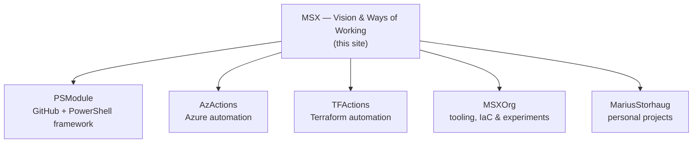

# Ecosystem

This site explains the vision. The **ecosystem** is where the vision is demonstrated — a set of GitHub organizations and repositories, each a concrete answer to one question:

> What would this look like if it were *easy*, to move *fast*, in a *safe* way?

The vision is stable and lives here. The products that express it grow, change, and occasionally retire. This page is the map from the *why* to the *what*.

## How it fits together

Each node inherits the principles on this site rather than restating them. Read the vision once; see it applied many times.

## Where the why comes to life

| Organization                                          | What it demonstrates                                                                 |
| ----------------------------------------------------- | ----------------------------------------------------------------------------------- |
| [PSModule](https://github.com/PSModule)               | Making it *easy* to build, test, and ship PowerShell on GitHub — the flagship.      |
| [AzActions](https://github.com/AzActions)             | Reusable building blocks for automating Azure.                                       |
| [TFActions](https://github.com/TFActions)             | Reusable building blocks for automating Terraform and infrastructure as code.        |
| [MSXOrg](https://github.com/MSXOrg)                   | Tooling, infrastructure, and experiments — including this documentation site.        |
| [MariusStorhaug](https://github.com/MariusStorhaug)   | Personal projects and the profile behind it all.                                     |

### PSModule

A GitHub and PowerShell development framework — a collection of reusable modules and a set of GitHub Actions that automate the full PowerShell delivery lifecycle. It is the most complete expression of the vision: the right thing made the easy thing, end-to-end. Its own documentation lives at [psmodule.io](https://psmodule.io).

### AzActions and TFActions

Where the principles meet the cloud. Reusable GitHub Actions and workflows that make automating **Azure** and **Terraform** consistent, observable, and safe — the same [Coding Standards](../Coding-Standards/index.md) and [Ways of Working](../Ways-of-Working/index.md), applied to infrastructure.

### MSXOrg

The home for tooling, infrastructure-as-code, editor extensions, and experiments — and the host of this documentation site. Where new ideas are tried before they earn a place elsewhere.

## A living map

This list grows and changes as the ecosystem does. What stays constant is the relationship: every organization and repository points back to the [Vision](../Vision/index.md) on this site. When you want to know *why* something is built the way it is, the answer is here. When you want to see *what* that looks like in practice, follow the links above.
