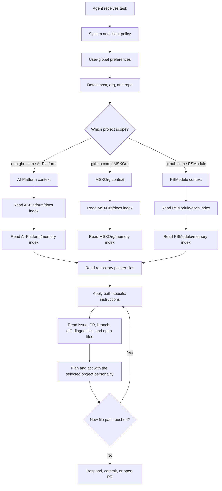

# Agentic Development — Design

The behaviour in the [spec](spec.md) is delivered by an organization-level documentation and memory pair, adopted by each product repository through thin pointer files. The design keeps project knowledge in one reviewed place, keeps working memory in one durable place, and lets each agent runtime adapt without copying process knowledge.

## Organization anatomy

The GitHub organization is the project boundary. The host distinguishes work from personal projects; the organization selects the project context.

```text
<host>/<org>/
  docs/      # canonical knowledge base; changes through pull requests
  memory/    # durable agent and team memory; versioned working knowledge
  <repo-a>/  # product or component repository
  <repo-b>/
```

Current project scopes follow the same shape:

| Host | Organization | Docs | Memory |
| --- | --- | --- | --- |
| `dnb.ghe.com` | `AI-Platform` | `AI-Platform/docs` | `AI-Platform/memory` |
| `github.com` | `MSXOrg` | `MSXOrg/docs` | `MSXOrg/memory` |
| `github.com` | `PSModule` | `PSModule/docs` | `PSModule/memory` |

## Repository roles

### `docs`

The `docs` repository is the canonical knowledge base. It owns:

- vision, principles, and ways of working;
- coding standards and documentation standards;
- framework and capability specs and designs;
- project glossary and onboarding;
- agent role descriptions and integration guidance.

Changes to `docs` happen through pull requests because this repository defines durable project intent.

### `memory`

The `memory` repository is the durable working-memory store. It owns:

- recurring gotchas and lessons learned;
- active project context that should survive a single chat session;
- agent role working knowledge;
- issue, PR, and incident notes worth reusing;
- project-specific preferences that are factual rather than private user preference.

Memory pages stay short and factual. They are safe to read before work begins and safe to improve when a lesson is learned.

### Product repositories

Product repositories carry local context and thin pointers:

```text
<repo>/
  AGENTS.md
  CLAUDE.md
  .github/
    copilot-instructions.md
    instructions/
      <scope>.instructions.md
  README.md
  docs/
```

The repository owns only repository-specific nuance: build commands, architecture notes, local exceptions, and path-scoped rules. Cross-cutting standards remain in `docs`; reusable lessons remain in `memory`.

## OKF page model

Both `docs` and `memory` use the [Open Knowledge Format](../../Dictionary/index.md#open-knowledge-format) style: Markdown with YAML frontmatter, one concept per page, paths as stable identity, and indexes as navigation maps.

Minimum page frontmatter:

```yaml
---
title: Agentic Development
description: One-line description of the page.
---
```

Memory pages MAY add scope-oriented metadata when it helps agents filter context:

```yaml
---
title: GitHub Actions cache gotchas
description: Reusable notes for cache failures and permissions.
scope: project
tags:
  - github-actions
  - cache
  - gotcha
---
```

The body stays concise. If a page grows into multiple concepts, split it and link through the nearest `index.md`.

## Indexes as the mindmap

Indexes are the navigation layer. An agent starts at the root index, reads descriptions, then drills inward until it reaches the relevant page.

```text
docs/
  index.md
  Ways-of-Working/index.md
  Coding-Standards/index.md
  Frameworks/index.md
  Frameworks/Agentic-Development/index.md

memory/
  index.md
  agents/index.md
  knowledge/index.md
  gotchas/index.md
```

Every index describes what sits below it. Generated indexes are preferred where tooling exists; manually maintained indexes are acceptable when the memory repository is intentionally lightweight.

## Context resolution flow



Resolution is deterministic. If the active repository remote is `github.com/PSModule/Json`, the selected project context is `PSModule`; if it is `github.com/MSXOrg/docs`, the selected project context is `MSXOrg`. Multi-root workspaces use the active file, explicit user prompt, current terminal directory, or branch repository to select the project. Ambiguity is resolved by asking the user before acting.

## Pointer files

`AGENTS.md` is the cross-runtime pointer file. It identifies the project, names the canonical docs and memory roots, and lists local nuance.

```markdown
# Agent Instructions

This repository belongs to `github.com/MSXOrg`.

Canonical project context:

- `github.com/MSXOrg/docs`
- `github.com/MSXOrg/memory`

Before changing files:

1. Segment the work by host, organization, repository, path, and task.
2. Read the relevant index in the resolved project docs repository.
3. Read relevant project memory for the resolved organization.
4. Read this repository's README and local docs.
5. Apply path-specific instructions for the files being changed.

This file points; it does not define process knowledge.
```

`CLAUDE.md` stays a thin import:

```markdown
@AGENTS.md
```

`.github/copilot-instructions.md` points Copilot to the same root and adds only Copilot-specific loading guidance:

```markdown
Follow `AGENTS.md`.

Segment the work by host, organization, repository, path, and task before loading project standards or memory. Resolve organization docs and memory before editing. Use path-specific instruction files when their `applyTo` pattern matches a file being read, generated, reviewed, or edited.
```

Path-specific instruction files are reserved for local rules that cannot live centrally because they apply only to a repository path.

## Local workspace

A local bootstrap makes central context predictable:

```text
~/.msx/
  AI-Platform/
    docs/
    memory/
  MSXOrg/
    docs/
    memory/
  PSModule/
    docs/
    memory/
```

The bootstrap clones missing repositories and fast-forwards existing clones when possible. It writes repository-local git configuration only. If a context repository cannot update, the agent uses the local copy and reports that it may be stale.

## Memory writing rules

Agents write memory only when a lesson is likely to matter again. Good memory is:

- short and factual;
- scoped to the organization;
- linked to the issue, PR, repository, or document that proves it;
- free of secrets, credentials, and private personal notes;
- updated or removed when it becomes wrong.

Session-specific notes stay out of durable memory unless they become reusable project knowledge.

## Client behaviour

Different clients load different files, but the framework keeps the same dependency direction:

| Client | Adapter | Behaviour |
| --- | --- | --- |
| Cross-client agents | `AGENTS.md` | Read the shared project pointer and local nuance. |
| Claude Code | `CLAUDE.md` | Import `AGENTS.md`; add no duplicated process knowledge. |
| GitHub Copilot in VS Code | `.github/copilot-instructions.md` and `.github/instructions/*.instructions.md` | Read project pointers, then apply path-specific instructions when files match. |
| Copilot coding agent | `AGENTS.md`, `.github/copilot-instructions.md`, setup workflow | Prepare the local context before implementation and follow the same project roots. |
| Copilot code review | Base-branch instructions | Review using trusted base-branch instructions rather than instructions changed by the PR under review. |

## Failure modes

| Failure | Design response |
| --- | --- |
| Repository does not identify its organization context | Infer from remote URL; ask when ambiguous. |
| Docs or memory clone is missing | Bootstrap it before work; if unavailable, continue only with explicit warning. |
| Pointer file duplicates central standards | Replace duplicated content with links during review. |
| Memory conflicts with docs | Docs win; memory is corrected or removed. |
| Two organizations are open in one workspace | Select by active repository; ask before cross-project changes. |
| A client ignores one pointer format | Add a thin adapter for that client that points to the same canonical roots. |

## Adoption path

1. Create or identify the organization `docs` repository.
2. Create or identify the organization `memory` repository.
3. Add `docs/index.md` and `memory/index.md` as the two root maps.
4. Add framework docs, standards, and agent role descriptions to `docs`.
5. Add starter memory sections to `memory`.
6. Add thin pointer files to each product repository.
7. Add a bootstrap that keeps local docs and memory clones present.
8. Review new work for pointer discipline: facts live once, links point to them.

## Where this connects

- [Spec](spec.md) — the requirements this design delivers.
- [Agentic Development](../../Ways-of-Working/Agentic-Development.md) — the way-of-working standard this framework implements.
- [Documentation Model](../../Ways-of-Working/Documentation-Model.md) — why spec and design are split.
- [README-Driven Context](../../Ways-of-Working/Readme-Driven-Context.md) — why local repository context remains the front door.
