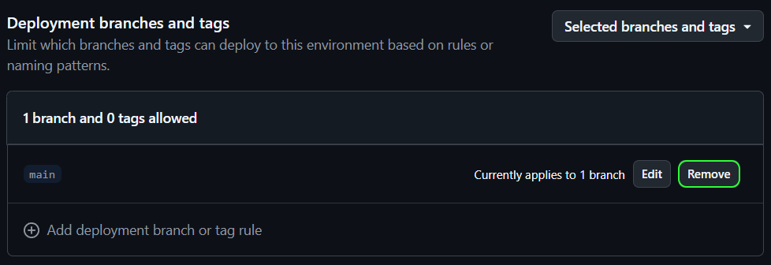
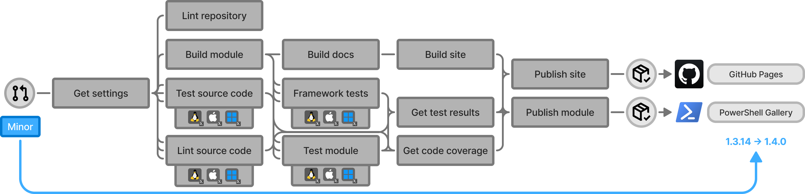

# Process-PSModule

Process-PSModule is the corner-stone of the PSModule framework. It is an end-to-end GitHub Actions workflow that automates the entire lifecycle of a
PowerShell module. The workflow builds the PowerShell module, runs cross-platform tests, enforces code quality and coverage requirements, generates
documentation, and publishes module to the PowerShell Gallery and its documentation site to GitHub Pages. It is the core workflow used across all
PowerShell modules in the [PSModule organization](https://github.com/PSModule), ensuring reliable, automated, and maintainable delivery of PowerShell
projects.

## How to get started

1. [Create a repository from the Template-Module](https://github.com/new?template_name=Template-PSModule&template_owner=PSModule&description=Add%20a%20description%20(required)&name=%3CModule%20name%3E).
2. Configure the repository:
   1. Enable GitHub Pages in the repository settings. Set it to deploy from **GitHub Actions**.
   2. This will create an environment called `github-pages` that GitHub deploys your site to.
      

Within the <code>github-pages</code> environment, remove the branch protection for <code>main</code>.

        
      

   3. [Create an API key on the PowerShell Gallery](https://www.powershellgallery.com/account/apikeys). Give it permission to manage the module you
      are working on.
   4. Create a new secret called `APIKEY` in the repository and set the API key for the PowerShell Gallery as its value.
   5. If you are planning on creating many modules, you could use a glob pattern for the API key permissions in PowerShell Gallery and store the
      secret on the organization.
3. Clone the repo locally, create a branch, make your changes, push the changes, create a PR and let the workflow run.
   - Adding a `Prerelease` label to the PR will create a prerelease version of the module.
4. When merging to `main`, the workflow automatically builds, tests, and publishes your module to the PowerShell Gallery and maintains the
   documentation on GitHub Pages. By default the process releases a patch version, which you can change by applying labels like `minor` or `major` on
   the PR to bump the version accordingly.

## How it works

Everything is packaged into this single workflow to simplify full configuration of the workflow via this repository. Simplifying management and
operations across all PowerShell module projects. A user can configure how it works by simply configuring settings using a single file.

### Workflow overview

The workflow is designed to be triggered on pull requests to the repository's default branch.
When a pull request is opened, closed, reopened, synchronized (push), or labeled, the workflow will run.
Depending on the labels in the pull requests, the [workflow will result in different outcomes](usage.md#scenario-matrix).

### Dependency tree

Process-PSModule composes its work from reusable workflows, actions, a container image, PowerShell modules, and Python packages. For the full
dependency tree, including diagrams and a reference of every dependency, see [DEPENDENCIES.md](https://github.com/PSModule/Process-PSModule/blob/main/DEPENDENCIES.md).

For the stage-by-stage breakdown of every job, how to call and configure the workflow, and the principles behind it, see the pages below.

<!-- INDEX:START -->

| Page | Description |
| --- | --- |
| [Pipeline stages](pipeline-stages.md) | The job-by-job breakdown of the Process-PSModule workflow, from Plan through Publish Docs. |
| [Usage](usage.md) | How to call the Process-PSModule workflow — inputs, secrets, permissions, the scenario matrix, and important-file change detection. |
| [Configuration](configuration.md) | The Process-PSModule settings file — every available setting, the full defaults, and worked examples for coverage, rapid testing, linting, and release notes. |
| [Skipping framework tests](skipping-framework-tests.md) | How to skip individual PSModule framework tests on a per-file basis, the available test IDs, and the broader configuration alternatives. |
| [Repository structure](repository-structure.md) | The repository and module source layout Process-PSModule expects, and how to declare module dependencies with #Requires -Modules. |
| [Principles and practices](principles-and-practices.md) | The versioning, branching, and colocation principles behind Process-PSModule, and the development practices it is compatible with. |

<!-- INDEX:END -->
