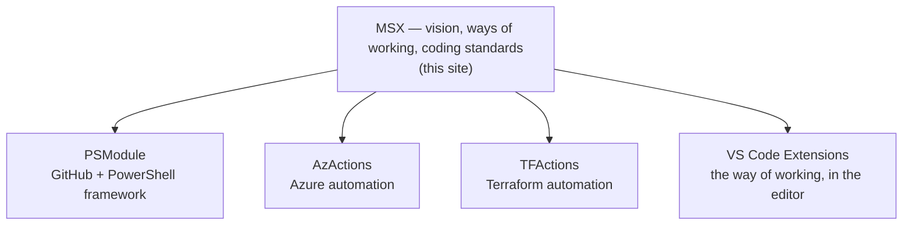

# Initiatives

The **initiatives** are where the vision becomes something you can use. Each one is a product — a framework, a set of reusable actions, an editor extension — that answers a single question:

> What would this look like if it were *easy*, to move *fast*, in a *safe* way?

The vision, principles, ways of working, and coding standards are written once, here, and **inherited** by every initiative. Products grow, change, and occasionally retire; the principles they express stay put.

<!-- INDEX:START -->

| Page | Description |
| --- | --- |
| [PSModule](PSModule.md) | The GitHub + PowerShell framework — reusable modules and the actions that ship them. |
| [AzActions](AzActions.md) | Reusable building blocks for automating Azure on GitHub. |
| [TFActions](TFActions.md) | Reusable building blocks for automating Terraform and infrastructure as code. |
| [VS Code Extensions](VS-Code-Extensions.md) | Editor tooling that brings the MSX way of working into VS Code. |

<!-- INDEX:END -->

## How they fit together

Each initiative inherits the principles on this site rather than restating them — read the vision once, see it applied many times. New ideas are incubated in **[MSXOrg](https://github.com/MSXOrg)** — tooling, infrastructure, and experiments — before they earn a place of their own.

## A living map

This list grows and changes as the work does. What stays constant is the relationship: every initiative points back to the [Vision](../Vision/index.md). When you want to know *why* something is built the way it is, the answer is here; when you want to see *what* that looks like in practice, open an initiative.
