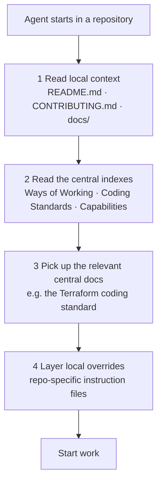

# Agentic Development

How the ecosystem's ways of working, coding standards, and documentation are authored — and how both humans and agents consume them. The documentation defines how work is done; agent configuration *references* that documentation. It never the other way around.

## Premise

Process knowledge — how to open an issue, how to review a pull request, how Terraform is written — belongs in documentation, written once for two audiences. The temptation is to encode it as a tool-specific "skill" or instruction file, tightly coupled to one agent's format and scattered across repositories. That inverts the relationship and guarantees drift: the same rule, copied into many tool files, disagrees with itself the moment one copy changes.

The specification fixes the direction of the dependency. The docs are the **stable core** that states how work is done. Agent configuration files are **thin pointers** to those docs — the same pages a new team member would read. Adding or swapping an agent runtime means writing new pointers, not rewriting process knowledge.

## Principles

This spec rests on the [Principles](Principles/index.md). Four apply directly:

- **Written once, referenced everywhere.** A standard, a process, or a convention is defined in exactly one place and linked from everywhere else. Agent config, repository docs, and tool integrations point to that definition — they never duplicate it. This is [DRY](Principles/Software-Design.md#dry-with-judgment) applied to process knowledge.
- **[Documentation lives close to the thing it documents](Principles/Engineering-Practices.md#documentation-lives-close-to-the-thing-it-documents).** Repo-specific context lives in the repository; cross-cutting guidance lives in the org-level docs and is referenced by its canonical URL. An agent always reads the repository's own context first.
- **[AI-first development](Principles/AI-First-Development.md).** Humans create context — in issues, docs, and decisions — and agents act on it. Because agents are trained to read documentation, keeping standards in documentation form serves both audiences with a single artifact; no separate "agent manual" exists.
- **[Extensible by default](Principles/Software-Design.md#extensible-by-default).** Ways of working and standards are the stable core. Coding agents are adapters that plug in. The system is pluggable: the docs do not change when a new runtime is added — only a new integration layer is written.

## Architecture

Agent configuration files are **pointers, not containers**. They tell the agent which human-readable files to read; they hold no process knowledge of their own. Documentation lives where it belongs — repo-specific docs in each repository's `README.md`, `CONTRIBUTING.md`, and `docs/`; cross-cutting standards in the org-level documentation site, referenced by canonical URL.

When an agent starts work in a repository, it discovers context in layers — local first, then central, then local nuance on top:

The flow is sequential, not a decision. The agent reads local docs to understand the repository, reads the central indexes to see which shared standards exist, picks up the relevant ones, and finally checks for local overrides that add repo-specific nuance. **Local files never replace central standards — they layer specifics on top.** The docs are the stable core; every integration is a thin adapter that references them.

## Where documentation lives

Documentation is not collected into a single repository. Each page is authored and maintained where it naturally belongs:

| Scope | Home | Examples |
| --- | --- | --- |
| **Cross-cutting** — ways of working, coding standards, capabilities | The org-level documentation site | This site: <https://msxorg.github.io/docs/> |
| **Repo-specific** — architecture, setup, domain context | The repository that owns it | `README.md`, `CONTRIBUTING.md`, `docs/` |

This split follows [Repository Segmentation](Repository-Segmentation.md) and [README-Driven Context](Readme-Driven-Context.md): the README is the front door of a repository, and the org-level site is the front door of the ecosystem.

## How an agent runtime plugs in

Agent context is delivered through three layers, in priority order — the same three layers the [Principles](Principles/AI-First-Development.md#human-agent-coexistence) describe:

1. **Documentation.** The primary source. The published docs, READMEs, and issue bodies are written for humans and read natively by agents.
2. **Central agent descriptions.** The roles agents play — Define, Implement, Reviewer, and the rest — are authored once as documentation in the [Agents](../Agents/index.md) section. They describe roles, boundaries, and procedural steps, and they reference the ways of working; they never restate a standard or convention.
3. **Local pointer files.** Each repository carries an `AGENTS.md` — read natively by most agent runtimes — and a `CLAUDE.md` that imports it, pointing to the central descriptions and adding only repo-specific nuance and the small amount of genuinely tool-specific configuration (permission scopes, path-scoped rules) that cannot be expressed as a pointer.

Any new runtime follows the same pattern, regardless of vendor:

- A **context file** that links to the ways-of-working docs and the repository's own context.
- **Workflow entry points** — named commands or agents — that reference those same docs and add the operational steps (branch creation, tool invocations, API calls).
- **Tool-specific settings** — permissions, model selection, and the like.

The context file and the entry points are pointers; the settings are the only genuinely tool-specific surface. When a new runtime is adopted, only this integration layer is added — the documentation it points to is untouched.

## Distribution

The two non-documentation layers have different distribution models:

- **Central agent descriptions** live in the [Agents](../Agents/index.md) section of this site and are referenced by canonical URL — one definition, available to every repository and runtime with no per-repo copy to maintain.
- **Per-repository pointer files** — `AGENTS.md`, the `CLAUDE.md` that imports it, and any path-scoped instruction files — are seeded from a template repository and kept current across existing repositories by a sync mechanism.

Process knowledge is never added to a distributed config file. If an agent needs the branch strategy, it goes in [Branching and Merging](Branching-and-Merging.md) or the repo's `CONTRIBUTING.md`; if it needs a coding convention, it goes in the relevant [coding standard](../Coding-Standards/index.md). The config file only points — it never defines.

## The workspace bootstrap

The natively-read entry file is a thin **bootstrap**, not a copy of the docs. Each runtime auto-loads its own file — Copilot reads `AGENTS.md`, Claude Code reads `CLAUDE.md` (which imports the same instructions) — and that file's first instruction is to make the central workspace present locally, then read from it.

The workspace is a git-isolated clone of the central repositories under `~/.msx`:

- `~/.msx/docs` — this documentation, read as local files. Changes to it go through pull requests.
- `~/.msx/memory` — durable notes and prior session context. Changes to it are pushed to main.

Each clone carries repository-local git config only, so the workspace never touches the global git config or the repository the agent is working in. The setup is one idempotent script — [`bootstrap/Initialize-MsxWorkspace.ps1`](https://github.com/MSXOrg/docs/blob/main/bootstrap/Initialize-MsxWorkspace.ps1) — that clones what is missing and fast-forwards the rest. This keeps "start at the same point" literal: every agent, in every repository, begins from the same local docs and memory.

## Where this connects

- [Documentation Model](Documentation-Model.md) — the discipline this specification follows.
- [Principles](Principles/index.md) — the beliefs this specification rests on, including the three-layer agent context model.
- [README-Driven Context](Readme-Driven-Context.md) — why the repository's own context comes first.
- [Coding Standards](../Coding-Standards/index.md) — the cross-cutting standards agents pick up in the central layer.
