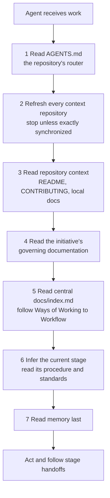

# Agentic Development

How the ecosystem's ways of working, coding standards, and documentation are authored — and how both humans and agents consume them. The documentation defines how work is done; agent configuration *references* that documentation, never the other way around.

## Premise

Process knowledge — how to open an issue, how to review a pull request, how Terraform is written — belongs in documentation, written once for two audiences. The temptation is to encode it as a tool-specific "skill" or instruction file, tightly coupled to one agent's format and scattered across repositories. That inverts the relationship and guarantees drift: the same rule, copied into many tool files, disagrees with itself the moment one copy changes.

The specification fixes the direction of the dependency. The docs are the **stable core** that states how work is done. Agent configuration files are **thin pointers** to those docs — the same pages a new team member would read. Adding or swapping an agent runtime means writing new pointers, not rewriting process knowledge.

## Principles

This spec rests on the [Principles](Principles/index.md). Four apply directly:

- **Written once, referenced everywhere.** A standard, a process, or a convention is defined in exactly one place and linked from everywhere else. Agent config, repository docs, and tool integrations point to that definition — they never duplicate it. This is [DRY](Principles/Software-Design.md#dry-with-judgment) applied to process knowledge.
- **[Documentation lives close to the thing it documents](Principles/Engineering-Practices.md#documentation-lives-close-to-the-thing-it-documents).** Repo-specific context lives in the repository; cross-cutting guidance lives in the org-level docs and is referenced by its canonical URL. An agent always reads the repository's own context first.
- **[AI-first development](Principles/AI-First-Development.md).** Humans create context — in issues, docs, and decisions — and agents act on it. Because agents are trained to read documentation, keeping standards in documentation form serves both audiences with a single artifact; no separate "agent manual" exists.
- **[Extensible by default](Principles/Software-Design.md#extensible-by-default).** Ways of working and standards are the stable core. Coding agents are adapters that plug in. The system is pluggable: the docs do not change when a new runtime is added — only a new integration layer is written.

## Architecture

Agent configuration files are **pointers, not process containers**. They name the context that governs the work and the order to read it in. They do not select a persona, copy workflow stages, restate standards, or carry the repository's own operating instructions. Documentation lives where it belongs — repo-specific context in each repository's `README.md`, `CONTRIBUTING.md`, and `docs/`; cross-cutting guidance in the org-level documentation site; workspace setup in the user-global bootstrap.

When an agent receives work, it follows the same documentation trail a human can follow:

```mermaid
flowchart TD
  task["Agent receives work"] --> pointer["1 Read AGENTS.md<br/>the repository's router"]
  pointer --> refresh["2 Refresh every context repository<br/>stop unless exactly synchronized"]
  refresh --> repo["3 Read repository context<br/>README, CONTRIBUTING, local docs"]
  repo --> initiative["4 Read the initiative's<br/>governing documentation"]
  initiative --> root["5 Read central docs/index.md<br/>follow Ways of Working to Workflow"]
  root --> stage["6 Infer the current stage<br/>read its procedure and standards"]
  stage --> memory["7 Read memory last"]
  memory --> work["Act and follow stage handoffs"]
```

Refresh is a gate before traversal, not a best-effort background step. After it passes, the indexes are the default discovery mechanism. [Workflow](Workflow.md) owns the process and routes the work to a [stage procedure](Workflow-Stages/index.md); the stage page then points to the standards and artifacts it consumes. A clear prompt such as `Review this PR <link>` may shortcut directly through the Workflow routing table, but it does not create a second process definition. **Local files never replace central standards — they layer specifics on top.**

## Where documentation lives

Documentation is not collected into a single repository. Each page is authored and maintained where it naturally belongs:

| Scope | Home | Examples |
| --- | --- | --- |
| **Cross-cutting** — ways of working, coding standards, capabilities | The org-level documentation site | This site: <https://msxorg.github.io/docs/> |
| **Repo-specific** — architecture, setup, domain context | The repository that owns it | `README.md`, `CONTRIBUTING.md`, `docs/` |

This split follows [Repository Segmentation](Repository-Segmentation.md) and [README-Driven Context](Readme-Driven-Context.md): the README is the front door of a repository, and the org-level site is the front door of the ecosystem.

## How an agent runtime plugs in

Each repository carries an `AGENTS.md` that routes an agent from the repository's own files outward to the documentation and memory that govern it. A client that cannot read that filename gets a route to it, and adds only the small amount of genuinely tool-specific configuration, such as permission scopes or path matching, that cannot live in ordinary documentation.

Any new runtime follows the same pattern, regardless of vendor:

- A **context pointer** that identifies the canonical docs and memory root indexes.
- Optional **keyword shortcuts** that route a clearly stated task to the matching [Workflow stage](Workflow.md#find-the-current-stage) without copying its procedure.
- **Tool-specific settings** — permissions, model selection, and the like.

There is no separate process surface for Define, Implement, or Review. If a client exposes a skill, command, named agent, or other convenience, it links to the canonical stage page and adds no process knowledge. When a new runtime is adopted, only this thin integration layer is added.

### Which agent files a repository carries

| File | Status | Role |
| --- | --- | --- |
| `AGENTS.md` | Required | The router, at the repository root. A list of destinations, nothing more. |
| `.claude/CLAUDE.md` | Required | Routes Claude Code to the router: `@../AGENTS.md`. |
| `.github/copilot-instructions.md` | Required | Routes the Copilot surfaces that do not read `AGENTS.md` to the router. |
| `.github/instructions/*.instructions.md` | Exceptional | A path-scoped caveat that genuinely has nowhere better to live. |

One router, and a route for every client that cannot reach it under that name.

#### What `AGENTS.md` routes to

`AGENTS.md` is a list of destinations and nothing else. It carries no bootstrap steps, no build commands, no contribution mechanics, and no standards — each of those has a file that already owns it. What it holds is the order:

1. **`README.md`** — what this repository is and how it builds.
2. **`CONTRIBUTING.md`** — how a change is made and reviewed here.
3. **The repository's own `docs/`** — when it has any.
4. **The initiative's governing documentation** — the standards for this family of repositories.
5. **The central MSX documentation** — the ecosystem-wide ways of working and coding standards this site owns.
6. **Memory** — durable lessons from earlier work, read last.

Nearest first, widening outward. A repository's own files answer the questions only it can answer, and each step out answers a broader one. The order is written generically on purpose: every initiative resolves step 4 to its own documentation, so the same router works in any organization that adopts this model.

Steps collapse where they coincide. A repository that publishes the standards — this one — resolves steps 3, 4, and 5 to the same `docs/` tree and has nothing above it, so its router lists four destinations rather than six. Skipping a step because it does not exist is not the same as omitting it.

Anything an agent needs *before* it can reach step 1 — cloning the workspace, the freshness gate — belongs to the [user-global bootstrap](#the-workspace-bootstrap), not to a repository file. A per-repository copy of the bootstrap is the same duplication in a different place.

#### Reading order is not authority order

An agent reads nearest-first. Authority runs the other way.

| Layer | Read | Authority |
| --- | --- | --- |
| Repository files | First | Add local nuance and narrow exceptions; never silently override a standard. |
| Initiative documentation | Next | Governs that initiative's repositories, and may adjust an MSX default for them. |
| Central MSX documentation | Next | The ecosystem default every repository inherits. |
| Memory | Last | Informs; never governs. Where memory and documentation disagree, the documentation is right and the memory entry is corrected. |

Reading nearest-first is what makes an agent efficient. Letting the nearest file win would make it wrong.

#### Client files route, they never carry content

Agent runtimes do not agree on a filename. `AGENTS.md` is read natively by Copilot Chat in VS Code, the Copilot cloud agent, and Copilot code review on GitHub.com, among others. Claude Code reads its own name. Copilot Chat on GitHub.com, Visual Studio, JetBrains, Eclipse, and Copilot code review outside GitHub.com read `.github/copilot-instructions.md`, as GitHub's [custom instructions support matrix](https://docs.github.com/en/copilot/reference/custom-instructions-support) records.

Each of those clients gets a file whose entire content is a route to the router. The risk these files carry is **duplication, and duplication is a property of content rather than of filenames**. A file that says only "follow `AGENTS.md`" has nothing in it to drift. A file that restates the reading order, the workflow, or a coding standard has everything to drift, no matter what it is called.

So the rule is about what a client file may contain, not how many of them exist:

- a route to `AGENTS.md`, and
- at most, genuinely runtime-specific configuration — permission scopes, model choice — that cannot be expressed as documentation.

It never restates a standard, never describes a workflow stage, and never repeats the reading order below. The router owns all of that, and every client reaches the same copy of it.

#### Path-scoped instruction files are the exception

A `.github/instructions/*.instructions.md` file earns its place only when a rule applies to one path in one repository and has nowhere better to live. Before adding one, put the rule where it belongs:

- a fact about the repository → `README.md`;
- a rule about contributing or reviewing → `CONTRIBUTING.md`;
- anything another repository could reuse → the initiative or central documentation.

What survives that test is a genuine local caveat, which is the narrow case these files exist for. They never restate a standard and never define workflow behaviour.

The [agentic development capability](../Capabilities/agentic-development/spec.md) is deliberately broader than this page: it permits a route for any client that points back to the same router, so an organization adopting the framework can support a runtime this one does not use. This page states what an MSX repository carries.

## Distribution

The two non-documentation layers have different distribution models:

- **The canonical process** lives in [Workflow](Workflow.md), which links to ordinary documentation pages for each [stage procedure](Workflow-Stages/index.md).
- **Per-repository pointer files** — `AGENTS.md` and the client routes that reach it — are seeded from a template repository and kept current across existing repositories by a sync mechanism. The routes are stable because they hold no content; what changes over time is the router they point at. A path-scoped instruction file is written by the repository that needs it and is not distributed.

Process knowledge is never added to a distributed config file. If an agent needs the branch strategy, it goes in [Branching and Merging](Branching-and-Merging.md) or the repo's `CONTRIBUTING.md`; if it needs a coding convention, it goes in the relevant [coding standard](../Coding-Standards/index.md). The config file only points — it never defines.

## The workspace bootstrap

The **user-global** entry file is a thin **bootstrap**, not a copy of the docs. Each runtime auto-loads its own user-level file — Copilot from its user instructions, Claude Code from `~/.claude/CLAUDE.md` (which imports the same instructions) — and its first instruction is to make the central workspace present locally, then start at the root indexes. It is central-first by design, because its whole job is to make central context exist before anything reads it. That is distinct from the per-repository `AGENTS.md`, which runs in the opposite direction once the workspace is present.

The workspace is a git-isolated clone of the central repositories under `~/.msx`:

- `~/.msx/docs` — this documentation, read as local files. Changes to it go through pull requests.
- `~/.msx/memory` — durable notes and prior session context. Changes to it are pushed to main.

Each clone carries repository-local git config only, so the workspace never modifies the global git config or the repository the agent is working in — git still reads them, but only repository-local config is written. Before context is read, [`bootstrap/Initialize-MsxWorkspace.ps1`](https://github.com/MSXOrg/docs/blob/main/bootstrap/Initialize-MsxWorkspace.ps1) clones missing repositories and requires every existing context repository to be clean, on its remote default branch, and exactly synchronized with the remote head. Any update failure stops context resolution rather than allowing stale guidance or memory.

The workspace makes the *central* context present locally; the same local-first stance shapes how each working repository is laid out. Repositories are cloned as [git worktrees](Git-Worktrees.md) — one working directory per branch — so a person and an agent, or several agents, can work on multiple issues in the same repository at once without stashing or switching branches.

## Where this connects

- [Git Worktrees](Git-Worktrees.md) — how this framework is implemented on a local machine, so several pieces of work run in parallel.
- [Documentation Model](Documentation-Model.md) — the discipline this specification follows.
- [Principles](Principles/index.md) — the beliefs this specification rests on, including the three-layer agent context model.
- [README-Driven Context](Readme-Driven-Context.md) — why the repository's own context comes first.
- [Coding Standards](../Coding-Standards/index.md) — the cross-cutting standards agents pick up in the central layer.
