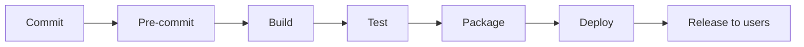

# Continuous Delivery and Release

Four terms are routinely used as if they were one: continuous integration, continuous
delivery, continuous deployment, and continuous release. They are not
interchangeable, and the difference between them is not academic — it decides where a
human still makes a call, what a pipeline is allowed to do without being asked, and
what "done" means for a change.

This page draws the distinction and records the decisions that follow from it. The
wider family of always-on practices, and where each term originates, is covered in
[Continuous Practices](Continuous-Practices.md); this page is about the delivery end of
that family in operational detail.

## The distinction

Each practice extends the one before it. The pipeline is the same spine every time;
what changes is how far along it a change travels without a human.

| Practice | What it means | Where it stops |
| --- | --- | --- |
| **Continuous integration** | Every change is merged into the mainline frequently and verified there | A verified mainline. Nothing is packaged for release. |
| **Continuous delivery** | Every verified change is packaged and proven deployable, so the mainline is releasable **at all times** | A releasable artifact. Shipping is a business decision a human makes. |
| **Continuous deployment** | The manual gate is removed — a verified change deploys itself | Deployed. Whether users see it is a separate question. |
| **Continuous release** | Users can now see the change | Released to users. |

The one-line version: **delivery means ready to ship the moment a human decides;
deployment means it ships itself; release means users can see it.** Deploying is not
releasing.

Continuous integration covers `Commit → Test`. Continuous delivery extends to
`Package`, and stops. Continuous deployment extends to `Deploy` automatically.
Continuous release extends to `Release to users` — which, once deployment and release
are decoupled by a flag or a progressive rollout, is a decision about exposure rather
than about a pipeline.

The final step is the one most often skipped in discussion, and it is the only one the
user experiences. A change sitting deployed behind a disabled flag has shipped nothing.

## Shift left: pre-commit is CI running locally

The first box on that spine is not decoration. A pre-commit hook runs the fast slice of
CI on the contributor's machine — the same linters and formatters the pipeline will run,
executed before the commit exists.

That makes pre-commit and CI the same gate at two distances, not two different gates.
The pipeline remains authoritative, because a local run can be skipped and a required
check cannot; the local run exists so that the overwhelming majority of failures are
found in seconds rather than minutes. See
[Pre-Commit](../Coding-Standards/Pre-Commit.md).

## Design decisions

Four decisions turn the distinction above into something a pipeline can implement.

### D1 — Build once, decided per artifact type

The classic rule is *build once, promote the same artifact*. It holds across the
pull-request-to-main boundary only for artifacts that have an **external addressable
identity** independent of their version. Where the version is embedded in the artifact,
promotion is impossible and the artifact MUST be rebuilt.

| Artifact | Across the PR → main boundary | Why |
| --- | --- | --- |
| Container image | **Promote** | Addressed by digest; a tag is metadata attached afterwards |
| Stored infrastructure plan | **Promote** | The plan is the reviewed artifact; rebuilding it invalidates the review |
| Composite action referenced by tag | **Promote** | Identity is the git ref, not a built file |
| Compiled binary | **Rebuild** | Version is compiled in |
| Module manifest | **Rebuild** | Version is a field inside the manifest |
| Package manifest for a language registry | **Rebuild** | Version is a field inside the manifest |

The rule of thumb: **external identity means promote, embedded version means rebuild.**
A promoted artifact behaves like continuous delivery — the thing that was reviewed is
the thing that ships. A rebuilt artifact behaves like continuous deployment — the
pipeline reproduces it from a verified source, and reproducibility is what carries the
guarantee instead.

### D2 — Version signals feed in, the label decides, at the PR gate

Several signals suggest what kind of change a pull request contains: the shape of the
diff, whether tests were added or changed, the commit messages, and an AI-assisted
reading of the change. Those signals MUST be treated as input. The
[release label](Automation-Labels.md) on the pull request is authoritative, and the
decision is taken at the pull-request gate.

This deliberately moves the version decision **right** — off the contributing agent or
author, onto the gate where a reviewer is already looking. An author guessing at a
version level is guessing about consumers they cannot see; a reviewer at the gate has
the whole change in front of them. It also means the decision is recorded on the
artifact everyone can see, rather than inferred later from history.

### D3 — Pre-release by default, stabilized on merge

Every build from a topic branch MUST be published as a pre-release. The stable version
is cut on merge, from the label.

A pre-release version (`1.3.0-add-widgets.1`) sorts below every stable version, which
is the entire mechanism: a consumer who has not opted in cannot resolve it, so
publishing early is free. Contributors and reviewers get a real, installable artifact
to test against for the whole life of the pull request, and nobody has to build it
by hand.

The stable release is then not a separate act of packaging — it is the same content
with the pre-release suffix removed, at the moment the change becomes part of the
mainline.

### D4 — Recovery is roll-forward only

A published version MUST NOT be altered or replaced. Recovery from a bad release is a
new, higher version.

This is [SemVer](../Dictionary/index.md#semver) §3: release contents are immutable once
published. The practical argument is stronger than the formal one. A consumer who has
already resolved `2.4.1` will not re-resolve it, so replacing its contents produces two
different artifacts answering to one name — and the consumer who was fast enough to
install the first one now has a build nobody can reproduce. Yanking has the same
problem in reverse: it breaks every lockfile that pinned it.

So a broken release stays published and a fix ships as `2.4.2`. The bad version is
recorded as bad in its release notes rather than erased.

## References

- Jez Humble and David Farley, *Continuous Delivery*, Addison-Wesley, 2010 (ISBN 978-0321601919) — the source of the delivery definition and the build-once rule.
- Jez Humble, [Continuous Delivery vs Continuous Deployment](https://continuousdelivery.com/2010/08/continuous-delivery-vs-continuous-deployment/) — including the author's own remark that "a more accurate name might have been continuous release".
- Martin Fowler, [Continuous Integration](https://martinfowler.com/articles/continuousIntegration.html) and [Continuous Delivery](https://martinfowler.com/bliki/ContinuousDelivery.html).
- Dinah McNutt, [Release Engineering](https://sre.google/sre-book/release-engineering/), in *Site Reliability Engineering*, O'Reilly, 2016.
- [Semantic Versioning 2.0.0](https://semver.org/).
- Nicole Forsgren, Jez Humble and Gene Kim, *Accelerate*, IT Revolution, 2018.

## Where this connects

- [Continuous Practices](Continuous-Practices.md) — the wider Continuous X family and where each term comes from.
- [Release Management](../Capabilities/release-management/spec.md) — how the version decision and the pre-release flow are implemented.
- [Automation Labels](Automation-Labels.md) — why the release label is the authoritative signal and why it is namespaced.
- [Pre-Commit](../Coding-Standards/Pre-Commit.md) — the local half of the integration gate.
- [Branching and Merging](Branching-and-Merging.md) — the PR → main boundary the build-once decision is taken across.
