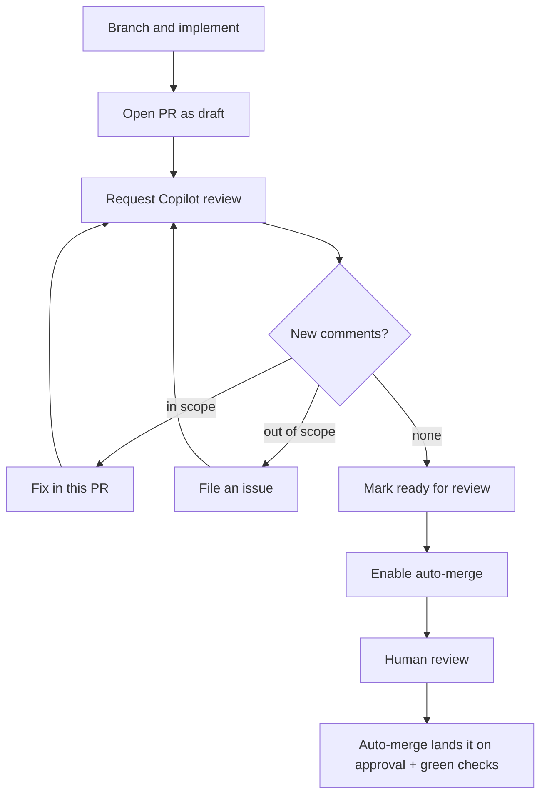

# Contribution Workflow

How a change travels from a branch to a review-ready pull request. The workflow
puts an automated Copilot review *before* human review: the author iterates with
Copilot on a **draft** pull request until it has no more feedback, then opens the
pull request for people.

This is the operational "how". The conventions it builds on live in the ways of
working — [Issue Format](Issue-Format.md), [PR Format](PR-Format.md),
[Branching and Merging](Branching-and-Merging.md), and
[Review Etiquette](Review-Etiquette.md).

## The flow



1. **Branch and implement.** Work on a `<type>/<description>` branch and keep the
   per-change implementation detail in the issue and the pull request, not in the
   spec or design.
2. **Open the pull request as a draft.** A draft attaches CI and keeps the change
   out of people's review queues while you iterate.
3. **Run the Copilot review loop** (below) until Copilot reports a clean round —
   no changes requested and no new inline comments.
4. **Mark the pull request ready for review** once it meets the
   [Definition of Ready for Review](Definition-of-Ready-and-Done.md#definition-of-ready-for-review).
5. **Enable auto-merge** so the change lands automatically when human review
   approves and the required checks stay green. Human review takes over from there.

## Why draft first

- **Copilot is the first pass.** It catches the obvious issues quickly, so the
  cheap feedback is spent before a person's time is
  ([AI-First Development](Principles/AI-First-Development.md)).
- **People review a self-reviewed change.** By the time someone is asked, the pull
  request has already survived an automated pass and the author's responses —
  review starts from a higher baseline.
- **The draft is a safe workspace.** Force-pushes, rewrites, and rapid iteration
  are fine while it is a draft; readiness is a deliberate signal.

## The Copilot review loop

Each round is the same: request a review, wait for Copilot, triage what it says,
and repeat until it is clean. The waiting is deterministic, so it is scripted —
`.github/scripts/Wait-CopilotReview.ps1` **explicitly requests** a Copilot review
and polls until Copilot submits one, then reports whether it left inline comments:

- exit `0` — a clean round: Copilot requested no changes and left **no new inline comments**;
- exit `2` — Copilot has feedback (a new inline comment or a changes-requested review);
- exit `1` — no review arrived before the timeout.

```powershell
# one round: request Copilot and wait for its verdict (-Verbose logs each step)
./.github/scripts/Wait-CopilotReview.ps1 -Repository MSXOrg/<repo> -PullRequest <n> -Verbose
```

**Always request the review explicitly — never assume a ruleset or other
automation will do it.** The script checks whether Copilot is already processing a
request (from the timeline) and requests one only if not; a review "requested
automatically" on push or on marking ready is not guaranteed to fire. Run a round
after each push; the loop ends on a clean round (exit `0`). Copilot re-reviews the
diff from scratch each round, so a genuine false positive can recur — do not
change correct code to silence it; dismiss it with a reason and treat the loop as
converged on substance.

## Triage: fix in scope, file an issue for the rest

For each piece of feedback, decide:

- **In scope** — it concerns the change under review. Address it in this pull
  request and push; the next round re-checks it.
- **Out of scope** — it points at a pre-existing gap or an adjacent improvement.
  File an issue ([Issue Format](Issue-Format.md)) capturing the gap and reference
  it; do not grow the pull request to cover it.
- **Not actionable** — a false positive, or a matter of taste you disagree with.
  Reply with the reason and resolve the thread; a documented dismissal counts as
  handled ([Review Etiquette](Review-Etiquette.md)).

Keeping out-of-scope work in its own issue is what stops a focused change from
sprawling — the pull request stays reviewable, and the gap is recorded rather than
lost.

## Marking ready

Mark the pull request **ready for review** only when it meets the
[Definition of Ready for Review](Definition-of-Ready-and-Done.md#definition-of-ready-for-review):
the loop is clean with no unresolved threads, every required check is green, no task
is left open, and the title, description, and label are final. Readiness is a
deliberate signal that the change has passed the automated pass and is ready for
people — see [Review Etiquette](Review-Etiquette.md) for what a reviewer is
accountable for.

Anyone who can verify that gate — a human contributor, or an agent acting on their
behalf — may mark the pull request ready. The gate, not the actor, is what makes it
ready.

## Enable auto-merge

Once the pull request is ready, enable auto-merge (squash). The change then lands
automatically the moment human review approves and the required checks are green — no
one has to watch the pull request to click merge. Auto-merge waits on exactly the
branch's required checks and required approval, so nothing lands early. See
[Branching and Merging](Branching-and-Merging.md#required-checks-and-auto-merge) for
the approval identity that satisfies the gate.

## Where this connects

- [Workflow](Workflow.md) — the spec-led loop this operates within.
- [PR Format](PR-Format.md) — the pull request title, description, and labels.
- [Definition of Ready and Done](Definition-of-Ready-and-Done.md#definition-of-ready-for-review) — the readiness gate this hands off at.
- [Branching and Merging](Branching-and-Merging.md) — the branch model a pull request builds on.
- [Review Etiquette](Review-Etiquette.md) — how human review proceeds once the pull request is ready.
