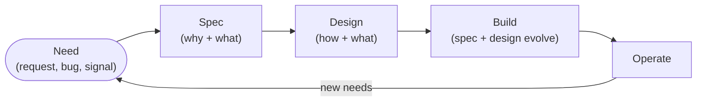

# Documentation Model

Documentation is a product, not a byproduct — and it is written once for two
audiences, **humans and agents**. This page describes how the documentation on
this site is organised so both find what they need fast: every capability is
described by a **spec** and a **design**, kept side by side, kept short, and
kept current as the system evolves.

## A spec and a design for every capability

Each capability the ecosystem builds is documented by two evergreen documents:

| Document | Owns | Answers | Written for |
| --- | --- | --- | --- |
| **Spec** | Requirements, expectations, needs | **Why** it exists and **what** it must do | Whoever decides *whether* and *what* to build |
| **Design** | Implementation approach | **How** and **what** is built to deliver the spec | Whoever *builds* and maintains it |

The **spec** is the contract — the behaviour, guarantees, and success criteria a
user (human or agent) can rely on. It never prescribes implementation. The
**design** is the current answer to *how that contract is delivered*: the
mechanism, the moving parts, the configuration. Both are durable, and both
evolve — neither is a one-time plan.

Everything the ecosystem builds is documented this one way — there is no second
shape. A capability whose **design composes other capabilities** is simply called
a *framework*: "framework" is an adjective for that kind of capability, not a
separate section or a different pair of documents. It carries the same spec and
design as any other capability, and lives beside them under
[Capabilities](../Capabilities/index.md).

Only the detail of a *single change* — the paths touched, the trade-off taken
this once — stays out of both, living at the delivery leaf's canonical
[issue planning altitude](Issues/Process/Planning.md) and in its pull request.

## Capabilities live in folders

Related docs sit together, and close to the thing they describe. Each capability
is a folder holding its spec and design side by side:

```text
Capabilities/
  release-management/
    index.md      # required navigation for this capability
    spec.md       # the why + what
    design.md     # the how + what is built
```

A reader opens one folder and has the whole picture — the requirement and the
implementation, one click apart. This is [Documentation lives close to the thing
it documents](Principles/Engineering-Practices.md#documentation-lives-close-to-the-thing-it-documents)
applied to the spec–design pair; where a design maps to a repository, the same
two documents live with the code.

Every capability folder requires an `index.md` for navigation. The spec and the
design are the two required **content artifacts**. A capability that outgrows
them grows downward into the optional
[artifact tiers](Spec-Driven-Development.md#the-artifact-tiers), each of which has
a fixed home in the same folder:

```text
Capabilities/
  <capability>/
    index.md          # required navigation, not a content artifact
    spec.md           # the why + what                              (required content)
    features/         # per-feature spec addenda
      index.md
      <feature>.md
    design.md         # the how + what is built                     (required content)
    implementation.md # the concrete values and names
    guides/           # task-oriented walkthroughs
      index.md
      <task>.md
    references.md     # lookup tables
    decisions/        # one-way-door choices, immutable
      index.md
      <decision>.md
    research/         # point-in-time exploration
      index.md
      <exploration>.md
```

A file that grows past a single page becomes a folder with an `index.md` and one
page per member — `design.md` may become `design/`, and `references.md` may
become `references/`, without changing what the tier means. The reverse also
holds: a tier that never fills up is never created. Empty scaffolding is a cost
with no reader, so a folder appears the first time it has something to hold
([concise by default](#concise-by-default)).

## Why, what, how — a home for everything

| Concern | Owned by |
| --- | --- |
| **Why / what** a capability must do | the capability's **spec** |
| **How / what** is built to deliver it | the capability's **design** |
| **Which exact value or name** was chosen | the capability's **implementation** docs |
| **How to perform a task** with it | the capability's **guides** |
| **What the settings are** | the capability's **references** |
| **Which one-way-door choice** was made, and why | the capability's **decisions** |
| **What was explored** before deciding | the capability's **research** |
| **How the work is done** — process, principles, conventions | [Ways of Working](index.md) |
| **How code looks** — style applied to code | [Coding Standards](../Coding-Standards/index.md) |
| **How this one change is implemented** — paths, trade-offs | the Task or Bug delivery leaf and its PR; see [Issue Planning](Issues/Process/Planning.md) |

Keeping implementation out of the spec is what makes the spec durable:
implementation detail rots fastest, so the spec leaves it to the design, the
design leaves exact values to the implementation docs, and all of them leave
per-change detail to the issue and the PR. Each tier absorbs the churn of the one
below it, so the tier above stays still.

## It starts with a need

Every capability begins with a need and moves through a spec, then a design,
then code — and loops:

1. **Need** — a request, a bug, a review observation, a platform change.
2. **Spec** — agree the next version's requirements: why it matters and what it
   must do. Nothing is committed to building yet.
3. **Design** — once committed to deliver, describe how and what will be built.
4. **Build** — ready Task and Bug leaves implement the gap, evolving the design
   *and* the spec as development reveals more.
5. **Operate** — running the system surfaces new needs, and the loop returns.


```mermaid
flowchart LR
    Need(["Need<br/>(request, bug, signal)"]) --> Spec["Spec<br/>(why + what)"]
    Spec --> Design["Design<br/>(how + what)"]
    Design --> Build["Build<br/>(spec + design evolve)"]
    Build --> Ops["Operate"]
    Ops -->|new needs| Need
```

Both the spec and the design are **evolutionary**: development almost always
changes your understanding, so you amend them in place rather than treating the
first draft as fixed. The gap between the spec and what the system actually does
is the work.

## Evergreen and evolutionary

Specs and designs are **evergreen**: written in the present tense as if the
system already behaves as described, and amended in place as intent changes. Git
history records what changed; the document records only what is true now.

- **Declarative and present-tense.** It reads like a good README — a reader
  trusts any line as the current contract.
- **Normative.** Requirements use MUST / SHOULD / MAY so obligations are
  unambiguous.
- **No status, deltas, phasing, or open questions.** Those rot the moment they
  are written; they belong in issues, PRs, and git history.
- **Measurable success criteria.** A spec states outcomes a reader can verify —
  *"a repository list returns every repository by default, with no silent
  truncation"* — never *"the sync is fast."*

Before a spec or design change is accepted it passes a quick rubric — is every
requirement testable, are criteria measurable and implementation-free, is it
present-tense and free of status? — applied in the reviewer's head and the PR
([4-eyes](Principles/AI-First-Development.md#4-eyes-or-n-eyes-principle)), leaving no artifact behind.

## Concise by default

Respect the reader's attention — human or agent. A document earns nothing by
being long.

- **Short and scannable.** Lead with the point. Prefer a table or a list to a
  paragraph. If a reader must scroll to find the rule, it is too long.
- **One fact, one place.** State a thing once and link to it; never duplicate
  ([DRY](Principles/Software-Design.md#dry-with-judgment)). Duplication is how docs begin to
  disagree with themselves.
- **Delete, don't stub.** A section that does not apply is removed, not marked
  "N/A". Empty scaffolding hides the real content.
- **Close together.** Related docs share a folder; docs sit near the code they
  describe. Laziness is a design constraint — the less a reader must travel, the
  more they actually read.

## For humans and agents

The same pages serve both. A contributor reads the index, follows the
description inward, and drills from section to page until they reach the answer;
an agent does exactly the same before it acts. Because the docs are the single
source, there is no separate "agent manual" to drift —
[Agentic Development](Agentic-Development.md) explains how agent configuration
points at these pages rather than copying them.

## Where this connects

- [Workflow](Workflow.md) — the loop specs and designs revolve around.
- [Agentic Development](Agentic-Development.md) — how humans and agents consume these docs.
- [README-Driven Context](Readme-Driven-Context.md) — why the README is the front door and the spec goes ahead of the code.
- [Coding Standards](../Coding-Standards/index.md) — how the code a design describes is written.
