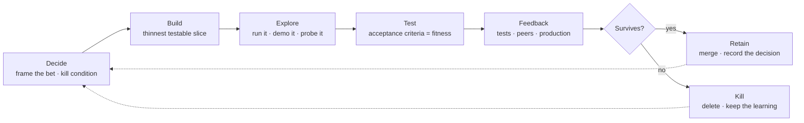
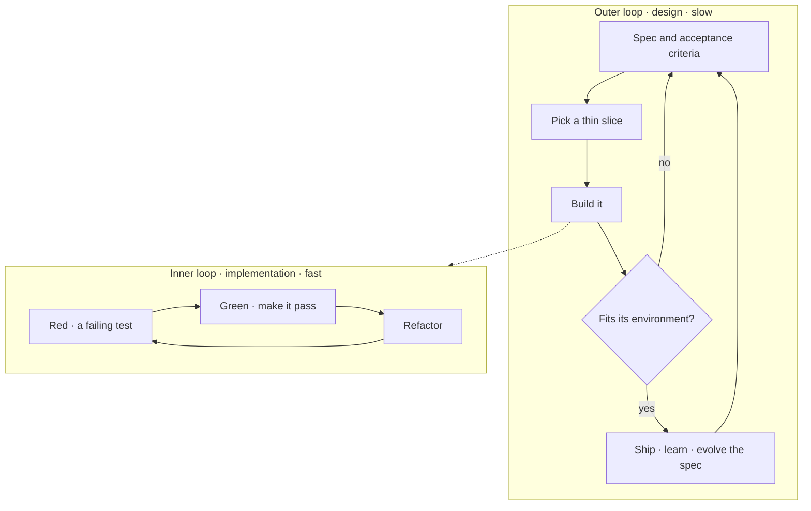

# Evolutionary Development

Software is grown, not specified into existence. No one designs the right system up front; the hardest part of any change is deciding precisely what to build. So we treat every change as a **bet**: frame it, build the smallest thing that can be judged, expose it to real selection pressure, and keep what survives.

This is Darwin's theory of evolution applied to engineering: variation, selection, and survival of the fittest. A design is not right because it was planned well; it survives because it fits the environment it has to live in — the tests, the users, the load, and the constraints. The outcome is non-deterministic: we direct the variation — the deliberate mutations — but real conditions, not our intentions, decide which design survives. It is neither blind natural selection nor a breeder's artificial selection: we choose what to try, the environment chooses what lives.

Nature ran this algorithm first. We copy what it does well and set it on hyper-speed: cheap variation, ruthless feedback, and generations measured in minutes, not millennia.

This standard is the *loop*, and it marries the practices we already keep. [Spec-Driven Development](Spec-Driven-Development.md) gives a bet its *shape* — the spec and its design, the *what* and *why*. Behavior-driven discovery turns that intent into Given / When / Then acceptance criteria — the definition of *fit*. Test-driven development grows the implementation against those criteria and the unit tests beneath them — the *how*, evolved in small steps. The three run as one loop. What drives it is not a particular hand but context in, criteria as the target, and feedback as the verdict — so the same loop turns whether a person runs it, an agent runs it, or agents run it end-to-end (see [How the loop is driven](#how-the-loop-is-driven)). It builds on [engineering practices](Principles/Engineering-Practices.md) (test-first where it pays, small batches, reversible decisions) and [AI-first development](Principles/AI-First-Development.md).

## Why evolve instead of plan

We state intent first and treat the plan as a living thing. Two habits carry it:

- **Build shared understanding from concrete examples**, in rapid iterations, with documentation that is continuously checked against the system.
- **Front-load the *why* and *what*** so both people and agents have the context they need, then refine continuously as understanding grows.

Neither habit assumes the first design is correct. Both optimise the *loop*, not the plan: a big up-front design is a large, hard-to-reverse bet made when we know the least; a small slice under real feedback is a cheap bet made while we can still change our minds. Prefer the cheap bet.

## The loop

A change moves through one turn of selection. Each turn is small, and it repeats until the design survives.

- **Decide.** State the bet as a hypothesis with an explicit kill condition — the result that would make us abandon it. Size the bet to its reversibility: local, reversible moves are cheap, so make them freely; one-way doors are expensive, so slow down and write them down ([decision before change](Principles/AI-First-Development.md#decision-before-change), [engineering taste](Engineering-Taste.md)).
- **Build.** Make the smallest thing that can be judged — a walking skeleton or a throwaway spike — as a thin vertical slice, not a layer ([engineering practices](Principles/Engineering-Practices.md)).
- **Explore.** Put it in front of reality: run it, demo it, probe its edges. Exploration is where surprises surface while they are still cheap.
- **Test.** The [acceptance criteria](Spec-Driven-Development.md#acceptance-criteria) — Given / When / Then — are the coarse fitness function; the unit tests beneath them check the internals. They pass, or the bet has not survived. These automated tests become the guard-rails that stop later turns breaking earlier ones.
- **Feedback.** Gather signal from the tests, from reviewers, and from production — the [delivery-performance signals](DevOps-Reference.md#dora-four-key-metrics) plus the one domain metric the change was meant to move.
- **Select.** Keep what survives; kill what does not, fast. Deleting a slice that failed its test is a *result*, not a failure — the learning updates the spec. Retain a survivor by merging it through a decision point and recording any one-way-door choice as an ADR beside the spec.

The loop turns until the design stops changing under feedback. Then the bet is settled (see [When a design survives](#when-a-design-survives)).

## How the loop is driven

Nothing in the loop is owned by a particular hand. What drives each turn is the same three things, whoever is turning it: **context** in, the **acceptance criteria** as the target, and **feedback** as the verdict. Give a turn those three and it can be run by a person, by an agent, or by agents end-to-end — increasingly the last, as context and criteria get sharp enough that a whole turn runs with no human in it.

The unit of work is therefore a **well-scoped task** carrying exactly those three: the [context bundle](#context-first), the acceptance criteria that define done, and the fitness test to verify against. Output is judged against the criteria — the test is the oracle, not anyone's confidence — so the driver need not be trusted, only the test. Variation is cheap, so run **several bets in parallel** and let selection choose; keeping every branch alive is the anti-pattern.

What does not move is the gate. Every change passes a [decision point](Principles/AI-First-Development.md#decision-before-change) before it reaches an environment, whether a person or an agent ran the loop — automation moves the work, never the accountability.

## The two loops

The loop above runs at two tempos at once, and the method keeps them distinct.

- **The outer loop evolves the design.** It is deliberate and coarse-grained: state the intent, agree the acceptance criteria, decide quickly, and let a slice meet reality. When feedback contradicts the intent, the spec changes first and the approach evolves — [spec-driven development](Spec-Driven-Development.md) turning. This is where early alignment, the acceptance criteria, and the one-way doors are settled. We dare to decide fast and fail fast here because the spec makes the cost of being wrong cheap to see and cheap to revise.
- **The inner loop evolves the implementation.** It nests inside the **Build** stage and runs fast and fine-grained: write a failing test, make it pass, refactor, repeat — [test-driven development](Principles/Engineering-Practices.md#test-driven-development). The tests come at two grains — fine-grained **unit tests** for the internals and the **Given / When / Then acceptance tests** that encode the behavior from discovery. Many inner turns fit inside one outer turn, fast enough that variations are generated and discarded far quicker than by hand.

The **acceptance criteria** couple the two loops. Written once as Given / When / Then, they are the outer loop's definition of *fit* and the inner loop's target — one behavioral statement serving discovery, the spec, and the test. Whoever turns each loop, the criteria keep both honest to the same intent.

## Signals: the shapes of intent

A turn does not only begin when someone asks for a feature. It begins with a **signal** — a pressure from the environment that the current design no longer fits — and every signal is **intent in a particular shape**. Naming the shapes keeps us honest that a bugfix, a performance guard, and a new capability are the same kind of work: a bet, framed from a signal, judged by selection.

- **Need.** A request for functionality or capability the product does not have yet — a user, a stakeholder, or a dependent system pulling it forward. Intent stated outright: *make it do this.*
- **Defect.** Proof that behavior and intent already disagree — a fault found in test or reported from production. An acceptance criterion that should hold does not, so the bet is to make it hold again.
- **Operational signal.** Logs, traces, metrics, and incidents — the SRE evidence that the system is straining under real load. A rising error rate or a slow path is intent the users never had to type; the environment is speaking.
- **Preventive analysis.** A proactive read that a design will not survive where it is heading — a performance cliff, a stability risk, a scaling limit seen before it bites. Intent inferred from the trajectory, not the pain.

Wrapping them as **intents of different types** is the point: each enters the same loop, carries the same three drivers — context, acceptance criteria, feedback — and passes the same [decision point](Principles/AI-First-Development.md#decision-before-change). A defect is not a lesser feature and a preventive fix is not a luxury; each is a bet framed from a different signal, and each earns its keep only by surviving.

## Discovery: finding and framing the bet

Bets do not start from a solution; they start from a signal — need, defect, operational symptom, or risk — explored together. Discovery, formulation, and automation are how a [specification](Spec-Driven-Development.md) and its acceptance criteria are produced rather than guessed.

- **Discovery.** Before pulling work in, hold a short, structured conversation about concrete examples. Map the story to its **rules** (the acceptance criteria), the **examples** that illustrate each rule, and the **questions** — the unknowns to resolve or defer. Time-box it; if the examples will not fit, the story is too big, so slice it. Three viewpoints must be present — the problem, the build, and the edge cases — covered by whoever is in the room, people or agents, drafting the rules and examples and surfacing the questions that need answering.
- **Formulation.** Turn the agreed examples into Given / When / Then, in the shared language of the domain. This is the executable form of the acceptance criteria and the vocabulary that runs all the way into the code.
- **Automation.** Connect each example to the system as a failing test, then build until it passes. The examples are living documentation: they describe what the system does today, and the build breaks the moment code and intent disagree.

Discovery is the variation stage — where candidate behaviors are generated cheaply. Mark unknowns as `[NEEDS CLARIFICATION]` rather than guessing; a guess is an untested bet smuggled past selection.

## Context first

A turn is only as good as the context it runs on — output quality tracks input quality. The **context bundle** is the opening move of any turn, not an afterthought:

- The [spec](Spec-Driven-Development.md) (why, what, acceptance criteria) and its design (how), or the marked unknowns where they do not exist yet.
- The constraints, non-goals, and dependencies that bound the solution.
- Pointers to the code, standards, and prior decisions that already apply — read in layers, local context before central standards ([Agentic Development](Agentic-Development.md)).

This is [context-first development](Principles/AI-First-Development.md#context-first-development) made operational: the context is created up front — in specs, issues, and ADRs — and the loop runs on it. Context loss is the most common cause of wasted effort; a bet made without context is a bet made blind. Context is not read-only, though: when a turn shows a standard or instruction is wrong — or teaches a better one — updating it is part of the turn (see [The instructions evolve too](#the-instructions-evolve-too)).

## The instructions evolve too

> [!IMPORTANT]
> Self-directed update is a standing directive, not an optional courtesy. Whoever turns the loop — a person or an agent — and learns something or hits a wrong instruction is expected to improve that instruction then and there, rather than leave it for someone else, so the next turn starts sharper than this one did. A loop that cannot improve its own instructions cannot evolve.

The standards, guides, and agent instructions that inform how we work are part of the environment the loop runs in. They are context, and context drives every turn (see [How the loop is driven](#how-the-loop-is-driven)) — so a weak instruction misdirects every turn that reads it, quietly and at scale, and a sharper one improves every turn just as widely. The instructions are under selection too: correct them when they are wrong, and refine them when a turn teaches something better. Either way, updating them is part of the work, not a separate chore. This is [self-improving agents](Principles/AI-First-Development.md#self-improving-agents) applied to the instructions themselves.

When a turn exposes a defect or discovers a better way of working — whether a person hits the friction or an agent does — raise the change as its own small bet and run it through the same loop: a change to the doc, reviewed and merged through a [decision point](Principles/AI-First-Development.md#decision-before-change). Signals worth acting on:

- An agent needs the same clarification twice, or a `[NEEDS CLARIFICATION]` marker keeps recurring.
- A review comment teaches a rule that is not written down yet.
- An instruction contradicts how the work is actually done, or points at something that has moved.
- A turn goes wrong in a way a clearer instruction would have prevented.
- A turn finds a better way — a sharper prompt, a cleaner sequence, a rule worth making the default — worth keeping for the next one.

Because a standard is defined once and pointed to everywhere ([Agentic Development](Agentic-Development.md)), one change propagates to every repo and every agent that reads it — improve it in one place and the whole fleet's behavior evolves. This is the method turned on itself: the same living-documentation discipline that keeps a spec true keeps the instructions true and refines them as we learn, so the way we work gets better every time a turn teaches us something worth keeping.

## Working a v1

A first version is where the least is known, so it is where evolution matters most. Start deliberately small and let the design earn its complexity.

- **Minimal viable spec.** Write just enough intent and acceptance criteria to make the first bet falsifiable. Mark everything else as an open question rather than inventing an answer. The spec grows as reality teaches, not before.
- **Walking skeleton.** Build the thinnest end-to-end slice that exercises the whole path — real inputs to real outputs — before thickening any single part. It proves the shape of the system while every decision is still cheap to undo.
- **Explore a set, then converge.** For a decision that matters, try two or three approaches cheaply — parallel spikes — instead of committing to the first that occurs to you. Keep the survivor; delete the rest. Do not marry a design before it has beaten an alternative.
- **Promote or kill.** A spike is disposable by default. It earns promotion only by passing its fitness test; otherwise it is deleted and what it taught updates the spec. A spike that quietly becomes production is a bet that skipped selection.
- **Evolve the spec first.** When feedback contradicts the spec, the spec changes before the code — it is the source of truth, written in the present tense as the [intended state](Principles/Engineering-Practices.md#evergreen-documentation).

## Bind to the practice, not the tool

The toolchain is an adapter and it churns — runners get abandoned and replaced. Executable specifications outlive the tool that runs them: a feature written as Given / When / Then survives a change of runner untouched. Depend on the durable practice, not the tool — intent stated first, examples as Given / When / Then, living documentation checked in CI, and this loop. Tools slot in as thin adapters and can be swapped without rewriting the method ([extensible by default](Principles/Software-Design.md#extensible-by-default)).

## When a design survives

A bet is settled — it stops being an experiment and becomes the baseline — when:

- its acceptance criteria pass and keep passing as guard-rails,
- the domain signal moved the way the spec predicted,
- no clarification markers remain, and
- it is boring to operate — observable, and quiet under normal load.

At that point the change meets the [Definition of Done](Definition-of-Ready-and-Done.md#definition-of-done) and the slice is retained. Further change to a settled design starts a new bet, and the loop begins again. Nothing is permanent: environments shift, and a design that no longer fits its environment is selected out — deprecated and deleted ([engineering practices](Principles/Engineering-Practices.md)).
