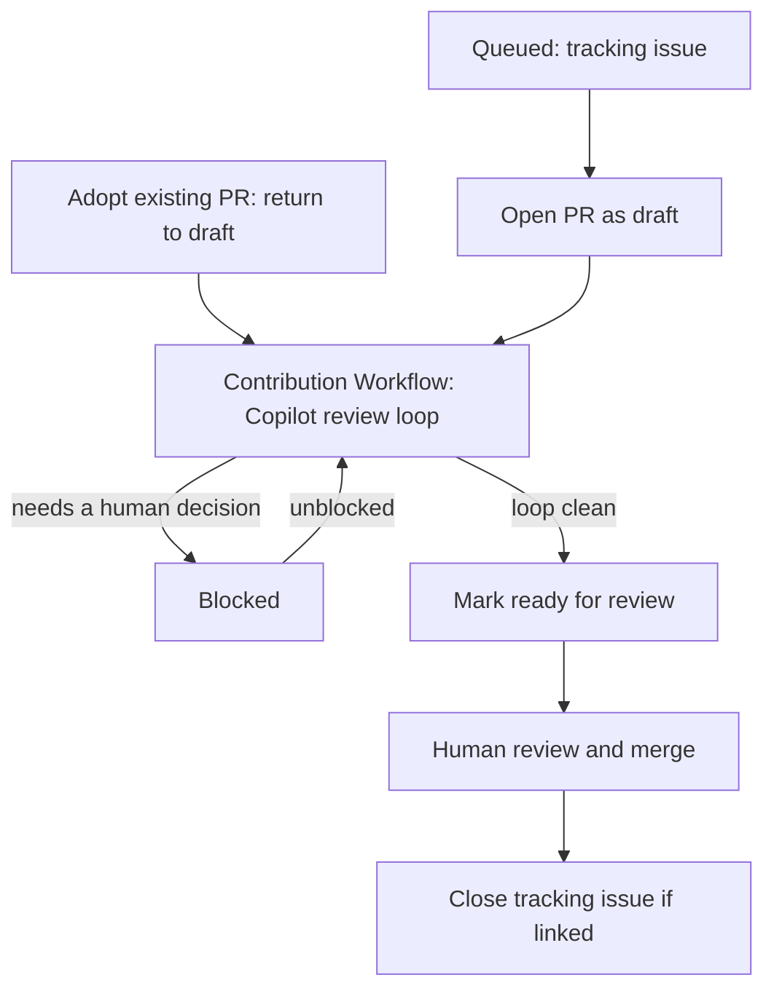

# Fleet Orchestration

How a single change is applied across many repositories at once — a *campaign*.
Each repository gets its own branch, pull request, and review loop; the campaign
is the coordination layer that keeps them moving and visible.

This is the multi-repository "how". Inside each repository the change follows the
ordinary [Contribution Workflow](Contribution-Workflow.md) — draft first, the
Copilot review loop, then people — on a branch created per
[Git Worktrees](Git-Worktrees.md). Fleet orchestration adds nothing to that loop;
it repeats it across a fleet and tracks the whole set.

The defining rule: **the state of a campaign lives on GitHub**, on the issues and
pull requests themselves — never in a local file or database. Anyone, or any
tool, can read and drive a campaign with the GitHub CLI alone.

## When to use it

- Use it when the *same* change must land in *many* repositories: a shared
  workflow or dependency bump rolled out to every consumer, a convention applied
  fleet-wide, or a mechanical migration.
- For a change in a single repository, there is no campaign — just follow the
  [Contribution Workflow](Contribution-Workflow.md).

## The campaign

A campaign is one change rolled out across a set of repositories. Each
repository's slice of the change is a **work item**: a tracking issue, a pull
request, or both. A campaign has a short, stable **slug** (for example
`process-psmodule-v6`) that names it everywhere.

A work item is usually created for the campaign, but an **existing open pull
request can be adopted** as one. When a repository already has a pull request
that does part of the change, add the remaining change to that branch and label
it with the same campaign prefix in the title instead of opening a duplicate — the existing pull request
*is* the work item. A separate tracking issue is optional in this case (a work
item may be a pull request alone); if one already exists, link it with
`Fixes #n` so merging still closes it. Reusing what is already open avoids two
competing pull requests touching the same files.

## State lives on GitHub

There is no orchestration database. Every fact needed to resume, hand off, or
audit a campaign is stored on GitHub, in two layers.

### Built-in properties come first

If GitHub already models a fact, that property *is* the state — it is never
copied into another state-bearing field, because duplicated state drifts.

| Fact | GitHub property |
| --- | --- |
| Work item exists | the issue or pull request itself |
| Who holds it | `assignees` |
| Work in progress | pull request is a **draft** |
| Ready for a human | pull request is **not** a draft |
| CI health | the status-check rollup |
| Review outcome | `reviewDecision` and unresolved review threads |
| Mergeability | `mergeable` / merge-state status |
| Done | pull request **merged**; tracking issue **closed** |
| Issue ↔ PR link | the pull request's closing references (`Fixes #n`) |

"Ready for review" is the draft flag flipping off; "done" is the merge. The two
signals people care about most are native, and are set by the same act that does
the work — [marking ready](Contribution-Workflow.md) and merging.

### Campaign identity lives in the title

Campaign membership is carried in a stable square-bracket prefix on every work
item title, for example `[process-psmodule-v6]`. The prefix is the cross-
repository join key; labels stay reserved for mutable workflow state.

### Process labels fill the gap

Only one label namespace is added, for state GitHub has no property for. The
labels are ordinary project-management words — not tool- or agent-specific — so a person
with the web UI, an agent, or a separate automation system all read them the
same way.

| Label | Purpose |
| --- | --- |
| `stage:queued` | Identified, not started (typically a tracking issue with no pull request yet). |
| `stage:in-progress` | Actively being changed; the assignee owns it. |
| `stage:blocked` | Needs a human decision or a manual, off-platform action before it can proceed. |

Rules: the campaign prefix is mandatory on every work item; at most one
`stage:*` label applies at a time; and `stage:*` may be dropped once a pull
request carries the signal itself (a ready pull request needs no `stage` label,
but `stage:blocked` stays explicit because "a human must act" has no built-in
equivalent). The slug inside the prefix is lowercase and hyphenated.

## Effective status

A campaign view shows one **effective status** per work item, derived purely from
the two layers above — no guessing. The first matching rule wins.

| # | Effective status | Condition |
| --- | --- | --- |
| 1 | Merged | pull request is merged |
| 2 | Blocked | `stage:blocked`, or the merge state is dirty/conflicting |
| 3 | Changes requested | review decision is changes-requested, or unresolved review threads remain |
| 4 | Ready for review | pull request is not a draft and not merged |
| 5 | CI failing | checks are failing on a draft |
| 6 | In review | draft with at least one review and CI not failing |
| 7 | In progress | draft with no review yet, or `stage:in-progress` |
| 8 | Queued | tracking issue open, no pull request yet |

Terminal and attention states (merged, blocked, changes requested, ready) rank
above transient progress states, because an explicit act — marking ready, or
flagging blocked — is a stronger signal than in-flight checks.

## The flow

Each repository moves through the same lifecycle. Every transition is a concrete
GitHub action, so the resulting state is always re-derivable.



1. **Queue the work.** Create a tracking issue per repository, with the campaign
  prefix in the title and `stage:queued`, following the [Issue Format](Issue-Format.md).
  The whole fleet starts as *Queued*. Skip this for any repository whose work
  item will be an **adopted pull request** (see step 2): that pull request is
  the work item and needs no tracking issue.
2. **Branch and open a draft.** Create a worktree and branch
   ([Git Worktrees](Git-Worktrees.md)), then open a **draft** pull request that
  closes the tracking issue, per [PR Format](PR-Format.md). Use the same
  campaign prefix in the pull request title and move the stage to
  `stage:in-progress`, clearing the tracking issue's `stage:queued` so the work
  item never carries two stages at once. If the repository already has an open
  pull request that covers part of the change, adopt it instead of opening a
  new one: add the remaining change to its branch, return it to **draft** while
  work is in progress, and give it the same campaign prefix and
  `stage:in-progress` label (clearing `stage:*` from any linked issue). The
  adopted pull request is the work item, so a separate tracking issue is
  optional — link one with `Fixes #n` if it exists; when there is none, the
  tracking-issue steps (1 and the close-on-merge in 6) simply do not apply, and
  the pull request's own draft and merge state carry the signal.
3. **Apply the change and run the loop.** Make the change and take the pull
   request through the [Contribution Workflow](Contribution-Workflow.md) —
   the Copilot review loop — exactly as any single-repository change. The
   [Implement](../Agents/implement.md) and [Reviewer](../Agents/reviewer.md)
   agent roles apply unchanged.
4. **Flag blockers, don't stall the fleet.** If an item needs a human decision or
   an off-platform action, set `stage:blocked` with a note and move on to the next
   repository.
5. **Mark ready only when the loop is clean.** When Copilot has no more feedback
   and CI is green, mark the pull request ready for review per the
   [Definition of Ready and Done](Definition-of-Ready-and-Done.md). The draft
   flag flips and the item becomes *Ready for review*.
6. **Human review and merge land it.** Merging lands the change and, where the
   pull request links a tracking issue, closes it via the `Fixes #n` reference.
   The campaign's job is to get every pull request to *Ready*;
   [Branching and Merging](Branching-and-Merging.md) governs how it merges.

## What a rollout surfaces

Applying one change across a whole fleet is also a fleet-wide audit. The same
edit that lands cleanly in most repositories will expose latent problems in a
few: a newer tool version starts enforcing a rule that flags pre-existing debt,
an upstream bug appears only under the new version, or a file was never quite
valid to begin with. Expect this, and triage each blocker by its cause instead
of absorbing it:

- **Caused by the change** — fix it in the campaign pull request; it is part of
  the work.
- **Pre-existing debt** — leave it to its owning effort and keep the pull request
  scoped to the change. Widening one repository's pull request to clean up
  unrelated problems breaks the "same change everywhere" property and stalls the
  fleet.
- **Upstream or shared tooling** — file an issue against the shared component, set
  `stage:blocked` with a note linking it, and move on. One fix there
  unblocks every repository hitting the same wall.

Because the change is identical everywhere, the review loop tends to raise the
*same* point on many pull requests. Decide the response once — a fix, or an
evidence-based reply when it is a false positive — and apply it consistently: a
concern that is invalid on one repository is usually invalid on the rest,
barring a repository where the change genuinely differs.

Discovery can also surface a repository where the change applies differently, or
not at all. Adapt that work item — its change and its pull request description —
to what the repository actually needs, rather than forcing an identical diff.

## The dashboard

A campaign is watched through a **dashboard** — a deterministic projection of
GitHub state, not a store of its own. A script enumerates the campaign's work
items by title prefix (`[<slug>]` across the owners), reads each pull request's
built-in properties, computes the effective status, and renders a page. It can
regenerate on an interval so the view refreshes as GitHub changes; deleting it
loses nothing, because GitHub is the source of truth.

Typical columns: effective status, repository, work item (linked), draft/ready,
CI, review decision and open-thread count, assignee, the latest progress note,
and last-updated. Rows sort by status then repository name, so the items needing
attention group together. *Ready for review* appears the instant a pull request
is marked ready; *Merged* the instant it merges.

A local `JSON` snapshot may be written as a cache for other tools, and a static
`HTML` page rendered for viewing — both are disposable projections, regenerated
from GitHub at will. A database is deliberately avoided: it would become a second
source of truth that drifts.

## Progress notes

To record *what* is being done — narration, not a state change — post a comment
on the work item and, when the pipeline stage changes, move the `stage:*` label.
The dashboard surfaces the latest comment as the item's note. Setting a status is
a deterministic label-and-comment write, so it is scripted; the judgement of
*which* status applies is the only human or agent decision.

## Driving it by hand or from another system

Because all state is on GitHub and the workflow labels are generic:

- **A person** can run a whole campaign from the GitHub UI — filter by
  the campaign prefix in the title, read each pull request's draft and merge state, move
  `stage:*` labels, and merge.
- **An automated system** — a scheduled workflow, a different agent framework, or
  a teammate's tooling — can enumerate the work with one query and pick up any
  item. The state is portable and self-describing.

If an automated run stops midway, nothing is lost: the board is complete, every
in-flight pull request shows its true state, and anyone can finish the job. This
resilience is the reason state is kept on GitHub rather than in a private store.

## Command reference

The mechanics are ordinary GitHub CLI calls, so they are easy to script or run by
hand. Labels and comments use the issues API, which serves issues and pull
requests alike.

```powershell
# enumerate a campaign's pull requests across an owner
gh search prs 'in:title "[<slug>]"' --owner <owner> `
  --json number,repository,title,url,isDraft,state

# read one pull request's authoritative state
gh pr view <n> --repo <owner>/<repo> --json `
  isDraft,state,reviewDecision,statusCheckRollup,mergeStateStatus,assignees

# set the pipeline stage (remove the others first) and add a progress note
gh api -X POST   repos/<owner>/<repo>/issues/<n>/labels -f "labels[]=stage:blocked"
gh api -X DELETE repos/<owner>/<repo>/issues/<n>/labels/stage:in-progress
gh api -X POST   repos/<owner>/<repo>/issues/<n>/comments -f body="<note>"

# ready for review — the native "ready for a human" signal
gh pr ready <n> --repo <owner>/<repo>
```

## Worked example: Process-PSModule and Pester 6

A concrete campaign from the [PSModule](../Initiatives/PSModule.md) initiative:
adopt the latest Process-PSModule reusable workflow across every consumer, add
the Pester version requirement to the test files, and migrate the tests.

- **Slug:** `process-psmodule-v6`.
- **Discover the fleet:** find consumers of the reusable workflow with a code
  search for its `uses:` reference, then queue a tracking issue in each.
- **Per repository:** bump the workflow pin, add the
  `#Requires -Modules @{ ModuleName = 'Pester'; ModuleVersion = '6.0.0'; MaximumVersion = '6.*' }`
  requirement to each `*.Tests.ps1`, migrate the tests, and take the pull request
  through the [Contribution Workflow](Contribution-Workflow.md).
- **Track it:** every issue and pull request starts with `[process-psmodule-v6]`;
  the dashboard shows the fleet advancing from *Queued* to *Merged*.

## What this is not

- **Not a database.** Any `JSON` or `HTML` is a disposable projection of GitHub.
- **Not agent-specific.** The model stays fully operable by people and non-agent
  tools; nothing in it depends on a particular assistant.
- **Not a shared label store.** Labels are per-repository; the campaign title
  prefix is the shared contract, created in each participating repository.
