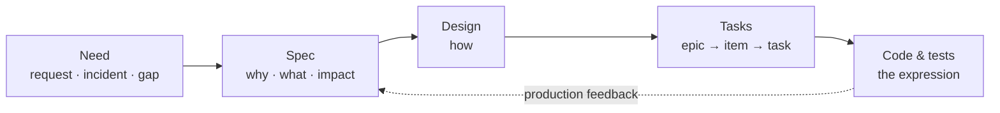

# Spec-Driven Development

Spec-driven development treats the specification as the source of truth: the spec captures *why* a change matters and *what* it must do, and everything downstream — design, tasks, code, tests — serves it. When intent changes, the spec changes first and the rest follows.

This standard is the shape of a spec. It defines the artifacts of the method — the **specification** and its **design** — what each contains, at what level of detail, and how they move through the life of a change. It builds on the [evergreen documentation](Principles/Engineering-Practices.md#evergreen-documentation) principle (how a spec is written) and the [engineering practices](Principles/Engineering-Practices.md) (how we plan, build, ship, and measure).

## The model

A change moves down a ladder of artifacts. Each sits at a fixed altitude, is versioned in git, and lives beside the thing it governs. Higher layers are stable; lower layers are regenerated as understanding improves.

| Layer | Answers | Altitude | Lives in | Changes when |
|---|---|---|---|---|
| **Need** | Is this worth doing? | one line | the request or issue | — |
| **Spec** | Why, what, for whom, and what "done" means | implementation-agnostic | the capability folder, in the owning repo | intent changes |
| **Design** | How it is built | technical, still readable | beside its spec (`design.md`) | the approach changes |
| **Tasks** | In what steps | actionable | issues, at the levels of the [issue hierarchy](Issue-Hierarchy.md) | the plan changes |
| **Code & tests** | The working expression | concrete | the codebase | continuously |



The spec is the durable artifact. Code is its expression in a particular language and framework; when the two disagree, the spec is what we meant and the code is what we did.

## What a specification is

A specification describes the intended state of one capability or feature — what is true when it exists, and why that matters. It reads true to a competent teammate who was not in the room, and it stays true after the code is refactored. Write it in the terse, present-tense, definitive style of [evergreen documentation](Principles/Engineering-Practices.md#evergreen-documentation).

A spec **contains**:

- **The problem and why now** — who is affected and what changes for them.
- **Outcomes and impact** — the result in the world, and its expected effect on delivery (see [Impact](#impact)).
- **Users and jobs** — who uses this and the job it gets done.
- **Scope** — what is included, and an explicit list of what is out of scope.
- **Requirements** — what the capability does and the qualities it must hold, functional and non-functional (see [Requirements](#requirements)).
- **Acceptance criteria** — observable behavior that verifies the requirements (see [Acceptance criteria](#acceptance-criteria)).
- **Constraints, assumptions, and dependencies** — the boundaries it respects and the work, access, or decisions it waits on.

A spec **excludes** — this is the design's job:

- Technology, frameworks, and libraries.
- Architecture, components, and diagrams.
- API shapes, schemas, and data models.
- Algorithms and pseudo-code.
- The task breakdown and rollout sequence.
- Links to the code that fulfils it — implementations come and go.

The altitude test: push detail *down* into the design, and push scope *up* into the epic. If a sentence would change when the team picks a different library, it belongs in the design, not the spec. This is the same rule the [Issue Format](Issue-Format.md) applies to issues — describe the *what* and *why*, never the *how*.

## Requirements

Requirements are testable statements of what must be true — never how it is built.

**Functional** requirements describe what the capability does, as observable behavior. Number them so the design and the tests can trace back to each one.

**Non-functional** requirements are the quality attributes the capability must hold — performance, security, reliability, availability, compliance, observability, and cost. State each as a measurable condition with a threshold; a non-functional requirement without a number is an opinion. For platform and infrastructure work these are often the point of the change rather than an afterthought — latency, redaction, retention, and blast radius decide whether the thing is fit to run.

The [acceptance criteria](#acceptance-criteria) verify these requirements, and every requirement has at least one.

## Acceptance criteria

Acceptance criteria state observable behavior, written as Given / When / Then. They are the contract between the spec and the working system, the basis for the [Definition of Done](Definition-of-Ready-and-Done.md#definition-of-done), and they become the acceptance tests that verify the change.

```gherkin
Feature: Provider failover
  Scenario: Primary provider is unavailable
    Given the primary upstream provider is returning errors
    When a client sends a request
    Then the request succeeds through a healthy provider
    And the response records which provider served it
```

Criteria describe effect, not mechanism — "requests succeed when the primary provider is down", not "a failover handler is added". Mechanism is the design's concern and must be free to change without rewriting the criteria.

## Impact

Every spec states the delivery impact it aims for, so the value is explicit before the work starts and measurable after it ships:

- **DORA direction** — the expected effect on lead time for changes, deployment frequency, change-failure rate, and time to restore service (the [DORA four](DevOps-Reference.md#dora-four-key-metrics)). State the direction and reasoning, not a false-precision number.
- **A domain signal** — one honest, measurable metric this change moves for the users of the capability.

Estimate up front to align on why the work is worth doing; measure afterwards to learn. Production reality feeds back into the spec: a metric that misses, an incident, or a new constraint updates the spec for the next iteration.

## What a design is

The design is the specification's companion. It answers *how*, and it is free to change as often as the implementation does while the spec holds still. A design **contains** the approach and its rationale, the alternatives considered and why they were rejected, the architecture and components, the data and contracts other things depend on, the security boundaries and threats for new surfaces, the testing strategy, and the rollout and operability plan.

One-way-door decisions taken in the design are recorded where they are made, following [Decision Before Change](Principles/AI-First-Development.md#decision-before-change), and kept as Architecture Decision Records beside the spec.

## From need to shipped change

The method is requirements-first. Work does not start from a solution; it starts from a need and earns its way down the ladder.

1. **A need surfaces.** A stakeholder request, an incident, or a platform gap — or the team authors one when it sees the opportunity.
2. **Draft the spec.** Capture the why, the outcome, and the requirements collaboratively. Agents draft, research context, and check the spec for ambiguity and gaps; humans supply the intent and make the calls ([AI-first development](Principles/AI-First-Development.md)). Unknowns are marked, not guessed (see [Authoring conventions](#authoring-conventions)).
3. **Review the spec as a pull request.** The spec is versioned and reviewed like any change, following [PR Format](PR-Format.md) and [Review Etiquette](Review-Etiquette.md). Review argues about intent while it is still cheap to change.
4. **Pass the readiness bar.** The spec is ready when it meets the [Definition of Ready](Definition-of-Ready-and-Done.md#definition-of-ready) — clear intent, testable acceptance criteria, no open questions that would change the approach.
5. **Design and decompose.** Write the design, then break the work into the levels of the [issue hierarchy](Issue-Hierarchy.md) — an epic into smaller, independently deliverable items.
6. **Build against the spec.** Implement in thin vertical slices, test-first where it pays, to the [Definition of Done](Definition-of-Ready-and-Done.md#definition-of-done) ([engineering practices](Principles/Engineering-Practices.md)). [Test-driven development](Principles/Engineering-Practices.md#test-driven-development) is an implementation practice governed by the coding standards and the Definition of Done, not something each spec re-specifies.
7. **Feed reality back.** Metrics and incidents update the spec, and the cycle repeats.

## Where specs and designs live

A specification and its design live together in a folder named for the capability they describe, alongside an `index.md` — the [capability folder](Documentation-Model.md#capabilities-live-in-folders) pattern. The capability is owned by a component, and by default a component is a repository ([Repository Segmentation](Repository-Segmentation.md)), so the spec lives beside the code it governs ([docs live close to the code](../Coding-Standards/Documentation.md#the-hierarchy-of-documentation)):

- **A component's own capabilities** → that repository's `docs/`.
- **Cross-cutting capabilities** that span components → the central documentation hub.

Splitting the spec from the design is what lets the spec stay stable across refactors while the design evolves with the code. How the docs are organized — the spec-and-design-per-capability shape and the folder layout — is the [Documentation Model](Documentation-Model.md).

## Authoring conventions

- **Write intended state.** Present tense, definitive, one fact stated once, as with all [evergreen documentation](Principles/Engineering-Practices.md#evergreen-documentation). No task lists, status, or history in the spec — those live in issues and PRs.
- **Let git carry the record.** Created and updated dates, revision numbers, authorship, and the changelog are the repository's history, not fields in the document. Restating them in the body duplicates git and drifts out of date; the commits and the pull requests that reference the spec hold how it got here.
- **Ownership is by location, not a byline.** The team that owns the code owns its spec ([docs live close to the code](../Coding-Standards/Documentation.md#the-hierarchy-of-documentation)); accountability lives in `CODEOWNERS`, not a per-document owner field that goes stale.
- **Mark unknowns, do not guess.** Where the need is unclear, leave an explicit `[NEEDS CLARIFICATION: the specific question]` marker rather than a plausible assumption. All markers are resolved and removed before the spec is accepted.
- **Self-review against a checklist.** Before review, confirm the spec is complete: no clarification markers remain, every requirement is testable, and the success criteria are measurable — a checklist is a unit test for the English.
- **Keep it navigable.** The spec is readable in one sitting. Heavy detail moves into the design or a linked note, not the body.
- **Reference, do not restate.** Point at the canonical standard or guide rather than copying it, so there is one source of truth and no drift.
- **Links, not bare URLs.** Every external reference is a Markdown link, scoped the same way as in the [Issue Format](Issue-Format.md).

## Templates

Copy these skeletons to start a `spec.md` and its `design.md`. Every section is present so nothing is forgotten; delete a heading only when it genuinely does not apply.

### Specification template

````markdown
# <Capability or feature name>

<One paragraph of intended state — present tense, as if it already exists.>

## Why

<The problem, who is affected, and why it matters now.>

## Outcomes and impact

- **Outcome:** <what becomes true for users or operators>
- **DORA:** <expected direction — lead time · deploy frequency · change-failure rate · time to restore>
- **Domain signal:** <one measurable metric this moves>

## Users and jobs

<Who uses this, and the job it gets done.>

## Scope

**In scope**

- <...>

**Out of scope**

- <...>

## Requirements

### Functional

- **F1.** <what the capability does — behavioral, testable, no technology>
- **F2.** <...>

### Non-functional

- **N1.** <a quality attribute as a measurable condition — latency, availability, redaction, retention, cost>
- **N2.** <...>

## Acceptance criteria

```gherkin
Scenario: <key flow>
  Given <precondition>
  When <action>
  Then <observable result>
```

## Constraints and assumptions

- **Constraint:** <a boundary the solution respects>
- **Assumption:** <taken as true; flag if unverified>

## Dependencies

- <work, access, or decision this waits on — linked>

## Open questions

- [NEEDS CLARIFICATION: <specific question>]   <!-- resolved and removed before acceptance -->

## Decisions

<Locked decisions, recorded as ADRs beside this spec.>
````

### Design template

````markdown
# <Capability or feature name> — Design

<One paragraph on how the spec is realised.>

## Specification

<Link to the specification this design serves.>

## Approach

<The chosen approach, and why it satisfies the requirements.>

## Alternatives considered

| Option | Trade-offs | Verdict |
|---|---|---|
| <option> | <trade-offs> | Chosen / Rejected — <reason> |

## Architecture

<Components and how they fit together. A diagram where it helps.>

## Data and contracts

<Schemas, interfaces, APIs, and events other things depend on.>

## Security

<Trust boundaries, authentication and authorization, secrets, and threats for new surfaces.>

## Testing strategy

<How the acceptance criteria are verified — contract, integration, end-to-end, unit — and what runs in CI.>

## Rollout and operability

<Sequencing, feature flags, migration, observability, and the runbooks for the top alerts.>

## Decisions

<ADR links for the one-way-door choices made here.>
````

## Influences

The method draws on established practice, adapted to an evergreen, docs-close-to-code, and AI-first way of working:

- **[Spec Kit](https://github.com/github/spec-kit)** — the spec → design → tasks split, the *what and why, not how* discipline, clarification markers, and checklists as tests for the specification.
- **Amazon's Working Backwards (PR/FAQ)** — start from the outcome and the customer, not the feature list.
- **Google design docs and Architecture Decision Records** — the design layer: context, non-goals, alternatives, and recorded decisions.
- **Behavior-Driven Development** — acceptance criteria as Given / When / Then.
- **[DORA](DevOps-Reference.md#dora-four-key-metrics)** — framing impact in delivery-performance terms.
