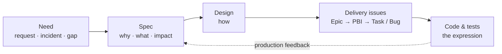

# Spec-Driven Development

Spec-driven development treats the specification as the source of truth: the spec captures *why* a change matters and *what* it must do, and everything downstream — design, delivery issues, code, tests — serves it. When intent changes, the spec changes first and the rest follows.

This standard is the shape of a spec. It defines the artifacts of the method — the **specification**, its **design**, and the tiers beneath them — what each contains, at what level of detail, and how they move through the life of a change. It builds on the [evergreen documentation](Principles/Engineering-Practices.md#evergreen-documentation) principle (how a spec is written) and the [engineering practices](Principles/Engineering-Practices.md) (how work is planned, built, shipped, and measured).

## The model

A change moves down a ladder of artifacts. Each sits at a fixed altitude, is versioned in git, and lives beside the thing it governs. Higher layers are stable; lower layers are regenerated as understanding improves.

| Layer | Answers | Altitude | Lives in | Changes when |
|---|---|---|---|---|
| **Need** | Is this worth doing? | one line | the request or issue | — |
| **Spec** | Why, what, for whom, and what "done" means | implementation-agnostic | the capability folder, in the owning repo | intent changes |
| **Design** | How it is built | technical, still readable | beside its spec (`design.md`) | the approach changes |
| **Delivery issues** | In what tracked outcomes and deliverables | progressively actionable | Epic and PBI aggregates, then Task and Bug leaves | the delivery plan changes |
| **Code & tests** | The working expression | concrete | the codebase | continuously |


```mermaid
flowchart LR
  need["Need\nrequest · incident · gap"] --> spec["Spec\nwhy · what · impact"]
  spec --> design["Design\nhow"]
  design --> issues["Delivery issues\nEpic → PBI → Task / Bug"]
  issues --> code["Code & tests\nthe expression"]
  code -. "production feedback" .-> spec
```

The spec is the durable artifact. Code is its expression in a particular language and framework; when the two disagree, the spec is the intent and the code is the outcome.

## The artifact tiers

The spec and the design are the two required **content artifacts**; each
capability folder also carries its required `index.md` navigation page. A
capability MAY carry five more content artifacts when its content genuinely needs
a different altitude or a different reader. Each tier answers one question for
one audience, and no tier restates another — it links.

| Artifact | Answers | Reader | Required |
|---|---|---|---|
| **[Specification](#what-a-specification-is)** | Why it exists, what must be true | whoever decides *whether* and *what* | MUST |
| **[Design](#what-a-design-is)** | How it is built, logically | whoever builds and maintains it | MUST |
| **[Implementation docs](#what-implementation-docs-are)** | The concrete settings, names, and mappings | whoever operates or changes the concrete detail | MAY |
| **[Guides](#what-a-guide-is)** | How to carry out a task against the shipped capability | whoever uses it | MAY |
| **[References](#what-a-reference-is)** | Stable facts, for fast lookup | whoever needs one value | MAY |
| **[Decision records](#what-a-decision-record-is)** | Which choice was made, and why that one | whoever inherits or questions the choice | MAY |
| **[Research](#what-research-is)** | What was explored and what was found | whoever revisits a decision | MAY |

A tier is added when content that belongs in it already exists and is crowding out the tier above. A capability with no concrete detail needs no implementation doc; a capability nobody operates by hand needs no guide. Empty tiers are not created in advance — **[delete, don't stub](Documentation-Model.md#concise-by-default)**.

## What a specification is

A specification describes the intended state of one capability or feature — what is true when it exists, and why that matters. It reads true to a competent teammate who was not in the room, and it stays true after the code is refactored. Write it in the terse, present-tense, definitive style of [evergreen documentation](Principles/Engineering-Practices.md#evergreen-documentation).

A spec **contains**:

- **The problem** — who is affected, what is wrong or missing for them, and why it matters. Stated as an enduring condition, not a moment in time.
- **Outcomes and impact** — the result in the world, and its expected effect on delivery (see [Impact](#impact)).
- **Users and jobs** — who uses this and the job it gets done.
- **Scope** — what is included, and an explicit list of what is out of scope.
- **Non-goals** — outcomes it deliberately does not pursue, named so its intent is not misread; distinct from out of scope, which bounds this change.
- **Requirements** — what the capability does and the qualities it must hold, functional and non-functional, each with its own behavioral scenarios (see [Requirements](#requirements)).
- **Acceptance criteria** — the cross-cutting observable behavior that spans more than one requirement (see [Acceptance criteria](#acceptance-criteria)).
- **Constraints, assumptions, and dependencies** — the boundaries it respects and the work, access, or decisions it waits on.

A spec **excludes** — this is the design's job:

- Technology, frameworks, and libraries.
- Architecture, components, and diagrams.
- API shapes, schemas, and data models.
- Algorithms and pseudo-code.
- The task breakdown and rollout sequence.
- Links to the code that fulfils it — implementations come and go.

A specification is **output-focused**: it states behavior and observable outcome, never the technology or the product that produces it. Two implementations that satisfy the same spec are interchangeable as far as the spec is concerned.

The **spec/design altitude test**: would this sentence change if the team picked a different library, service, or framework, while the required behavior stayed the same? If yes, it belongs in the design. Push implementation detail *down*, and keep delivery scope at the appropriate [issue planning altitude](Issues/Process/Planning.md).

### Conformance to principles

A spec **conforms to** the [Principles](Principles/index.md) and never restates them. The reference direction is set by the [principles' own contract](Principles/index.md#principles-do-not-link-down): specs link up, and principles do not link down. A rule that holds for every capability belongs in a principle or a standard and is referenced from the spec by link; a spec that copies it creates a second source that will disagree with the first. When a spec needs a narrow exception to a standard, it names the exception and links to the standard that permits it.

### Core and feature addenda

A capability that grows features MAY be composed of a **core specification** and **feature-addendum pages**. The core states the invariants, qualities, and requirements shared by every feature. Each feature page is self-contained, extends the core, and states only what is specific to that feature.

- A requirement that more than one feature depends on is stated **once in the core** and referenced by link. It is never duplicated onto a feature page.
- Requirement numbering is **per page**: the core starts at `FR1`, and every feature page also starts at `FR1`. Identity is the page plus the anchor — `[FR1](features/scheduling.md#fr1)` — so spinning a feature out of the core never renumbers anything.
- Feature pages live in a `features/` folder beside the core spec, with their own `index.md`.

This keeps the core stable while features compose. A single-feature capability keeps a single `spec.md` and adds `features/` only when a second feature exists.

## Specify the minimum

A spec fixes the smallest set of requirements that make the capability correct and verifiable, and leaves every other choice to the design and the people building it. Over-specification is waste: it commits the team to decisions before they must be made, and every detail the spec pins is one more thing that rots when the implementation moves. Fix what must be agreed; leave the rest open.

This is [Lean Software Development](Principles/Planning-and-Delivery.md#lean-software-development) and YAGNI applied to intent — the fewer things a spec pins, the longer it stays true and the more freedom the people building it keep. The altitude test above is how the principle is applied in practice.

## Requirements

Requirements are testable statements of what must be true — never how it is built. Write them with the [BCP 14](https://www.rfc-editor.org/info/bcp14) keywords — **MUST**, **MUST NOT**, **SHOULD**, **SHOULD NOT**, **MAY**, and the rest of the set — in uppercase, where they carry their normative meaning ([RFC 2119](https://www.rfc-editor.org/rfc/rfc2119), [RFC 8174](https://www.rfc-editor.org/rfc/rfc8174)).

**Functional** requirements describe what the capability does, as observable behavior. **Non-functional** requirements are the quality attributes the capability must hold — performance, security, reliability, availability, compliance, observability, and cost — each stated as a measurable condition with a threshold; a non-functional requirement without a number is an opinion. For platform and infrastructure work these are often the point of the change rather than an afterthought — latency, redaction, retention, and blast radius decide whether the thing is fit to run.

Give each requirement its own heading with a stable, explicit anchor — `### FR1 — <statement> { #fr1 }` for functional, `### NFR1 — <statement> { #nfr1 }` for non-functional. The anchor is the identifier alone, so the heading can be reworded without breaking a single reference. Identifiers are **append-only**: assign the next unused number, never renumber, and never reuse — a removed requirement simply disappears, and git holds the history.

Numbering is scoped **per page**. Every spec page — a core spec and each of its [feature addenda](#core-and-feature-addenda) — starts at `FR1` and `NFR1`. Identity is the page plus the anchor, so a requirement is referenced as `[FR1](#fr1)` on the same page and `[FR1](spec.md#fr1)` across pages; a feature reference has the form `features/<feature-name>.md#fr2`. Because identity includes the page, moving a set of requirements onto a new feature page never forces a renumber.

### Behavioral scenarios

Each requirement owns a `#### Behavioral scenarios` subsection immediately beneath it, holding one or two Given / When / Then scenarios that make that one requirement concrete in place. These are the acceptance criteria for that requirement, stated once, where the requirement is stated.

````markdown
### FR1 — A request MUST succeed while any healthy upstream provider remains { #fr1 }

#### Behavioral scenarios

```gherkin
Scenario: The primary provider is unavailable
  Given the primary upstream provider is returning errors
  When a client sends a request
  Then the request succeeds through a healthy provider
  And the response records which provider served it
```
````

Requirement-local scenarios MUST NOT be repeated in the consolidated [acceptance criteria](#acceptance-criteria). One scenario, one home.

## Acceptance criteria

The consolidated **Acceptance criteria** section holds only the **cross-cutting** scenarios — behavior that spans more than one requirement and therefore has no single requirement to live under. Each is labelled `AC1`, `AC2`, and so on, and names the requirements it verifies.

```gherkin
# AC1 — Verifies: [FR1](#fr1), [NFR2](#nfr2)
Scenario: Failover stays within the latency budget
  Given the primary upstream provider is returning errors
  When a client sends a request
  Then the request succeeds through a healthy provider
  And the total response time stays within the stated budget
```

Together, the requirement-local scenarios and the cross-cutting criteria are the contract between the spec and the working system, the basis for the [Definition of Done](Definition-of-Ready-and-Done.md#definition-of-done), and the acceptance tests that verify the change. Every requirement has at least one scenario; a spec with no cross-cutting behavior has no `Acceptance criteria` section at all.

Criteria describe effect, not mechanism — "requests succeed when the primary provider is down", not "a failover handler is added". Mechanism is the design's concern and must be free to change without rewriting the criteria.

## Impact

Every spec states the delivery impact it aims for, so the value is explicit before the work starts and measurable after it ships:

- **DORA direction** — the expected effect on lead time for changes, deployment frequency, change-failure rate, and time to restore service (the [DORA four](DevOps-Reference.md#dora-four-key-metrics)). State the direction and reasoning, not a false-precision number.
- **A domain signal** — one honest, measurable metric this change moves for the users of the capability.

Estimate up front to align on why the work is worth doing; measure afterwards to learn. Production reality feeds back into the spec: a metric that misses, an incident, or a new constraint updates the spec for the next iteration.

## What a design is

The design is the specification's companion. It answers *how*, and it is free to change as often as the implementation does while the spec holds still. A design **contains** the approach and its rationale, the alternatives considered and why they were rejected, the architecture and components, the data and contracts other things depend on, the security boundaries and threats for new surfaces, the testing strategy, and the rollout and operability plan.

A design is **logical**: technical, naming the approach and the technology, and still readable end-to-end. It stops short of the exact values.

The **design/implementation altitude test**: would this sentence change if exact settings, counts, or names changed, while the technology and the approach stayed the same? If yes, the detail belongs in [implementation docs](#what-implementation-docs-are); if no, it belongs in the design. This keeps the design readable without discarding the concrete detail.

One-way-door decisions taken in the design are recorded as [decision records](#what-a-decision-record-is) beside the spec, not left implicit in the design prose.

A design MAY be a single `design.md` or a `design/` folder when it grows past one page. The name stays singular either way.

## What implementation docs are

An implementation doc holds the concrete details a design deliberately leaves out: exact configuration values, element and resource names, taxonomies, field-by-field mappings from a requirement to the thing that satisfies it, and the scripts that apply them.

Implementation docs exist so the design stays at the logical altitude. A design that has started listing settings has outgrown itself: the settings move down, and the design keeps the explanation and a link.

An implementation doc is **optional**. A capability whose design carries no concrete detail does not have one.

## What a guide is

A guide is an operational how-to for a shipped capability: the step-by-step procedure a person or an agent carries out to get a task done. It is distinct from the specification (why and what) and the design (how it is built).

A guide states the steps and nothing else. It links to the spec for context and to a [reference](#what-a-reference-is) for values; it never restates either. Guides live in a `guides/` folder beside the spec, one task per page, named for the task.

## What a reference is

A reference is a page for fast lookup of stable facts — schemas, endpoints, parameters, labels, identifiers, supported values. It is uniform and neutral: tables over prose, no narrative, no steps, no rationale.

Each fact lives on exactly **one** reference page, and everything else links to it. A reference is not owned by a single design, because more than one design may depend on the same fact.

## What a decision record is

A decision record captures one choice that constrains everything built after it: the context that forced a choice, the options weighed, the option taken, and the consequences accepted. It is written once, at the moment of the decision.

A decision record is required when a choice is a **one-way door** — when reversing it later would cost materially more than making it differently now. Public contracts, data formats that outlive a release, identity and permission models, and anything a consumer will depend on all qualify. A choice that can be changed in an afternoon does not; it belongs in the design.

A decision record is **immutable**. It is not edited when the decision is revisited — a later decision is a new record that supersedes it, and the superseded record says so. This is what makes the reasoning of a past choice recoverable instead of overwritten. Decision records live in a `decisions/` folder beside the spec of the scope they constrain, one decision per page, named for the choice made and following [Decision Before Change](Principles/AI-First-Development.md#decision-before-change).

The design states what is built; the decision record states what was rejected and why. A design that has started arguing with alternatives has a decision record hiding inside it.

## What research is

Research captures the exploration and findings that informed a capability's decisions — what was investigated, what was tried, and what was found.

Research is the one artifact that is **not evergreen**. It is a point-in-time record, written in the past tense, and it is not amended when the world changes; a later exploration is a new page. Git carries its dates.

Research **informs but never governs**. Once a finding becomes a commitment it moves into the spec or the design, and the research links to the decision it fed. Research lives in a `research/` folder owned by the scope it informs; only genuinely cross-cutting exploration lives centrally.

## From need to shipped change

The method is requirements-first. Work does not start from a solution; it starts from a need and earns its way down the ladder.

1. **A need surfaces.** A stakeholder request, an incident, or a platform gap — or the team authors one when it sees the opportunity.
2. **Draft the spec.** Capture the why, the outcome, and the requirements collaboratively. Agents draft, research context, and check the spec for ambiguity and gaps; humans supply the intent and make the calls ([AI-first development](Principles/AI-First-Development.md)). Unknowns are marked, not guessed (see [Authoring conventions](#authoring-conventions)).
3. **Review the spec as a pull request.** The spec is versioned and reviewed like any change, following [PR Format](PR-Format.md) and [Review Etiquette](Review-Etiquette.md). Review argues about intent while it is still cheap to change.
4. **Accept the spec.** Resolve clarification markers, confirm testable requirements and acceptance criteria, and review the intent before committing to delivery.
5. **Design and decompose.** Write the design, then use the canonical [Issue Planning](Issues/Process/Planning.md) and [Issue Hierarchy](Issues/Types/Hierarchy.md) guidance to create Epic or PBI aggregates and ready Task or Bug delivery leaves.
6. **Build against the spec.** Pull only a ready Task or Bug into Build, implement in thin vertical slices, and finish through its applicable [Definition of Done](Definition-of-Ready-and-Done.md#definition-of-done) ([engineering practices](Principles/Engineering-Practices.md)). [Test-driven development](Principles/Engineering-Practices.md#test-driven-development) is an implementation practice governed by the coding standards and the Definition of Done, not something each spec re-specifies.
7. **Feed reality back.** Metrics and incidents update the spec, and the cycle repeats.

## Where specs and designs live

A specification and its design live together in a folder named for the capability they describe, alongside the required `index.md` navigation page — the [capability folder](Documentation-Model.md#capabilities-live-in-folders) pattern. The capability is owned by a component, and by default a component is a repository ([Repository Segmentation](Repository-Segmentation.md)), so the spec lives beside the code it governs ([docs live close to the code](../Coding-Standards/Documentation.md#the-hierarchy-of-documentation)):

- **A component's own capabilities** → that repository's `docs/`.
- **Cross-cutting capabilities** that span components → the central documentation hub.

Splitting the spec from the design is what lets the spec stay stable across refactors while the design evolves with the code. How the docs are organized — the spec-and-design-per-capability shape, the optional tiers, and the folder layout — is the [Documentation Model](Documentation-Model.md#capabilities-live-in-folders).

## Authoring conventions

- **Write intended state.** Present tense, definitive, one fact stated once, as with all [evergreen documentation](Principles/Engineering-Practices.md#evergreen-documentation). No task lists, status, or history in the spec — those live in issues and PRs.
- **Write impersonally.** Third person throughout. A spec does not address the reader, name a person, or refer to "we" or "the team"; it states facts that stand on their own. Roles and teams change; the requirement does not.
- **State enduring problems, not timing.** Avoid "why now", "currently", "recently", and similar time-bound framing. A spec states the condition that makes the capability worth having, phrased so it stays true. Where a time bound genuinely is durable — a published deprecation, a contractual date — it is a constraint, stated as one.
- **Let git carry the record.** Created and updated dates, revision numbers, authorship, and the changelog are the repository's history, not fields in the document. Restating them in the body duplicates git and drifts out of date; the commits and the pull requests that reference the spec hold how it got here.
- **Ownership is by location, not a byline.** The team that owns the code owns its spec ([docs live close to the code](../Coding-Standards/Documentation.md#the-hierarchy-of-documentation)); accountability lives in `CODEOWNERS`, not a per-document owner field that goes stale.
- **Conform, do not restate.** A spec links up to the principle or standard it obeys and never copies it. The direction is one-way by [design](Principles/index.md#principles-do-not-link-down): principles do not link down to specs.
- **Mark unknowns, do not guess.** Where the need is unclear, leave an explicit `[NEEDS CLARIFICATION: the specific question]` marker rather than a plausible assumption. All markers are resolved and removed before the spec is accepted.
- **Self-review against a checklist.** Before review, confirm the spec is complete: no clarification markers remain, every requirement is testable and carries at least one scenario, and the success criteria are measurable — a checklist is a unit test for the English.
- **Keep it navigable.** The spec is readable in one sitting. Heavy detail moves down a tier — into the design, an implementation doc, or a reference — not into the body.
- **Reference, do not restate.** Point at the canonical standard or guide rather than copying it, so there is one source of truth and no drift.
- **Links, not bare URLs.** Every external reference is a Markdown link, scoped the same way as in the [Issue Format](Issues/Process/Format.md).

## Templates

[Spec-Driven Development Templates](Spec-Driven-Development-Templates.md) holds a skeleton for every artifact tier — specification, feature addendum, design, implementation doc, guide, reference, research, and decision record. Copy the one that matches the tier being written, and delete a heading only when it genuinely does not apply.

## Influences

The method draws on established practice, adapted to an evergreen, docs-close-to-code, and AI-first way of working:

- **[Spec Kit](https://github.com/github/spec-kit)** — the spec → design → tasks split, the *what and why, not how* discipline, clarification markers, and checklists as tests for the specification.
- **Amazon's Working Backwards (PR/FAQ)** — start from the outcome and the customer, not the feature list.
- **Google design docs and Architecture Decision Records** — the design layer: context, non-goals, alternatives, and recorded decisions.
- **Behavior-Driven Development** — acceptance criteria as Given / When / Then.
- **[DORA](DevOps-Reference.md#dora-four-key-metrics)** — framing impact in delivery-performance terms.
