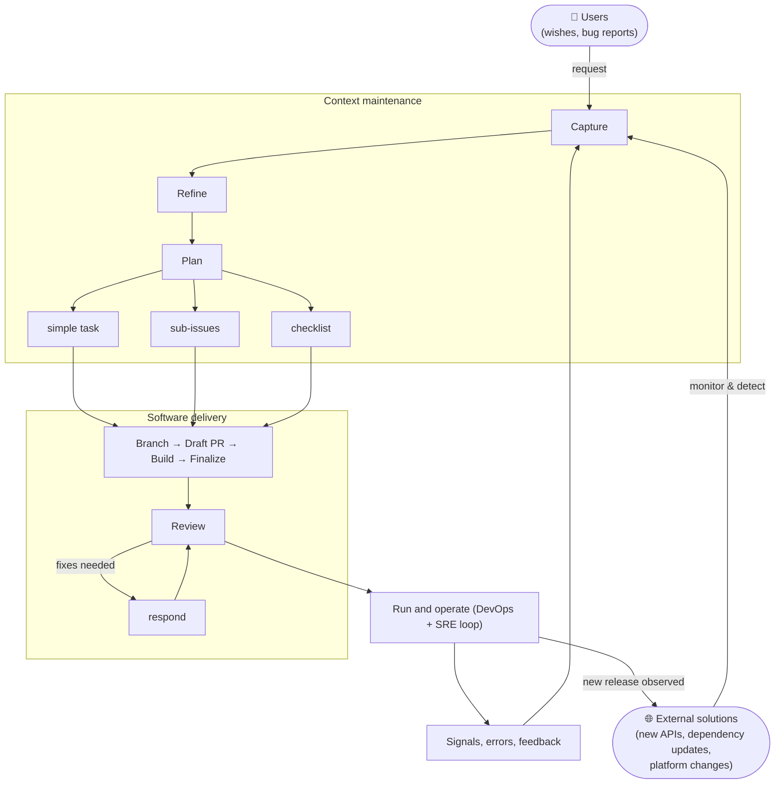

# Workflow

How work flows from idea to delivery — and back again. This is the heartbeat of the MSX ecosystem.

## The big picture

Two things run side by side, continuously:

1. **Context** — keeping issues, decisions, READMEs, and documentation right and evergreen.
2. **Software** — delivering code, tests, and releases.

Each feeds the other. Software produces signals that require context maintenance. Refined context unblocks the next round of software work. The loop never stops.

## Phases

### Capture

A desire for change enters the system. It can come from anywhere:

- A user request or feature idea.
- A bug report or error signal.
- An observation during a review.
- A dependency update or platform change.

The goal is to **write it down** — quickly, in a GitHub issue — so it exists for the world to see and "remember".
At this stage, precision is less important than existence. The issue captures the current state, the pain or opportunity, and the desired outcome.

See [Issue Format § Section 1](Issue-Format.md) for structure.

### Refine

Ground the captured desire in reality. Ask:

- What is the actual problem? (Not the symptom, not the first solution that comes to mind.)
- Who is affected and how?
- What does "done" look like from
  1. the user's perspective?
  2. the maintainer's perspective?
- Are there constraints, dependencies, or prior decisions that matter?

This may involve questions in issue comments, interactive discussion, or research.
The goal is **shared understanding** — everyone (humans and agents) agrees on what the real problem is and what the outcome should be.

### Plan

Turn the refined understanding into actionable work:

- **Gap analysis** — diff the [evergreen specification](Documentation-Model.md#evergreen-and-evolutionary) for the affected capability against the current implementation. The gap is the work.
- **Decisions** — what approach will we take? What trade-offs are we making? Document them in the issue.
- **Decomposition** — if the work is large, break it into sub-issues. Each sub-issue should be deliverable in a single pull request.
- **Checklist** — for a single task, list the concrete steps in the issue body.

The plan is the contract. It drives implementation.

See [Documentation Model](Documentation-Model.md), [Issue Format § Sections 2–3](Issue-Format.md), [Issue Hierarchy](Issue-Hierarchy.md).

### Build

Execute the plan:

1. **Branch** — create a branch (and [worktree](Git-Worktrees.md)) for the issue.
2. **Draft PR** — push early and open a draft pull request. Link it to the issue. This makes progress visible and attaches CI from the start.
3. **Implement** — work through the checklist. One logical change per commit. Update the issue as each task completes.
4. **Test locally** — don't push known failures to CI. Push work as far inward as it can go.
5. **Self-review with automation** — run the [Copilot review loop](Contribution-Workflow.md#the-copilot-review-loop) until it reports a clean round, fixing in-scope feedback and filing follow-up issues for the rest.
6. **Ready and auto-merge** — when the change meets the [Definition of Ready for Review](Definition-of-Ready-and-Done.md#definition-of-ready-for-review), finalize the pull request per [PR Format](PR-Format.md), mark it ready, and enable auto-merge.

See [Commit Conventions](Commit-Conventions.md), [PR Format](PR-Format.md), [Contribution Workflow](Contribution-Workflow.md).

### Review

Every change gets a second perspective:

- Does the PR deliver what the linked issue asks for?
- Does it follow the project's standards and conventions?
- Are there security concerns or undiscussed decisions?
- Is the code clear and maintainable?

Feedback is processed one thread at a time: read → evaluate → fix → reply → resolve.

See [Review Etiquette](Review-Etiquette.md).

### Ship

Human review approves the ready pull request and the required checks stay green, so auto-merge lands the change — squash-merged into the protected branch, its branch deleted. Where the project releases from the trunk, the merge cuts the release.

The pull request description becomes the release note. Write it for end users, not reviewers.

See [PR Format](PR-Format.md), [Branching and Merging](Branching-and-Merging.md#required-checks-and-auto-merge).

### Operate

> You build it, you run it.

After merge, the system is live. Monitor, observe, respond to signals. When something breaks or an opportunity appears — the loop starts again at **Capture**.

## Three horizons of planning

Planning happens at different time horizons and levels of detail:

| Level      | Now                  | Next          | Later          |
| ---------- | -------------------- | ------------- | -------------- |
| Conceptual | Vision delivered now | Vision next   | Vision later   |
| Logical    | Approach now         | Approach next | Approach later |
| Detailed   | Tasks in flight      | Tasks ready   | Tasks framed   |

- **Now / Next / Later** are time horizons without firm dates.
- **Conceptual / Logical / Detailed** are levels of fidelity.

Detail increases as work moves from Later toward Now.

- A single task lives in **Now / Detailed**.
- A product backlog item lives between **Now / Logical** and **Next / Detailed**.
- An epic spans **Now → Next → Later** at **Conceptual / Logical** fidelity.

This workflow follows the [Human–agent coexistence](Principles/AI-First-Development.md#human-agent-coexistence) principle — it is designed for humans first, with agents joining the same process rather than running a parallel one.
