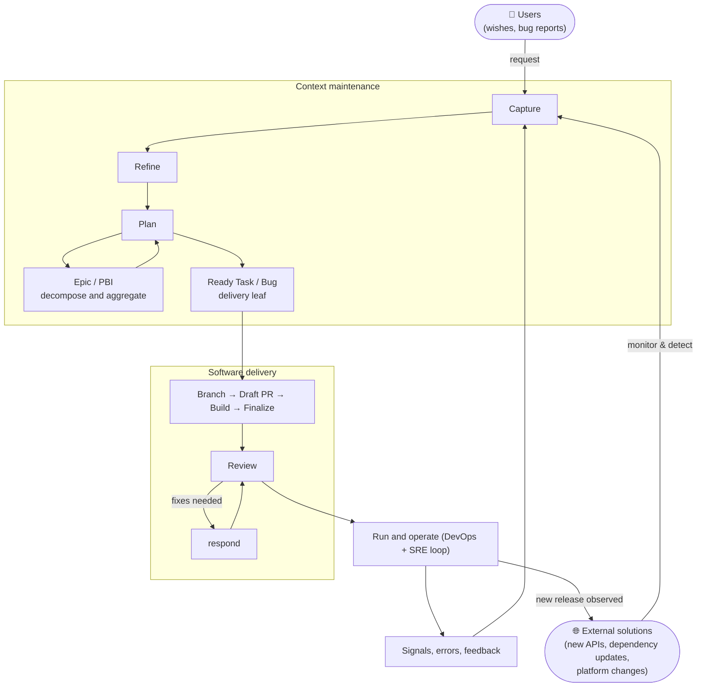

# Workflow

How work flows from idea to delivery — and back again. This is the heartbeat of the MSX ecosystem.

## The big picture

Two things run side by side, continuously:

1. **Context** — keeping issues, decisions, READMEs, and documentation right and evergreen.
2. **Software** — delivering code, tests, and releases.

Each feeds the other. Software produces signals that require context maintenance. Refined context unblocks the next round of software work. The loop never stops.

```mermaid
flowchart TD
    Usr(["👤 Users\n(wishes, bug reports)"])
    Ext(["🌐 External solutions\n(new APIs, dependency updates,\nplatform changes)"])

    Usr -->|request| Cap
    Ext -->|monitor & detect| Cap

    subgraph CM["Context maintenance"]
        Cap[Capture] --> Ref[Refine] --> Pl[Plan]
        Pl --> Agg["Epic / PBI<br/>decompose and aggregate"]
        Agg --> Pl
        Pl --> Leaf["Ready Task / Bug<br/>delivery leaf"]
    end

    subgraph SD["Software delivery"]
        Bld["Branch → Draft PR → Build → Finalize"]
        Bld --> Rev[Review]
        Rev -->|fixes needed| Rsp[respond]
        Rsp --> Rev
    end

    Leaf --> Bld
    Rev --> Ops["Run and operate (DevOps + SRE loop)"]
    Ops --> Sig["Signals, errors, feedback"]
    Sig --> Cap
    Ops -->|new release observed| Ext
```

## Find the current stage

Start from this page after following the documentation indexes: [Home](../index.md) → [Ways of Working](index.md) → Workflow. Infer the current stage from the work and its artifacts, then use the [stage procedure index](Workflow-Stages/index.md) or the direct links below. A stage is a part of this workflow, not a separate agent, skill, or instruction set.

| Current work or prompt | Enter | Continue until |
| --- | --- | --- |
| A request, signal, or issue needs to be captured, routed, refined, or planned. Prompts such as `Make this issue <description>` route here. | [Define](Workflow-Stages/Define.md) | The issue meets the readiness gate for its altitude. |
| A ready Task or Bug needs implementation, or a pull request needs author-side changes. Prompts such as `Implement <issue>` or `Fix <issue>` route here. | [Implement](Workflow-Stages/Implement.md) | The pull request meets the ready-for-review gate. |
| A pull request needs an independent assessment. Prompts such as `Review this PR <link>` route here. | [Review](Workflow-Stages/Review.md) | The change is approved or actionable feedback returns it to Implement. |
| The requested assessment is explicitly security-focused. Prompts such as `Security review <scope>` route here. | [Security Review](Workflow-Stages/Security-Review.md) | Findings are reported through the agreed channel and the review returns to its caller. |
| The workflow pages or repository pointers themselves need to change. | [Maintain Workflow Guidance](Workflow-Stages/Maintain-Guidance.md) | The canonical docs and thin pointers agree. |

Keywords are shortcuts, not a second routing system. When a prompt is ambiguous, use the current issue, pull request, branch, and completed work to identify the stage. When work crosses a stage boundary, follow the handoff and load the next procedure rather than carrying separate process instructions through the whole task.

## Phases

### Capture

A desire for change enters the system. It can come from anywhere:

- A user request or feature idea.
- A bug report or error signal.
- An observation during a review.
- A dependency update or platform change.

The goal is to **write it down** — quickly, in a GitHub issue — so it exists for the world to see and "remember".
At this stage, precision is less important than existence. The issue captures the current state, the pain or opportunity, and the desired outcome.

See the [Issue Lifecycle](Issues/Process/Lifecycle.md) for how the issue evolves during Capture.

### Refine

Ground the captured desire in reality. Ask:

- What is the actual problem? (Not the symptom, not the first solution that comes to mind.)
- Who is affected and how?
- What does "done" look like from
  1. the user's perspective?
  2. the maintainer's perspective?
- Are there constraints, dependencies, or prior decisions that matter?

This may involve questions in issue comments, interactive discussion, or research.
The goal is **shared understanding** — everyone (humans and agents) agrees on what the real problem is and what the outcome should be.

### Plan

Turn the refined understanding into actionable work:

- **Gap analysis** — diff the [evergreen specification](Documentation-Model.md#evergreen-and-evolutionary) for the affected capability against the current implementation. The gap is the work.
- **Route and decide** — assign the native type and add decisions at its [planning altitude](Issues/Process/Planning.md).
- **Decompose aggregates** — use native sub-issues for Epic and PBI children, and native dependency edges only where execution is genuinely gated.
- **Prepare delivery leaves** — refine Task and Bug children until they satisfy their type-specific readiness gate.

The issue graph is the delivery plan. Only a ready Task or Bug is eligible for Build; Epic and PBI remain in Plan while their children deliver and their aggregate criteria stay current.

See [Documentation Model](Documentation-Model.md), [Issue Planning](Issues/Process/Planning.md), [Issue Relationships](Issues/Process/Relationships.md), and [Issue Hierarchy](Issues/Types/Hierarchy.md).

### Build

Execute one ready, unblocked Task or Bug. For repository delivery:

1. **Branch** — create a branch (and [worktree](Git-Worktrees.md)) for the delivery leaf.
2. **Draft PR** — push early and open a draft pull request scoped to one Task or Bug delivery leaf. The pull request closes that scoped leaf; any additional convergent issues are linked separately through the session-end issue convergence sweep. This makes progress visible and attaches CI from the start.
3. **Implement** — work through the implementation plan. One logical change per commit. Update the issue as each plan step completes.
4. **Test locally** — don't push known failures to CI. Push work as far inward as it can go.
5. **Self-review with automation** — run the [Copilot review loop](Contribution-Workflow.md#the-copilot-review-loop) until it reports a clean round, fixing in-scope feedback and filing follow-up issues for the rest.
6. **Standards and framework alignment pass** — once the change is complete, reconcile it against process, the applicable [Coding Standards](../Coding-Standards/index.md) chapters, and the repository's framework documentation, and record the result in the pull request. See [Implement](Workflow-Stages/Implement.md#5-standards-and-framework-alignment-pass).
7. **Issue convergence sweep** — in the same session-end window, sweep scoped open issues for asks already satisfied by the finished diff, and link fully convergent issues in the pull request with closing keywords. See [Implement](Workflow-Stages/Implement.md#6-issue-convergence-sweep).
8. **Ready and auto-merge** — when the change meets the [Definition of Ready for Review](Definition-of-Ready-and-Done.md#definition-of-ready-for-review), finalize the pull request per [PR Format](PR-Format.md), mark it ready, and enable auto-merge.

An audited operational Task follows its [operational completion path](Issues/Types/Task.md#operational-delivery) instead of creating a branch or pull request.

See [Commit Conventions](Commit-Conventions.md), [PR Format](PR-Format.md), [Contribution Workflow](Contribution-Workflow.md).

### Review

Every change gets a second perspective:

- Does the PR deliver what its closing Task or Bug asks for?
- Does it follow the project's standards and conventions?
- Are there security concerns or undiscussed decisions?
- Is the code clear and maintainable?

Feedback is processed one thread at a time: read → evaluate → fix → reply → resolve.

See [Review Etiquette](Review-Etiquette.md).

### Ship

Human review approves the ready pull request and the required checks stay green, so auto-merge lands the change — squash-merged into the protected branch, its branch deleted — and closes its Task or Bug. Where the project releases from the trunk, the merge cuts the release.

The pull request description becomes the release note. Write it for end users, not reviewers.

Parent PBI and Epic issues close separately when their native children and aggregate acceptance criteria are complete. See [PR Format](PR-Format.md), [Issue Lifecycle](Issues/Process/Lifecycle.md), and [Branching and Merging](Branching-and-Merging.md#required-checks-and-auto-merge).

### Operate

> You build it, you run it.

After merge, the system is live. Monitor, observe, respond to signals. When something breaks or an opportunity appears — the loop starts again at **Capture**.

## Three horizons of planning

Planning happens at different time horizons and levels of detail:

| Level      | Now                  | Next          | Later          |
| ---------- | -------------------- | ------------- | -------------- |
| Conceptual | Vision delivered now | Vision next   | Vision later   |
| Logical    | Approach now         | Approach next | Approach later |
| Detailed   | Tasks in flight      | Tasks ready   | Tasks framed   |

- **Now / Next / Later** are time horizons without firm dates.
- **Conceptual / Logical / Detailed** are levels of fidelity.

Detail increases as work moves from Later toward Now.

- A single task lives in **Now / Detailed**.
- A PBI lives between **Now / Logical** and **Next / Detailed**.
- An Epic spans **Now → Next → Later** at **Conceptual / Logical** fidelity.

This workflow follows the [Human–agent coexistence](Principles/AI-First-Development.md#human-agent-coexistence) principle — it is designed for humans first, with agents joining the same process rather than running a parallel one.
